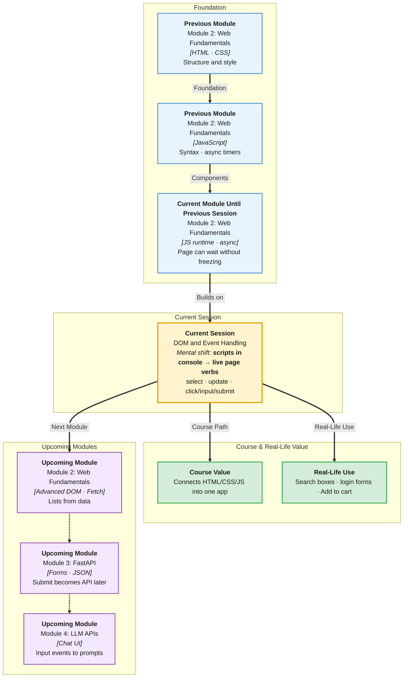

# Pre-Read: DOM & Event Handling

## Session Mindmap

This diagram shows where this session sits in the course.



## 1. What You'll Learn

In this pre-read, you'll discover:

- How to **select** nodes with `getElementById`, `querySelector`, and `querySelectorAll`
- How to **read and update** text, HTML, and attributes
- How to **listen** for click, input, and submit
- How to do **basic form validation** in JavaScript
- How **HTML, CSS, and JS** share one page in the browser

---

## 2. Detailed Explanation

### One-line definition

The **DOM** (Document Object Model) is the live tree of elements the browser builds from HTML. **Events** are signals like click and submit.

### Relatable analogy

HTML is the blueprint. The DOM is the actual house. JavaScript is the resident who turns lights on and changes the sign on the door.

CSS is paint. JS does not replace paint. It can switch which paint class is on.

### Why it matters

> **In the Real World:** **Swiggy** "Add to cart" is a click listener. **Google Search** suggestions listen to **input**. **Net Banking** login **submit** is validated before send.

**Benefits:**

- Pages respond to users
- Forms catch empty fields early
- You connect structure, style, and behavior

### Selecting elements

```javascript
const title = document.getElementById("title");
const btn = document.querySelector(".save");
const items = document.querySelectorAll("li");
```

| Method | Returns |
|--------|---------|
| `getElementById("id")` | One element or `null` |
| `querySelector("css")` | First match |
| `querySelectorAll("css")` | A list of matches |

### Read and update content and attributes

```javascript
title.textContent = "Hello";
img.setAttribute("alt", "Product photo");
const src = img.getAttribute("src");
```

- **`textContent`** — plain text (safer default)
- **`innerHTML`** — HTML string (use carefully)
- **`setAttribute` / `getAttribute`** — `href`, `src`, `disabled`

### Events: click, input, submit

```javascript
btn.addEventListener("click", () => {
  title.textContent = "Saved";
});
```

**submit:** call `event.preventDefault()` so the page does not reload.

### Basic form validation

Check a field. If empty, show a message. Do not submit.

```javascript
form.addEventListener("submit", (e) => {
  e.preventDefault();
  if (email.value.trim() === "") {
    msg.textContent = "Email required";
    return;
  }
  msg.textContent = "OK";
});
```

### How HTML, CSS, and JS work together

- **HTML** — structure (`form`, `input`, `button`)
- **CSS** — look (`.error { color: red; }`)
- **JS** — behavior (toggle class, set text)

**Messy:** Inline `onclick` everywhere, no ids, no labels.

**Clear:** Semantic HTML, CSS classes, JS `addEventListener`.

**Final small example:**

```html
<input id="name" />
<p id="out"></p>
<script>
  document.getElementById("name").addEventListener("input", (e) => {
    document.getElementById("out").textContent = e.target.value;
  });
</script>
```

### Building blocks

- [ ] I can select by id and CSS selector
- [ ] I can set `textContent` and an attribute
- [ ] I can attach click, input, submit listeners
- [ ] I can `preventDefault` and check empty fields
- [ ] I can explain the HTML/CSS/JS split

---

## 3. Practice Exercises

**Exercise 1 — Select**  
Add `<h1 id="app">DOM</h1>`. Select it three ways if possible (`id`, `querySelector`, `querySelectorAll` on `h1`). Log them.

**Exercise 2 — Update**  
Change the `h1` text to your name. Set `document.body` attribute `data-theme` to `"light"`.

**Exercise 3 — Click**  
A button `#go` should set a paragraph to `"clicked"` on click.

**Exercise 4 — Input**  
An input `#q` copies its value into `#preview` on every `input` event.

**Exercise 5 — Submit validation**  
A form with email. On submit, prevent reload. If empty, show `"Required"`. Else show `"Thanks"`.
