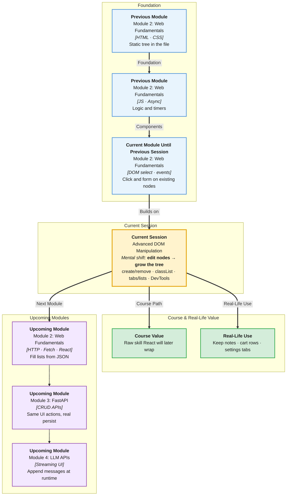

# Pre-Read: Advanced DOM Manipulation

## Session Mindmap

This diagram shows where this session sits in the course.



## 1. What You'll Learn

In this pre-read, you'll discover:

- How to **create, remove, and replace** elements while the page is open
- How to set **inline styles** and **toggle CSS classes**
- How to build a **dynamic list** or a **simple tab** UI
- How to **traverse** the tree (`parent`, `children`) to update UI state
- How to **debug** DOM and events in **DevTools**

---

## 2. Detailed Explanation

### One-line definition

**Advanced DOM work** means growing and shrinking the tree at runtime, not only editing text on nodes that already exist.

### Relatable analogy

Last session you relabeled rooms in an existing house. This session you **build a new room**, **tear one down**, and **swap doors**.

Classes are uniforms. Inline styles are a one-off sticker. Prefer classes for real UI.

### Why it matters

> **In the Real World:** **Trello** cards appear when you add a task. **YouTube** comments append. **Chrome** DevTools is how **frontend engineers at CRED** find why a click does nothing.

**Benefits:**

- Lists can grow from user input
- Tabs can show one panel at a time
- Bugs become visible in the Elements panel

### Create, remove, replace

```javascript
const li = document.createElement("li");
li.textContent = "Milk";
list.append(li);

li.remove();

const next = document.createElement("li");
next.textContent = "Eggs";
oldLi.replaceWith(next);
```

### Inline styles vs classes

```javascript
box.style.backgroundColor = "navy";
box.classList.add("active");
box.classList.toggle("hidden");
box.classList.remove("active");
```

**Messy:** `style.color` on every item in a loop.

**Clear:** `.active { ... }` in CSS, `classList.toggle("active")` in JS.

### Dynamic list or tabs

**List:** On button click, `createElement`, set text, `append`.

**Tabs:** Buttons share a group. Click sets `active` class on one panel. Hide others.

### Traverse and UI state

```javascript
const parent = item.parentElement;
const kids = parent.children;
```

Use traversal to find the card around a Delete button. Update a counter of remaining items.

### Debug in DevTools

- **Elements** — see if the node exists
- **Event Listeners** pane — is click attached?
- **Console** — `document.querySelector(...)` live
- **Breakpoints** in Sources on the click handler

**Final small example:**

```javascript
const ul = document.querySelector("#todos");
const li = document.createElement("li");
li.textContent = "Ship homework";
ul.append(li);
li.classList.add("done");
```

### Building blocks

- [ ] I can `createElement`, `append`, `remove`, `replaceWith`
- [ ] I can use `style` and `classList`
- [ ] I can build a list or tabs
- [ ] I can walk `parentElement` / `children`
- [ ] I can inspect a node and a listener in DevTools

---

## 3. Practice Exercises

**Exercise 1 — Create**  
Button `#add` appends a new `li` "Item" to `#list`.

**Exercise 2 — Remove / replace**  
Second button removes the last `li`. Third button replaces the first `li` with `"Replaced"`.

**Exercise 3 — Styles and classes**  
Toggle class `highlight` on a `div`. Also set `div.style.border = "2px solid black"` once.

**Exercise 4 — Mini list or tabs**  
Either: add items from an input. Or: two tabs that show `#panelA` or `#panelB`.

**Exercise 5 — DevTools**  
Break your click on purpose (`wrongId`). Use Elements + Console to find why. Fix it. Write one sentence on what you saw.
