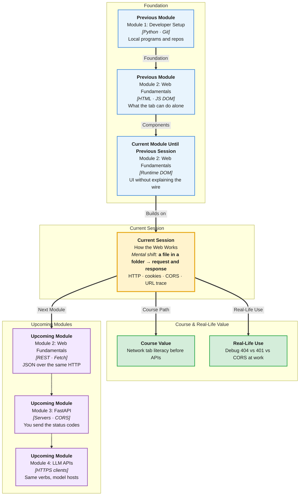

# Pre-Read: How the Web Works

## Session Mindmap

This diagram shows where this session sits in the course.



## 1. What You'll Learn

In this pre-read, you'll discover:

- How **client-server** talk uses **HTTP request-response**
- Common **HTTP methods** and **status codes**
- The role of **headers**, **cookies**, and **sessions**
- Why **CORS** exists for **browser API** calls
- What happens from **typing a URL** until the **server responds**

---

## 2. Detailed Explanation

### One-line definition

The **web** is clients (browsers, apps) asking **servers** for resources over **HTTP**, then using the **response**.

### Relatable analogy

You (the **client**) order from a kitchen (the **server**). The ticket is the **request**. The plate is the **response**. The **status code** is "200 OK" or "404 we don't have that dish."

**Cookies** are a stamp on your hand so the club knows you already paid cover. A **session** is the server remembering that stamp.

### Why it matters

> **In the Real World:** Every **Flipkart** product page, **Gmail** refresh, and **Razorpay** payment is HTTP. **CORS** errors appear the first time a student calls an API from a local HTML file.

**Benefits:**

- You can read DevTools **Network**
- You can guess what `404` vs `401` vs `500` means
- You will not panic at CORS — you will explain it

### Client-server and request-response

1. Browser builds a **request** (method, URL, headers, optional body)
2. Server **handles** it
3. Server returns **status**, **headers**, **body**
4. Browser uses the body (HTML, JSON, image)

### Methods and status codes

| Method | Typical intent |
|--------|----------------|
| **GET** | Read |
| **POST** | Create / submit |
| **PUT** | Replace |
| **DELETE** | Remove |

| Code | Meaning |
|------|---------|
| **200** | OK |
| **201** | Created |
| **400** | Bad request |
| **401** | Unauthenticated |
| **403** | Forbidden |
| **404** | Not found |
| **500** | Server error |

### Headers, cookies, sessions

**Headers** are metadata: `Content-Type`, `Authorization`, `Cookie`.

**Cookies** are small bits the browser stores and often **sends back**.

**Sessions** are server-side memory of "this browser is user X," often keyed by a cookie.

### CORS

**CORS** (Cross-Origin Resource Sharing) is a **browser** rule. A page on `http://localhost:5500` cannot read responses from `https://api.other.com` unless that API allows it with CORS headers.

It protects users from hostile sites reading their data. It is **not** a Python error. It is the **browser** blocking the read.

### Trace: URL to response

1. You type `https://www.wikipedia.org`
2. DNS finds an IP (name → address)
3. HTTPS connection
4. **GET** request for `/`
5. Server **200** + HTML
6. Browser parses and may request CSS/JS next

**Final small example (shape only):**

```
GET /about HTTP/1.1
Host: example.com

HTTP/1.1 200 OK
Content-Type: text/html
```

### Building blocks

- [ ] I can draw client → request → server → response
- [ ] I can name GET/POST/PUT/DELETE and 200/404/500
- [ ] I can say what headers and cookies are for
- [ ] I can explain CORS as a browser safety check
- [ ] I can narrate URL → DNS → GET → response

---

## 3. Practice Exercises

**Exercise 1 — Roles**  
Label each: Chrome, FastAPI later, JSON file on disk. Which is client? Which is server? (Disk file opened as `file://` is not a remote server.)

**Exercise 2 — Methods**  
Match: load a homepage, submit a form, delete a comment. Pick GET, POST, or DELETE.

**Exercise 3 — Status**  
A user types a wrong URL path. Which code family? A server bug? Which code family?

**Exercise 4 — Cookies**  
In two sentences: why does a "keep me logged in" site need a cookie or similar token?

**Exercise 5 — CORS**  
Your page is on `localhost:3000`. API is on `localhost:8000`. Why might the browser hide the response even if the API works in DevTools "open URL"?
