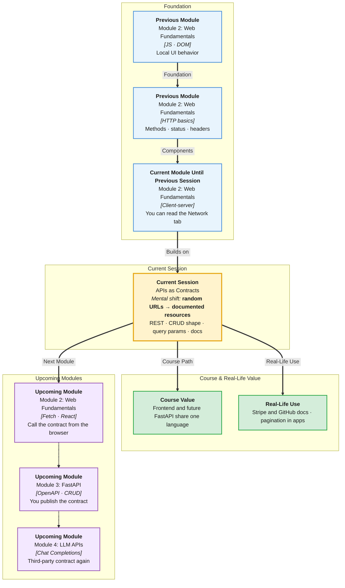

```mermaid
flowchart TB
    subgraph foundation ["Foundation"]
        P1["<b>Previous Module</b><br/>Module 2: Web Fundamentals<br/><i>[JS · DOM]</i><br/>Local UI behavior"]
        P2["<b>Previous Module</b><br/>Module 2: Web Fundamentals<br/><i>[HTTP basics]</i><br/>Methods · status · headers"]
        CM["<b>Current Module Until Previous Session</b><br/>Module 2: Web Fundamentals<br/><i>[Client-server]</i><br/>You can read the Network tab"]
    end
    subgraph current ["Current Session"]
        CS["<b>Current Session</b><br/>APIs as Contracts<br/><i>Mental shift:</i> <b>random URLs</b> → <b>documented resources</b><br/>REST · CRUD shape · query params · docs"]
    end
    subgraph value ["Course & Real-Life Value"]
        CV["<b>Course Value</b><br/>Frontend and future FastAPI share one language"]
        RL["<b>Real-Life Use</b><br/>Stripe and GitHub docs · pagination in apps"]
    end
    subgraph future ["Upcoming Modules"]
        U1["<b>Upcoming Module</b><br/>Module 2: Web Fundamentals<br/><i>[Fetch · React]</i><br/>Call the contract from the browser"]
        U2["<b>Upcoming Module</b><br/>Module 3: FastAPI<br/><i>[OpenAPI · CRUD]</i><br/>You publish the contract"]
        U3["<b>Upcoming Module</b><br/>Module 4: LLM APIs<br/><i>[Chat Completions]</i><br/>Third-party contract again"]
    end
    P1 ==>|&nbsp;Foundation&nbsp;| P2
    P2 ==>|&nbsp;Components&nbsp;| CM
    CM ==>|&nbsp;Builds on&nbsp;| CS
    CS ==>|&nbsp;Course Path&nbsp;| CV
    CS ==>|&nbsp;Real-Life Use&nbsp;| RL
    CS ==>|&nbsp;Next Module&nbsp;| U1
    U1 -.-> U2
    U2 -.-> U3
    classDef previous fill:#E8F4FD,stroke:#4A90D9,stroke-width:2px,color:#1a1a1a
    classDef current fill:#FFF3CD,stroke:#E6A817,stroke-width:3px,color:#1a1a1a
    classDef value fill:#D4EDDA,stroke:#28A745,stroke-width:2px,color:#1a1a1a
    classDef future fill:#F3E8FF,stroke:#9B59B6,stroke-width:2px,color:#1a1a1a
    class P1,P2,CM previous
    class CS current
    class CV,RL value
    class U1,U2,U3 future
    linkStyle default stroke-width:3px
```
