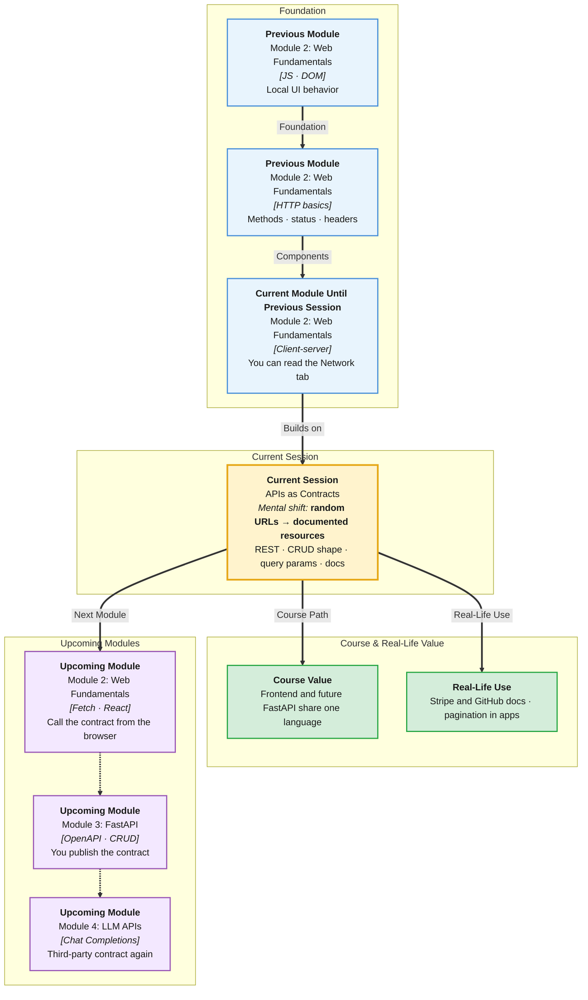

# Pre-Read: APIs as Contracts

## Session Mindmap

This diagram shows where this session sits in the course.



## 1. What You'll Learn

In this pre-read, you'll discover:

- How **REST** names **resources**, **endpoints**, and **HTTP verbs**
- How **CRUD** maps to request and response shape
- How **error responses** use status codes plus a body
- How **pagination**, **filtering**, and **query params** keep lists usable
- How to **read third-party API docs** and pick the right endpoint

---

## 2. Detailed Explanation

### One-line definition

An **API contract** is the agreed shape of URLs, methods, bodies, and errors so two programs can work together.

### Relatable analogy

A food-delivery menu is a contract. "Item 17, extra spicy" is a **request**. The kitchen cannot invent a secret plate and call it 17.

**REST** treats data as **resources** (users, todos, orders) with URLs.

### Why it matters

> **In the Real World:** **Razorpay**, **Twilio**, and **JSONPlaceholder** publish docs so apps do not guess. Frontend and backend teams at **Swiggy** argue about the contract **before** either side codes for a week.

**Benefits:**

- You know what to `fetch`
- You handle errors as data, not mystery
- You can read docs without fear

### REST: resources, endpoints, verbs

| Resource | Endpoint example | Verb |
|----------|------------------|------|
| All todos | `/todos` | GET |
| One todo | `/todos/1` | GET |
| Create | `/todos` | POST |
| Update | `/todos/1` | PUT |
| Delete | `/todos/1` | DELETE |

**Endpoint** = URL path that names the resource.

### CRUD request/response

**Create** — POST JSON body `{ "title": "Milk" }` → often **201** + created object.  
**Read** — GET → **200** + object or list.  
**Update** — PUT/PATCH body → **200** + updated object.  
**Delete** — DELETE → **200** or **204** empty.

This session is **reading the contract**, not building FastAPI.

### Errors

Errors still have **status** and usually **JSON**:

```json
{ "error": "Not found" }
```

**404** missing id. **400** bad JSON. **401** missing login. Do not parse only the body; **read the code**.

### Pagination, filtering, query params

Long lists: `?page=2&limit=20`  
Filter: `?completed=true`  
Search: `?q=milk`

**Query params** start after `?` and join with `&`.

### Reading docs

Look for: **base URL**, **path**, **method**, **required query/path params**, **example response**, **error codes**.

**JSONPlaceholder** (practice API): `https://jsonplaceholder.typicode.com` — fake posts, todos, users. Safe for class.

**Final small example:**

```
GET https://jsonplaceholder.typicode.com/todos/1
```

You expect **200** and JSON with `userId`, `id`, `title`, `completed`.

### Building blocks

- [ ] I can map CRUD to verbs and paths
- [ ] I can sketch a success JSON vs error JSON
- [ ] I can explain `?page=` and filters
- [ ] I can find base URL and an endpoint in docs
- [ ] I can say why a contract beats guesswork

---

## 3. Practice Exercises

**Exercise 1 — Name the resource**  
For a bookstore, list three resources (example: books, authors, reviews).

**Exercise 2 — CRUD table**  
Fill verb + path for: list books, get book 5, add a book, delete book 5.

**Exercise 3 — Error**  
Response status `404` and body `{ "error": "Todo not found" }`. What failed?

**Exercise 4 — Query string**  
Write a URL that lists todos, only completed, limit 10. Use `https://jsonplaceholder.typicode.com/todos` plus query params you invent (`?completed=true&_limit=10` is a real JSONPlaceholder style).

**Exercise 5 — Docs hunt**  
Open JSONPlaceholder guide. Write the endpoint to get all **users**. Write the endpoint to get **posts** for user id 1 (`/posts?userId=1`).
