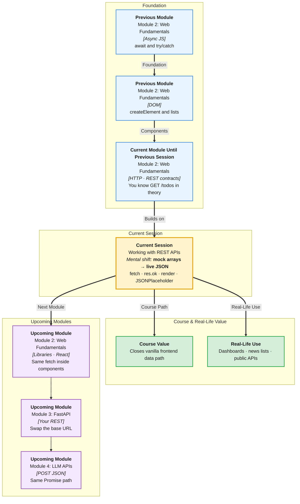

# Pre-Read: Working with REST APIs

## Session Mindmap

This diagram shows where this session sits in the course.



## 1. What You'll Learn

In this pre-read, you'll discover:

- How to **GET** data with **`fetch`** and **`async`/`await`**
- How to **`json()`** parse and **handle fetch errors**
- How to **render** API data into the **DOM**
- How to read **JSONPlaceholder** docs and call **`/todos`**
- How to build a **page** that fetches and **displays** that data

---

## 2. Detailed Explanation

### One-line definition

**`fetch`** is the browser function that sends an HTTP request and returns a **Promise**. You **await** it, then **await** `response.json()`.

### Relatable analogy

`fetch` is placing the order. `response.ok` is checking the plate is not sent back. `json()` is unwrapping the foil. The **DOM** is setting the table.

### Why it matters

> **In the Real World:** **News apps**, **weather widgets**, and **GitHub** profile pages all GET JSON then draw lists. **JSONPlaceholder** is the gym. Later, **your FastAPI** will be the kitchen.

**Benefits:**

- Live data without rewriting HTML files
- Practice async + DOM together
- Honest error messages when the network fails

### GET with fetch + async/await

```javascript
async function load() {
  const res = await fetch("https://jsonplaceholder.typicode.com/todos?_limit=5");
  const data = await res.json();
  console.log(data);
}
```

Default method is **GET**.

### Parse JSON and handle errors

`fetch` **succeeds** even on **404**. You must check **`res.ok`** (true for 200–299).

Network failure (offline) **throws**. Use **try/catch**.

```javascript
async function load() {
  try {
    const res = await fetch(url);
    if (!res.ok) throw new Error("HTTP " + res.status);
    return await res.json();
  } catch (err) {
    console.log(err.message);
  }
}
```

### Render in the DOM

Loop the array. `createElement("li")`. Set `textContent` from `todo.title`. `append` to `ul`.

Do not dump raw JSON as the only UI. Users read titles, not braces.

### JSONPlaceholder todos

Docs: `https://jsonplaceholder.typicode.com/`  
Todos: `GET /todos`  
One item: `GET /todos/1`  
Limit: `?_limit=10`

Each todo: `userId`, `id`, `title`, `completed`.

### The page you will build

HTML: heading, `ul#list`, `p#status`.  
JS: on load, status "Loading…", fetch, render, or show error.

**Messy:** Ignore `ok`, use `innerHTML` with untrusted strings.  
**Clear:** Check `ok`, `textContent`, try/catch.

**Final small example:**

```javascript
const res = await fetch("https://jsonplaceholder.typicode.com/todos/1");
const todo = await res.json();
document.body.textContent = todo.title;
```

### Building blocks

- [ ] I can `await fetch` and `await res.json()`
- [ ] I check `res.ok` and use try/catch
- [ ] I can append `li` from each item
- [ ] I know the todos URL
- [ ] I can show loading and error text

---

## 3. Practice Exercises

**Exercise 1 — GET**  
`fetch` `https://jsonplaceholder.typicode.com/todos/1`. Log `title`.

**Exercise 2 — Errors**  
Use a bad URL path. Log `res.status` and `res.ok`. Then add try/catch for a made-up host.

**Exercise 3 — Render**  
After a successful fetch of 5 todos (`?_limit=5`), put each `title` in an `li`.

**Exercise 4 — Docs**  
From the docs, write the URL for todos of `userId=1`. Fetch and log `data.length`.

**Exercise 5 — Mini page**  
HTML + JS file: loading message, then list, or "Could not load." Open via a local server if CORS/`file://` fights you.
