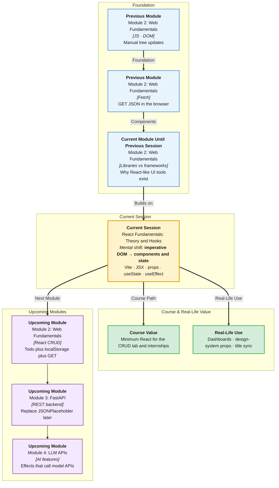

# Pre-Read: React Fundamentals — Theory, Components, JSX & Hooks

## Session Mindmap

This diagram shows where this session sits in the course.



## 1. What You'll Learn

In this pre-read, you'll discover:

- How **components** and a beginner **virtual DOM** idea organize UI
- How to **set up Vite + React** and write **functional components** in **JSX**
- How **props** pass data from parent to child
- How **`useState`** holds values that change on screen
- How **`useEffect`** runs work on **mount** and **update** (no other hooks)

---

## 2. Detailed Explanation

### One-line definition

**React** is a JavaScript library for building UI from **components**. You describe the UI with **JSX**. **State** and **effects** keep it alive.

### Relatable analogy

Vanilla DOM is moving furniture piece by piece. React is sending a new **floor plan** (JSX) whenever data changes. React diffs the plan (virtual DOM idea) and moves only what it must.

**Props** are labeled boxes a parent hands a child. **useState** is a sticky note the component can rewrite. **useEffect** is "after the room is painted, also plug in the lamp" (fetch, `console.log`, sync).

### Why it matters

> **In the Real World:** **Netflix**, **Airbnb**, and **Instagram** UIs are component trees. **Vite** is how many 2024–2026 tutorials start React, including this course.

**Benefits:**

- Reusable pieces
- UI stays in sync with data
- Same `fetch` skills, cleaner structure

### Components and virtual DOM (beginner)

A **component** is a function that returns JSX.

The **virtual DOM** (simple story): React keeps a light description of the tree. On state change it compares and updates the real DOM. You do not call `append` for every pixel.

### Vite + functional components + JSX

```bash
npm create vite@latest my-app -- --template react
```

Then `cd my-app`, `npm install`, `npm run dev`.

**JSX** looks like HTML in JS. Use `className` not `class`. Use `{ }` for JS expressions.

```jsx
function Hello() {
  return <h1>Hello React</h1>;
}
```

### Props

```jsx
function Badge({ label }) {
  return <span>{label}</span>;
}

<Badge label="New" />
```

Parent owns the data. Child displays it. Props are **read-only** in the child.

### useState

```jsx
import { useState } from "react";

function Counter() {
  const [n, setN] = useState(0);
  return <button onClick={() => setN(n + 1)}>{n}</button>;
}
```

**Never** assign `n = n + 1`. Always **`setN`**.

### useEffect — mount and update only

```jsx
import { useEffect, useState } from "react";

useEffect(() => {
  console.log("runs on mount and when n changes");
}, [n]);

useEffect(() => {
  console.log("mount only");
}, []);
```

- Empty deps `[]` — **mount** (first paint)
- `[n]` — **mount and when `n` updates**

**Do not** use other hooks (`useRef`, `useContext`, `useReducer`, `useMemo`, …).

**Final small example:**

```jsx
function Title({ text }) {
  const [on, setOn] = useState(true);
  useEffect(() => {
    document.title = text;
  }, [text]);
  return <button onClick={() => setOn(!on)}>{on ? text : "Off"}</button>;
}
```

### Building blocks

- [ ] I can explain component + virtual DOM in one analogy
- [ ] I can start Vite React and return JSX
- [ ] I can pass and use props
- [ ] I can use `useState`
- [ ] I can use `useEffect` with `[]` or `[dep]`

---

## 3. Practice Exercises

**Exercise 1 — Component**  
Create `Welcome.jsx` that returns `<p>Welcome</p>`. Render it from `App.jsx`.

**Exercise 2 — Props**  
`Welcome` takes `name` and shows `Welcome, {name}`.

**Exercise 3 — useState**  
A button toggles the text `Open` / `Closed`.

**Exercise 4 — useEffect mount**  
`useEffect` with `[]` that `console.log("mounted")`. Confirm once per load.

**Exercise 5 — useEffect update**  
State `query`. Effect with `[query]` logs `query` whenever it changes. Type in an input that `setQuery`.
