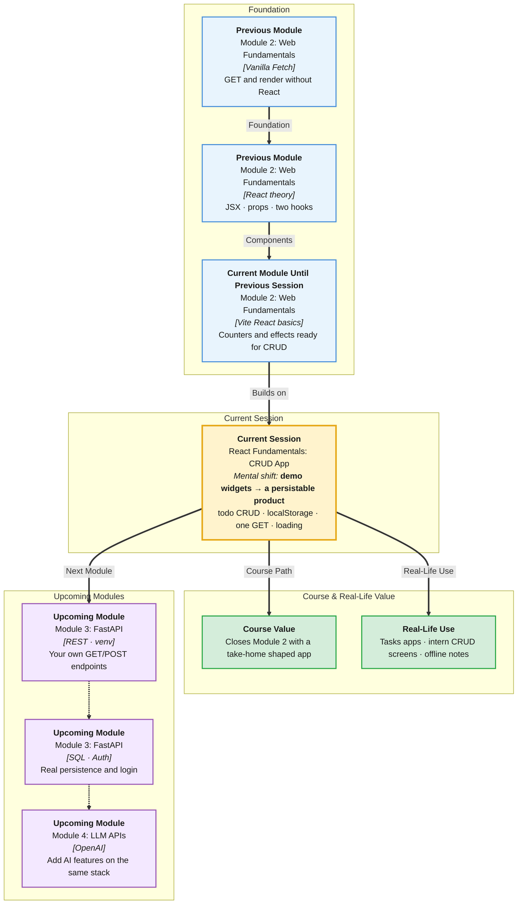

# Pre-Read: React Fundamentals — CRUD App

## Session Mindmap

This diagram shows where this session sits in the course.



## 1. What You'll Learn

In this pre-read, you'll discover:

- How to build a **React Todo** with **add, edit, delete, mark complete**
- How to **persist** todos in **`localStorage`**
- How **`useState`** and **`useEffect`** run the app
- How to **GET once** from `https://jsonplaceholder.typicode.com/todos`
- How to show a **loading** state while that fetch runs (**no FastAPI**)

---

## 2. Detailed Explanation

### One-line definition

A **CRUD Todo** lets you **Create, Read, Update, Delete** items. React holds them in **state**. The browser **`localStorage`** remembers them. One **GET** seeds sample rows.

### Relatable analogy

State is the desk. **localStorage** is the drawer. JSONPlaceholder is a **starter pack** of sticky notes you import once. Loading is the "please wait" sign while the pack arrives.

### Why it matters

> **In the Real World:** **Apple Reminders**, **Google Tasks**, and **Trello** cards are CRUD. Intern take-homes often say: "Todo app, persist, fetch sample." This session **is** that take-home, without a custom backend.

**Benefits:**

- Full UI loop in React
- Persistence without a server
- Real GET + loading UX

### Features

| Action | Typical UI |
|--------|------------|
| Add | Input + button → new item `completed: false` |
| Edit | Change `title` (input in row or prompt) |
| Delete | Remove from array |
| Complete | Toggle `completed` |

Use `map` to render. Each item needs a **`key`** (`id`).

### localStorage

```javascript
localStorage.setItem("todos", JSON.stringify(todos));
const saved = JSON.parse(localStorage.getItem("todos") || "[]");
```

**useEffect** to **load** on mount and **save** when `todos` updates. Be careful not to overwrite with `[]` before load finishes. Pattern: `loaded` flag or only save after first read.

### useState + useEffect

```jsx
const [todos, setTodos] = useState([]);
const [loading, setLoading] = useState(true);
```

Effects: fetch on mount; persist when todos change.

**No other hooks. No FastAPI.**

### One GET

```javascript
const res = await fetch(
  "https://jsonplaceholder.typicode.com/todos?_limit=5"
);
const data = await res.json();
```

Map to your shape: `{ id, title, completed }`. If localStorage already has items, **prefer saved** (do not wipe user data). If empty, **seed** from API.

### Loading

While `loading` is true, show `"Loading todos…"`. Then show the list or empty state.

**Final small example (save):**

```javascript
useEffect(() => {
  localStorage.setItem("todos", JSON.stringify(todos));
}, [todos]);
```

### Building blocks

- [ ] I can add, edit, delete, toggle
- [ ] I can save and load JSON in localStorage
- [ ] I only need useState and useEffect
- [ ] I can GET `/todos` once on mount
- [ ] I can show loading

---

## 3. Practice Exercises

**Exercise 1 — Add/delete**  
From an array in `useState`, add a todo object and delete by `id`.

**Exercise 2 — Toggle and edit**  
Toggle `completed`. Change one `title`.

**Exercise 3 — localStorage**  
`setItem` / `getItem` your array. Refresh. Confirm data remains.

**Exercise 4 — GET**  
Fetch `?_limit=3`. Log titles. Do not use FastAPI.

**Exercise 5 — Loading**  
`loading` starts `true`. After fetch (or timeout), set `false`. Render `Loading…` or the list.
