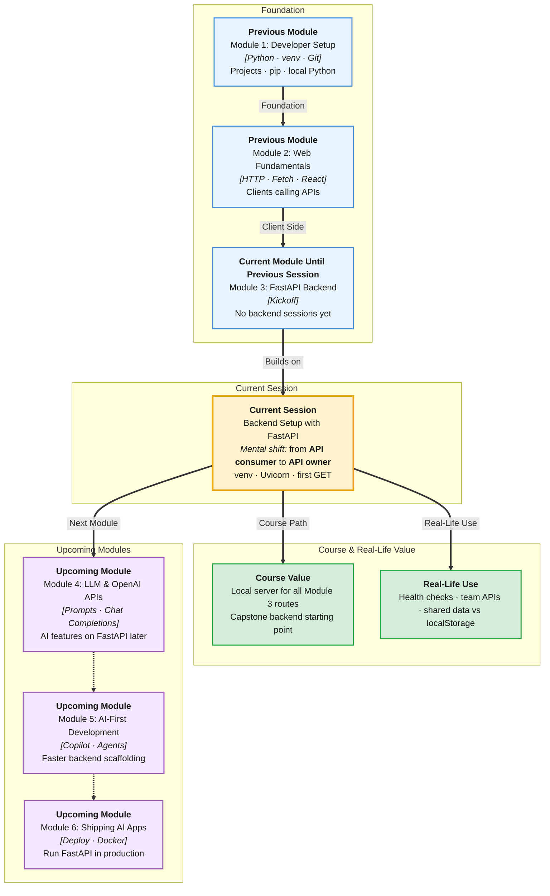

# Pre-Read: Backend Setup with FastAPI

## Session Mindmap

This diagram shows where this session sits in the course.



## 1. What You'll Learn

In this pre-read, you'll discover:

- How the **backend** (the server that stores data and runs business rules) differs from the frontend you already built
- How to **create and activate a venv** so FastAPI stays isolated from other Python projects
- How to **install FastAPI** and **run the development server** with live reload
- How to **build a minimal FastAPI app** — one file, one `app` object
- How to **implement and test a basic GET** in the browser, like a tiny public notice board

---

## 2. Detailed Explanation

### The Backend's Job

You already built pages, styled them, and called APIs with Fetch. Those APIs lived on someone else's computer (JSONPlaceholder). Now **you** write the server.

The **backend** is the program that:

- Receives HTTP requests (`GET /health`)
- Decides what to do (read data, check rules)
- Sends an HTTP response (JSON, status code)

**Analogy:** The frontend is the restaurant dining room. The backend is the kitchen. Guests never walk into the kitchen. They place an order (request). The kitchen returns a plate (response).

> **In the Real World:** When you tap **Pay** on **PhonePe** or **Amazon**, the React-like UI does not move money. A backend service checks the user, talks to a database, and returns success or failure.

**Why It Matters**

- One backend can serve a website, a mobile app, and a partner tool
- Business rules stay in one place — prices, stock, who is allowed to see what
- Data lives on the server, not only in `localStorage`

### Messy to Clear

**Messy:** A React todo app that only saves in the browser. Close the laptop, data is gone for everyone else.

**Clear:** A FastAPI app on `http://127.0.0.1:8000` that answers `GET /todos`. Any client — browser, Postman, another Python script — can ask for the same list.

### Building Blocks

| Piece | Role |
|-------|------|
| **venv** | Isolated Python for this backend project |
| **FastAPI** | Framework that turns Python functions into HTTP endpoints |
| **Uvicorn** | **ASGI server** — the process that listens on a port |
| **`app = FastAPI()`** | The application object Uvicorn loads |
| **Route decorator** | `@app.get("/hello")` maps URL + method to a function |
| **Path operation** | The function that returns JSON |

### Create and Activate a venv

Use the same muscle memory as Module 1:

```bash
python3 -m venv venv
source venv/bin/activate   # macOS / Linux
```

Your prompt should show `(venv)`. Then install:

```bash
pip install "fastapi[standard]"
```

This pulls FastAPI plus **Uvicorn** so you can run the server.

### Minimal App

Create `main.py`:

```python
from fastapi import FastAPI

app = FastAPI()

@app.get("/")
def read_root():
    return {"message": "Kitchen is open"}
```

Run:

```bash
uvicorn main:app --reload
```

- `main` — the file `main.py`
- `app` — the variable name
- `--reload` — restart when you save (dev only)

Open `http://127.0.0.1:8000`. You should see JSON, not an HTML page.

### Test a Basic GET

Add:

```python
@app.get("/health")
def health():
    return {"status": "ok"}
```

Visit `/health` in the browser. A GET with no extra data is the simplest request. Status **200** means success.

**Common mix-up:** FastAPI is not a replacement for React. React still draws the UI. FastAPI answers data requests.

**Python vs JavaScript:** Browser `fetch` sends HTTP. FastAPI **receives** HTTP. Same conversation, other side of the table.

---

## 3. Practice Exercises

**Exercise 1 — Role sketch (2 min)**  
A user clicks “Place order” on a food app. Write three bullets: what the **frontend** does, what the **backend** does, what neither should do.

**Exercise 2 — venv checkpoint (3 min)**  
Create a folder `campus-api`, make a venv, activate it, run `which python`. Confirm the path contains `venv`.

**Exercise 3 — Install and run (4 min)**  
With venv active, install FastAPI (standard extra). Run `uvicorn main:app --reload` on the tiny `main.py` above. Screenshot the terminal line that says `Uvicorn running`.

**Exercise 4 — Second GET (4 min)**  
Add `GET /campus` that returns `{"name": "IITREICT", "role": "backend-lab"}`. Predict the JSON, then open the URL.

**Exercise 5 — Real-world mapping (3 min)**  
Pick **Swiggy**, **IRCTC**, or **Gmail**. Name one GET a mobile app might call on day one (example: `/health` or `/menu`). Write why that GET is safe to test in a browser with no body.
