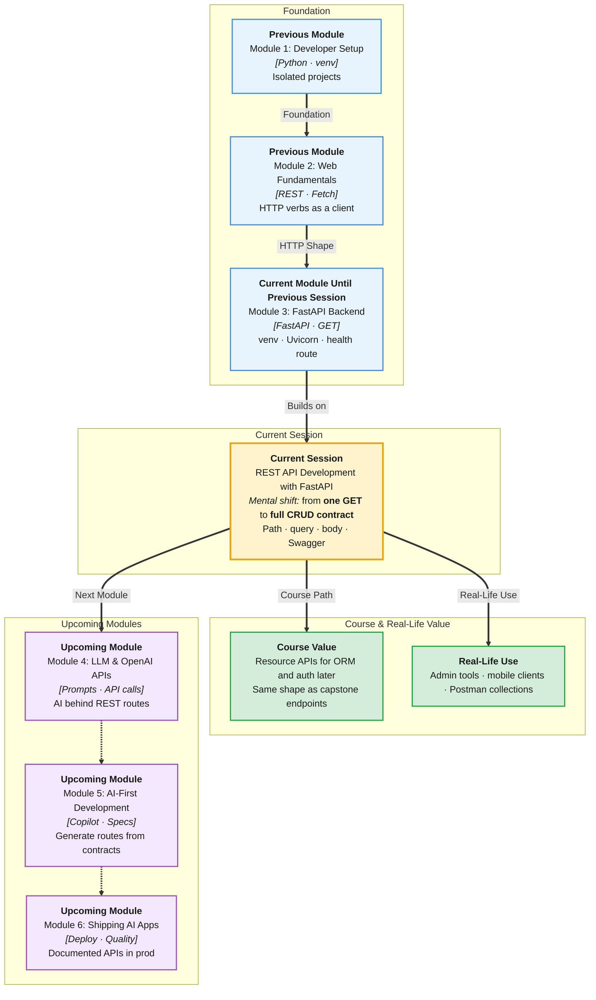

# Pre-Read: REST API Development with FastAPI

## Session Mindmap

This diagram shows where this session sits in the course.



## 1. What You'll Learn

In this pre-read, you'll discover:

- How to implement **GET, POST, PUT, DELETE** — the four **CRUD** verbs — as FastAPI routes
- How to accept **path parameters**, **query parameters**, and a **JSON body**
- How **filtering, sorting, and pagination** keep list endpoints usable
- How **Swagger UI at `/docs`** documents and tests your API
- How to **test CRUD** with Swagger or **Postman** like an API teammate

---

## 2. Detailed Explanation

### REST in One Sentence

**REST** (a style of HTTP APIs) treats data as **resources** at URLs. Verbs say what to do.

| HTTP method | Typical job | Example |
|-------------|-------------|---------|
| **GET** | Read | `GET /books` or `GET /books/3` |
| **POST** | Create | `POST /books` with JSON body |
| **PUT** | Replace/update | `PUT /books/3` with full JSON |
| **DELETE** | Remove | `DELETE /books/3` |

**Analogy:** A library catalog. GET browses. POST adds a book. PUT rewrites the card. DELETE removes it.

> **In the Real World:** **GitHub** uses REST (`GET /repos/{owner}/{repo}`). **Spotify** lists tracks with query params. Your Module 2 Fetch work was the client side of this contract.

**Why It Matters**

- Frontends and mobile apps share one contract
- Swagger means you test without writing a UI first
- Filtering and pagination stop huge dumps that freeze browsers

### Messy to Clear

**Messy:** One route `GET /doStuff?action=delete&id=3` that does everything.

**Clear:** `DELETE /items/3`. The URL names the item. The method names the action.

### Path vs Query vs Body

```python
from fastapi import FastAPI

app = FastAPI()
items = [{"id": 1, "title": "Pen", "price": 10}]

@app.get("/items/{item_id}")
def get_item(item_id: int):
    return items[item_id - 1]
```

- **Path** `{item_id}` — which resource
- **Query** `?q=pen&limit=10` — optional filters
- **JSON body** — POST/PUT payload (`{"title": "Pen"}`)

```python
@app.get("/items")
def list_items(q: str | None = None, skip: int = 0, limit: int = 10):
    data = items
    if q:
        data = [i for i in data if q.lower() in i["title"].lower()]
    return data[skip : skip + limit]
```

**Pagination:** `skip` and `limit` (or `page` and `size`) return a slice, not the whole warehouse.

**Sorting:** `sort=price` then `sorted(data, key=lambda i: i["price"])`.

### Swagger `/docs`

Run the server. Open `http://127.0.0.1:8000/docs`. FastAPI builds **OpenAPI** docs. You can try GET/POST live.

**Postman** is a desktop client: same HTTP, saved collections for teams.

Stay in memory lists this session. Databases come later.

---

## 3. Practice Exercises

**Exercise 1 — Verb map (3 min)**  
For a campus lost-and-found app, write four URLs+methods: list items, add item, update item, remove item.

**Exercise 2 — Path vs query (3 min)**  
Which is path and which is query: “item 7” vs “only items tagged keys”? Write both URLs.

**Exercise 3 — Predict JSON (3 min)**  
`GET /items?skip=0&limit=2` on a list of 5 dicts. How many objects return? Why?

**Exercise 4 — Swagger click (5 min)**  
From last session’s app, open `/docs`. Expand GET `/health`. Click **Try it out** → **Execute**. Note status code.

**Exercise 5 — Real-world (3 min)**  
Open [JSONPlaceholder posts](https://jsonplaceholder.typicode.com/posts?_limit=2) in a browser. Name the method, the query idea (`_limit`), and how your FastAPI `limit` param is the same idea.
