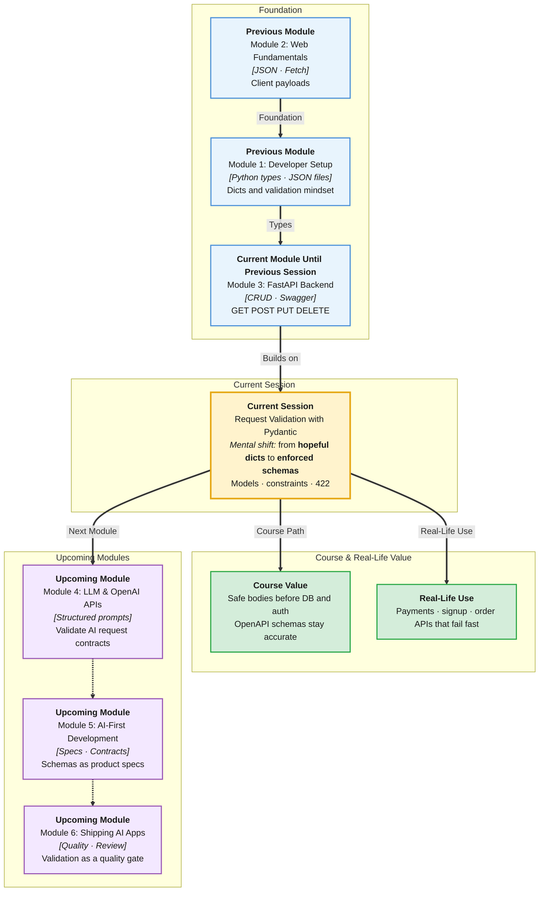

```mermaid
flowchart TB
    subgraph foundation ["Foundation"]
        direction TB
        P1["<b>Previous Module</b><br/>Module 2: Web Fundamentals<br/><i>[JSON · Fetch]</i><br/>Client payloads"]
        P2["<b>Previous Module</b><br/>Module 1: Developer Setup<br/><i>[Python types · JSON files]</i><br/>Dicts and validation mindset"]
        CM["<b>Current Module Until Previous Session</b><br/>Module 3: FastAPI Backend<br/><i>[CRUD · Swagger]</i><br/>GET POST PUT DELETE"]
    end

    subgraph current ["Current Session"]
        CS["<b>Current Session</b><br/>Request Validation with Pydantic<br/><i>Mental shift:</i> from <b>hopeful dicts</b> to <b>enforced schemas</b><br/>Models · constraints · 422"]
    end

    subgraph value ["Course & Real-Life Value"]
        CV["<b>Course Value</b><br/>Safe bodies before DB and auth<br/>OpenAPI schemas stay accurate"]
        RL["<b>Real-Life Use</b><br/>Payments · signup · order APIs that fail fast"]
    end

    subgraph future ["Upcoming Modules"]
        direction TB
        U1["<b>Upcoming Module</b><br/>Module 4: LLM & OpenAI APIs<br/><i>[Structured prompts]</i><br/>Validate AI request contracts"]
        U2["<b>Upcoming Module</b><br/>Module 5: AI-First Development<br/><i>[Specs · Contracts]</i><br/>Schemas as product specs"]
        U3["<b>Upcoming Module</b><br/>Module 6: Shipping AI Apps<br/><i>[Quality · Review]</i><br/>Validation as a quality gate"]
    end

    P1 ==>|&nbsp;Foundation&nbsp;| P2
    P2 ==>|&nbsp;Types&nbsp;| CM
    CM ==>|&nbsp;Builds on&nbsp;| CS
    CS ==>|&nbsp;Course Path&nbsp;| CV
    CS ==>|&nbsp;Real-Life Use&nbsp;| RL
    CS ==>|&nbsp;Next Module&nbsp;| U1
    U1 -.-> U2
    U2 -.-> U3

    classDef previous fill:#E8F4FD,stroke:#4A90D9,stroke-width:2px,color:#1a1a1a
    classDef current fill:#FFF3CD,stroke:#E6A817,stroke-width:3px,color:#1a1a1a
    classDef value fill:#D4EDDA,stroke:#28A745,stroke-width:2px,color:#1a1a1a
    classDef future fill:#F3E8FF,stroke:#9B59B6,stroke-width:2px,color:#1a1a1a

    class P1,P2,CM previous
    class CS current
    class CV,RL value
    class U1,U2,U3 future

    linkStyle default stroke-width:3px
```
