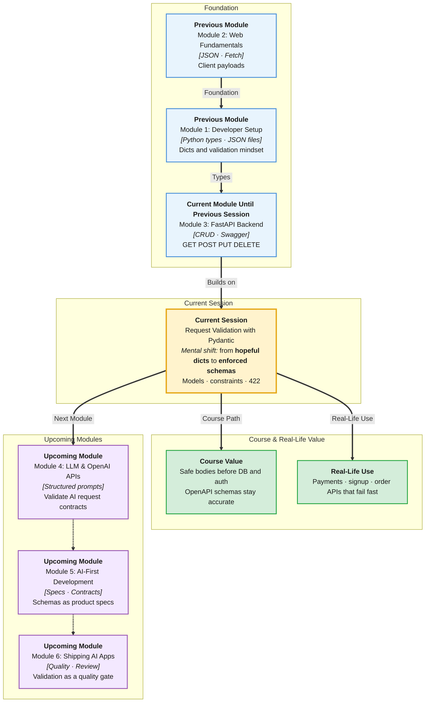

# Pre-Read: Request Validation with Pydantic

## Session Mindmap

This diagram shows where this session sits in the course.



## 1. What You'll Learn

In this pre-read, you'll discover:

- How to create **Pydantic models** with **type hints** (`str`, `int`, `float`, `bool`)
- How FastAPI **validates the request body** before your function runs
- How **response models** keep API output consistent
- How **field constraints** (`min_length`, `max_length`, required fields) stop junk data
- How to **read validation error JSON** (usually **422**) and fix the client payload

---

## 2. Detailed Explanation

### Why `dict` Is Not Enough

Last session POST accepted `book: dict`. A client can send `{"title": 99}` or `{}`. Your code then crashes or stores garbage.

**Pydantic** is a library that checks data against a **schema** (a declared shape with types).

**Analogy:** A college admission form. If age is blank or "abc", the office rejects it before the file enters the cabinet.

> **In the Real World:** **Stripe** rejects a payment if `amount` is missing. **IRCTC** rejects a PNR lookup if the PNR format is wrong. The API answers with a clear error, not a 500 crash.

**Why It Matters**

- Invalid JSON never reaches business logic
- `/docs` shows the schema automatically
- Response models hide internal fields you did not mean to leak

### Messy to Clear

**Messy:** `if "title" not in body: return error` in every route.

**Clear:** One `BookCreate` model. Every POST uses it.

### Building Blocks

```python
from pydantic import BaseModel, Field

class BookCreate(BaseModel):
    title: str = Field(min_length=1, max_length=80)
    year: int
```

- **`BaseModel`** — parent class for schemas
- **Type hints** — `title: str` means a string is required
- **`Field(...)`** — extra rules: length, numeric bounds
- **Required** — no default → client must send the field
- **Optional** — `year: int | None = None`

### Request Body Validation

```python
from fastapi import FastAPI

app = FastAPI()

@app.post("/books")
def create_book(book: BookCreate):
    return book
```

FastAPI parses JSON → Pydantic → your function gets a `BookCreate` instance. Bad JSON → **422 Unprocessable Entity**. Your function does not run.

### Response Models

```python
class BookOut(BaseModel):
    id: int
    title: str

@app.get("/books/{book_id}", response_model=BookOut)
def get_book(book_id: int):
    return {"id": book_id, "title": "SQL", "secret": "nope"}
```

`secret` is stripped from the JSON because it is not on `BookOut`.

### Reading Validation Errors

A typical 422 body looks like:

```json
{
  "detail": [
    {
      "type": "string_too_short",
      "loc": ["body", "title"],
      "msg": "String should have at least 1 character"
    }
  ]
}
```

- **`loc`** — where it failed (`body`, field name)
- **`msg`** — human-readable reason
- **`type`** — machine code for the rule

Fix the client JSON. Do not catch 422 inside the route — FastAPI already handled it.

**Python vs JS:** TypeScript interfaces document types. Pydantic **enforces** them at runtime on the server.

---

## 3. Practice Exercises

**Exercise 1 — Model sketch (3 min)**  
Write a `LostItemCreate` model: `title` string, `location` string, `found: bool`. Mark which fields are required.

**Exercise 2 — Constraint (3 min)**  
Add `Field(min_length=3, max_length=40)` on `title`. Predict: POST `{"title": "Hi", "location": "Lab", "found": true}` — pass or 422?

**Exercise 3 — Error reading (4 min)**  
Look at the 422 JSON above. Which field failed? What would you change in the payload?

**Exercise 4 — Response trim (3 min)**  
If `BookOut` has only `id` and `title`, and the function returns `secret`, does the client see `secret`? Why?

**Exercise 5 — Real-world (4 min)**  
A **Swiggy** "place order" body missing `address`. Should that be a 422 from the schema or a crash in the kitchen code? Write one sentence.
