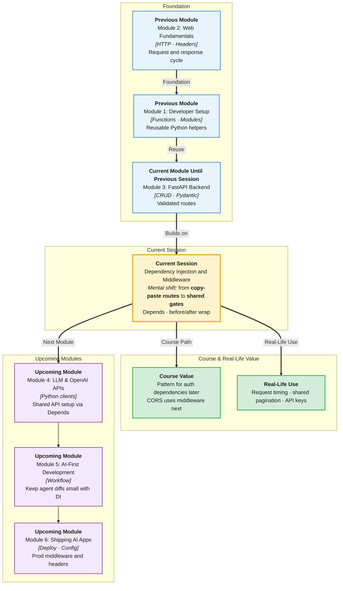

```mermaid
flowchart TB
    subgraph foundation ["Foundation"]
        direction TB
        P1["<b>Previous Module</b><br/>Module 2: Web Fundamentals<br/><i>[HTTP · Headers]</i><br/>Request and response cycle"]
        P2["<b>Previous Module</b><br/>Module 1: Developer Setup<br/><i>[Functions · Modules]</i><br/>Reusable Python helpers"]
        CM["<b>Current Module Until Previous Session</b><br/>Module 3: FastAPI Backend<br/><i>[CRUD · Pydantic]</i><br/>Validated routes"]
    end

    subgraph current ["Current Session"]
        CS["<b>Current Session</b><br/>Dependency Injection and Middleware<br/><i>Mental shift:</i> from <b>copy-paste routes</b> to <b>shared gates</b><br/>Depends · before/after wrap"]
    end

    subgraph value ["Course & Real-Life Value"]
        CV["<b>Course Value</b><br/>Pattern for auth dependencies later<br/>CORS uses middleware next"]
        RL["<b>Real-Life Use</b><br/>Request timing · shared pagination · API keys"]
    end

    subgraph future ["Upcoming Modules"]
        direction TB
        U1["<b>Upcoming Module</b><br/>Module 4: LLM & OpenAI APIs<br/><i>[Python clients]</i><br/>Shared API setup via Depends"]
        U2["<b>Upcoming Module</b><br/>Module 5: AI-First Development<br/><i>[Workflow]</i><br/>Keep agent diffs small with DI"]
        U3["<b>Upcoming Module</b><br/>Module 6: Shipping AI Apps<br/><i>[Deploy · Config]</i><br/>Prod middleware and headers"]
    end

    P1 ==>|&nbsp;Foundation&nbsp;| P2
    P2 ==>|&nbsp;Reuse&nbsp;| CM
    CM ==>|&nbsp;Builds on&nbsp;| CS
    CS ==>|&nbsp;Course Path&nbsp;| CV
    CS ==>|&nbsp;Real-Life Use&nbsp;| RL
    CS ==>|&nbsp;Next Module&nbsp;| U1
    U1 -.-> U2
    U2 -.-> U3

    classDef previous fill:#E8F4FD,stroke:#4A90D9,stroke-width:2px,color:#1a1a1a
    classDef current fill:#FFF3CD,stroke:#E6A817,stroke-width:3px,color:#1a1a1a
    classDef value fill:#D4EDDA,stroke:#28A745,stroke-width:2px,color:#1a1a1a
    classDef future fill:#F3E8FF,stroke:#9B59B6,stroke-width:2px,color:#1a1a1a

    class P1,P2,CM previous
    class CS current
    class CV,RL value
    class U1,U2,U3 future

    linkStyle default stroke-width:3px
```
