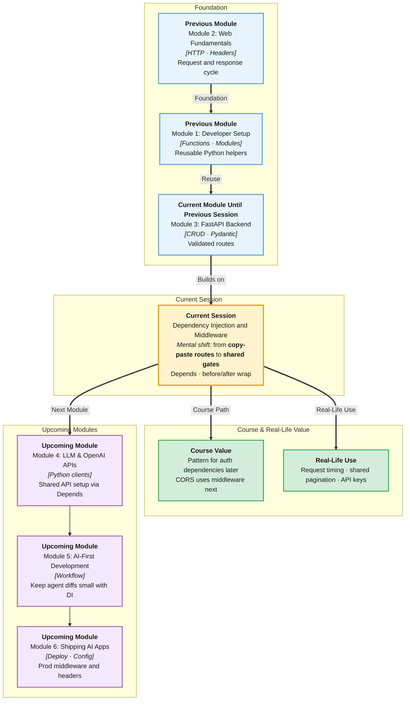

# Pre-Read: Dependency Injection & Middleware

## Session Mindmap

This diagram shows where this session sits in the course.



## 1. What You'll Learn

In this pre-read, you'll discover:

- What **dependency injection (DI)** means in FastAPI and why routes stay thin
- How to **create and inject reusable dependencies** with `Depends()`
- How **middleware** wraps every request and response
- How one **shared dependency** can serve many endpoints
- How middleware runs **before and after** the route handler

---

## 2. Detailed Explanation

### Dependencies — Shared Setup for Routes

A **dependency** is a function FastAPI runs **before** (and sometimes after) your route. The route receives the result.

**Analogy:** Every exam hall needs an ID check. You do not copy the ID-check code into every question paper. One checker at the door. Each paper assumes "student is already verified."

> **In the Real World:** **Netflix** APIs share "current user" and "region." **Amazon** shares a request id for logs. They do not paste that setup into hundreds of handlers.

**Why It Matters**

- Common logic lives once — pagination defaults, fake "current campus," headers
- Tests can swap dependencies later (you only need the idea today)
- Routes stay readable: "give me the catalog, I already have settings"

### Messy to Clear

**Messy:** Copy `api_key = request.headers.get(...)` into ten functions.

**Clear:**

```python
from fastapi import Depends, FastAPI, Header, HTTPException

app = FastAPI()

def require_token(x_token: str | None = Header(default=None)):
    if x_token != "campus-secret":
        raise HTTPException(status_code=401, detail="Missing token")
    return x_token

@app.get("/grades", dependencies=[Depends(require_token)])
def grades():
    return {"ok": True}
```

`Depends(require_token)` **injects** the checker. Many routes can reuse it.

### Inject a Value Into the Function

```python
def pagination(skip: int = 0, limit: int = 10):
    return {"skip": skip, "limit": limit}

@app.get("/notices")
def list_notices(page: dict = Depends(pagination)):
    return page
```

Query params still work. FastAPI sees `pagination`'s parameters and adds them to the endpoint.

### Middleware — Around the Whole App

**Middleware** is code that runs for **every** request: first on the way in, then the route, then on the way out.

**Analogy:** A security camera at the building entrance. It logs everyone entering **and** leaving. It is not a single classroom rule; it is building-wide.

```python
import time
from fastapi import Request

@app.middleware("http")
async def log_time(request: Request, call_next):
    start = time.perf_counter()
    response = await call_next(request)
    ms = (time.perf_counter() - start) * 1000
    response.headers["X-Process-Ms"] = str(round(ms, 2))
    return response
```

Order:

1. Middleware code **before** `call_next` (inbound)
2. Route handler
3. Middleware code **after** `call_next` (outbound)

**DI vs middleware:** Dependency = selected routes, can return values. Middleware = all HTTP, wraps the response.

Stay with this logging/header example. Auth JWT is a later session.

---

## 3. Practice Exercises

**Exercise 1 — Why DI (3 min)**  
Three routes need the same `limit` default of 10. Why is a `pagination()` dependency better than copy-paste?

**Exercise 2 — Sketch Depends (4 min)**  
Write a dependency `campus_name()` that returns `"IITREICT"`. Inject it into `GET /info`. Predict the JSON.

**Exercise 3 — Shared (3 min)**  
List two endpoints that should both use `require_token` from this pre-read. Name one public endpoint that should not.

**Exercise 4 — Before/after (4 min)**  
In `log_time`, what runs before the route? What runs after? Where would you put "reject if path starts with /admin" conceptually?

**Exercise 5 — Real-world (3 min)**  
**IRCTC** logs every booking request's duration. Is that a good middleware candidate? Why, in one sentence?
