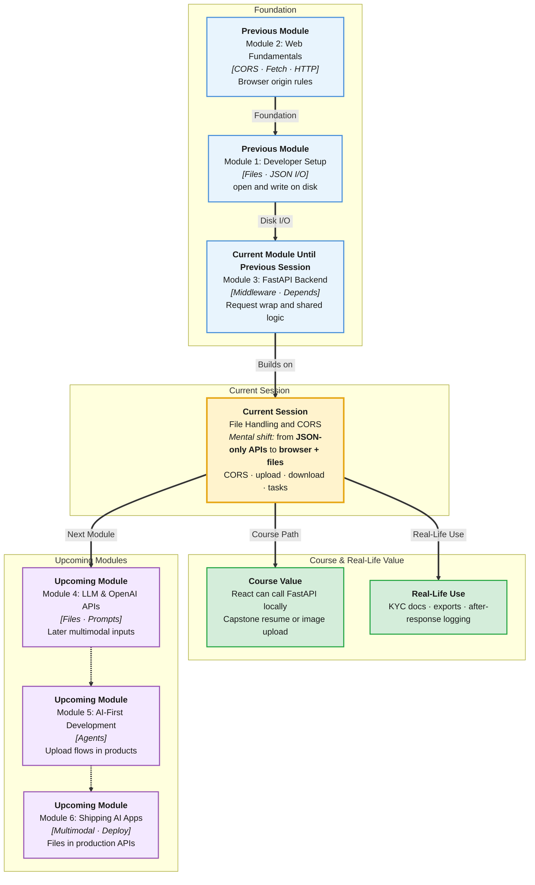

# Pre-Read: File Handling & CORS

## Session Mindmap

This diagram shows where this session sits in the course.



## 1. What You'll Learn

In this pre-read, you'll discover:

- How to **configure CORS middleware** so a React app on another origin can call FastAPI
- How to **add background tasks** that run after the response is sent
- How to **implement a basic file upload** with `UploadFile`
- How to **return a file download** with `FileResponse`
- **When background tasks** are right versus doing work **inside** the request

---

## 2. Detailed Explanation

### CORS — Browsers Guarding Origins

**CORS** (Cross-Origin Resource Sharing) is a browser rule. A page on `http://localhost:5173` (Vite/React) cannot read a response from `http://127.0.0.1:8000` unless the server allows it.

You already met CORS in "How the Web Works." Today you **configure it on FastAPI**.

**Analogy:** A hostel visitor desk. Students from another campus need a written pass. The backend issues that pass via headers like `Access-Control-Allow-Origin`.

> **In the Real World:** **Zomato**'s website origin is not the same as its API host. Without CORS, the browser blocks the JSON even if Postman works. That is why "works in Postman, fails in React" is a classic bug.

**Why It Matters**

- Local React + FastAPI is two origins during development
- Wrong CORS = blank UI and scary console errors
- Too-open CORS (`*`) with credentials is a future security lesson — start explicit

```python
from fastapi import FastAPI
from fastapi.middleware.cors import CORSMiddleware

app = FastAPI()
app.add_middleware(
    CORSMiddleware,
    allow_origins=["http://localhost:5173"],
    allow_methods=["*"],
    allow_headers=["*"],
)
```

This is **middleware**, like last session, built in for CORS.

### File Upload

```python
from fastapi import File, UploadFile

@app.post("/upload")
async def upload(file: UploadFile = File(...)):
    content = await file.read()
    return {"name": file.filename, "size": len(content)}
```

**UploadFile** streams the file. You get `filename` and bytes.

> **In the Real World:** **WhatsApp** status images, **Drive** uploads, campus assignment PDFs — all POST multipart forms, not JSON.

### File Download

```python
from fastapi.responses import FileResponse

@app.get("/download")
def download():
    return FileResponse("data/notes.txt", filename="notes.txt")
```

The client gets a file, not JSON. Browser may prompt Save As.

### Background Tasks vs Regular Handling

A **background task** runs **after** FastAPI has sent the response.

```python
from fastapi import BackgroundTasks

def write_log(msg: str):
    with open("data/log.txt", "a") as f:
        f.write(msg + "\n")

@app.post("/report")
def report(background_tasks: BackgroundTasks):
    background_tasks.add_task(write_log, "report requested")
    return {"status": "accepted"}
```

| Use background task | Do it in the request |
|---------------------|----------------------|
| Write a log line | Compute the JSON the user needs now |
| Send a "we got it" side effect | Validate and save the upload result to return |
| Work that can finish a moment later | Work the client must wait for |

**Mental model:** The user gets the receipt first. The kitchen prints a log slip after they leave the counter.

Do not use background tasks for "the upload itself" if the client needs to know the file is stored — do that in the handler, then optionally log in the background.

---

## 3. Practice Exercises

**Exercise 1 — Origin pair (3 min)**  
React at `http://localhost:5173`, API at `http://127.0.0.1:8000`. Are these the same origin? Should CORS be configured?

**Exercise 2 — Predict CORS (3 min)**  
Postman GET `/health` works. React fetch fails. Name the missing piece from this session.

**Exercise 3 — Upload (4 min)**  
Sketch a POST `/resume` that accepts `UploadFile`. Return filename and size only. Predict: is the body JSON or form-data in `/docs`?

**Exercise 4 — Download (3 min)**  
Write one sentence: difference between `return {"file": "..."}` and `FileResponse(...)`.

**Exercise 5 — Real-world choice (4 min)**  
User uploads a photo. You must return `{"saved": true}` only after bytes are on disk. Then you append a log line. Which part is the handler? Which is a background task? Why?
