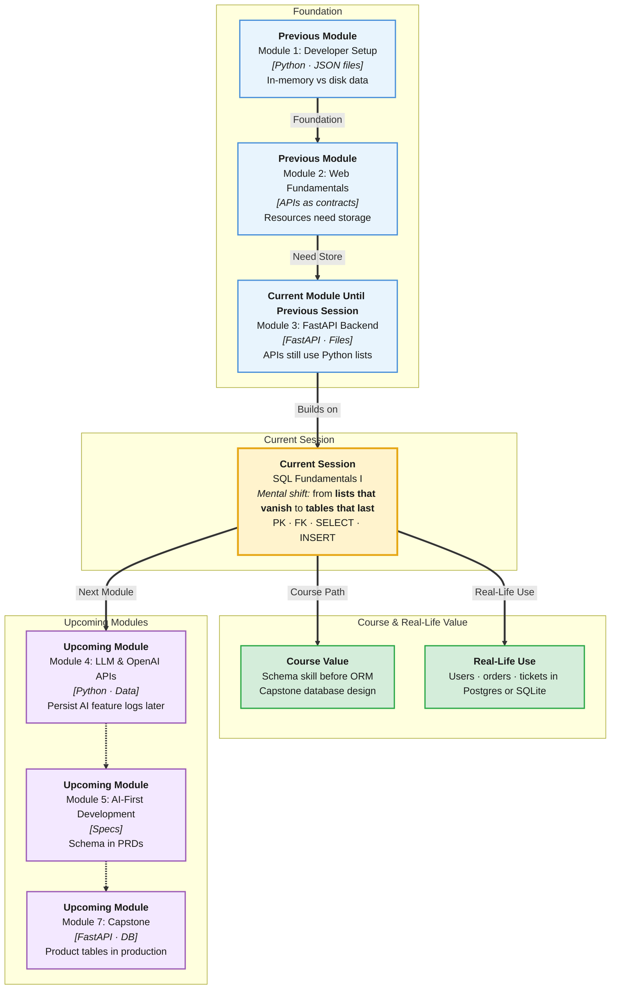

# Pre-Read: SQL Fundamentals I

## Session Mindmap

This diagram shows where this session sits in the course.



## 1. What You'll Learn

In this pre-read, you'll discover:

- **Why relational databases** beat a Python list for real backends
- How to **design tables** with **primary keys**, **foreign keys**, and simple constraints
- How to **write SELECT** to read rows
- How to **write INSERT** to add rows
- How to **create a simple schema** for a sample campus app (students and clubs)

---

## 2. Detailed Explanation

### Why Relational Databases

Your FastAPI books list **dies when Uvicorn restarts**. Two servers cannot share one Python list.

A **relational database** stores data in **tables** (rows and columns) on disk. Many API processes can read the same data. Queries are a standard language: **SQL**.

**Analogy:** A well-labeled Excel workbook that many staff can query — but with rules so two students cannot share one roll number.

> **In the Real World:** **IRCTC** seats, **SBI** balances, **Instagram** posts — not JSON files on one laptop. Banks use relational DBs because relationships and constraints prevent nonsense rows.

**Why It Matters**

- Data survives restarts
- **Primary keys** uniquely identify a row
- **Foreign keys** keep links valid (no club membership to a missing club)

### Messy to Clear

**Messy:** `users.json` with nested clubs copied inside every user. Update a club name in 400 places.

**Clear:** `clubs` table and `students` table. Membership points with ids.

### Building Blocks

| Idea | Meaning |
|------|---------|
| **Table** | A named grid (e.g. `students`) |
| **Row** | One record |
| **Column** | One field (`name`, `email`) |
| **PRIMARY KEY** | Unique id, usually `id` |
| **FOREIGN KEY** | Column that must match another table's PK |
| **NOT NULL** | Value required |
| **UNIQUE** | No duplicates (emails) |

### Sample Schema — Campus Clubs

```sql
CREATE TABLE clubs (
  id INTEGER PRIMARY KEY,
  name TEXT NOT NULL UNIQUE
);

CREATE TABLE students (
  id INTEGER PRIMARY KEY,
  name TEXT NOT NULL,
  email TEXT NOT NULL UNIQUE,
  club_id INTEGER,
  FOREIGN KEY (club_id) REFERENCES clubs(id)
);
```

One student belongs to at most one club here (`club_id`). That is a simple **many students → one club** sketch. Deeper relationship types are the next SQL session.

### INSERT

```sql
INSERT INTO clubs (id, name) VALUES (1, 'Robotics');
INSERT INTO students (id, name, email, club_id)
VALUES (1, 'Asha', 'asha@campus.edu', 1);
```

### SELECT

```sql
SELECT id, name, email FROM students;
SELECT name FROM students WHERE club_id = 1;
```

`SELECT` reads. It does not change rows. `WHERE` filters (more practice next session; a taste is fine).

**Python vs SQL:** Python loops filter lists in RAM. SQL filters on the database engine, close to the data.

You can practice in [SQLite Online](https://sqliteonline.com) or VS Code SQLite. FastAPI connection comes with SQLAlchemy later.

---

## 3. Practice Exercises

**Exercise 1 — Why DB (3 min)**  
Name two problems of the in-memory `books = []` list from REST week.

**Exercise 2 — PK vs FK (3 min)**  
In the schema above, which column is the PK of `students`? Which is the FK? What table does it point to?

**Exercise 3 — SELECT (4 min)**  
Write a SELECT that returns only `name` from `clubs`. Predict the column count.

**Exercise 4 — INSERT (4 min)**  
Write an INSERT for a second club `"Drama"`. Then insert student `"Ravi"` with email `ravi@campus.edu` in that club. Use ids 2.

**Exercise 5 — Real-world schema (5 min)**  
Design two tables for a tiny **library**: `books` and `members`. Include PKs. Add `borrowed_book_id` on members **or** skip it and only create `books` with `isbn UNIQUE`. Label constraints.
