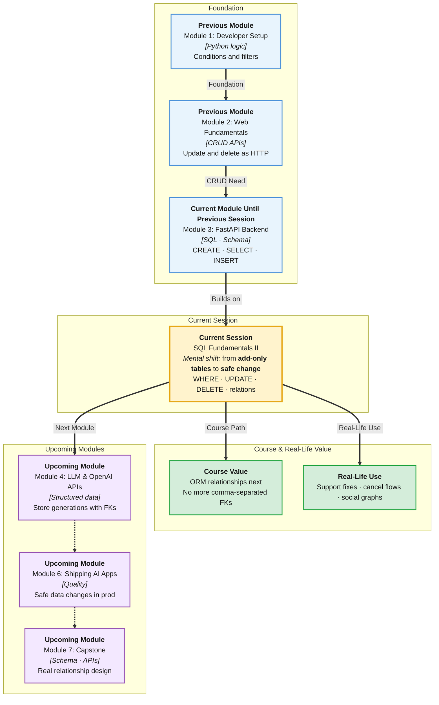

```mermaid
flowchart TB
    subgraph foundation ["Foundation"]
        direction TB
        P1["<b>Previous Module</b><br/>Module 1: Developer Setup<br/><i>[Python logic]</i><br/>Conditions and filters"]
        P2["<b>Previous Module</b><br/>Module 2: Web Fundamentals<br/><i>[CRUD APIs]</i><br/>Update and delete as HTTP"]
        CM["<b>Current Module Until Previous Session</b><br/>Module 3: FastAPI Backend<br/><i>[SQL · Schema]</i><br/>CREATE · SELECT · INSERT"]
    end

    subgraph current ["Current Session"]
        CS["<b>Current Session</b><br/>SQL Fundamentals II<br/><i>Mental shift:</i> from <b>add-only tables</b> to <b>safe change</b><br/>WHERE · UPDATE · DELETE · relations"]
    end

    subgraph value ["Course & Real-Life Value"]
        CV["<b>Course Value</b><br/>ORM relationships next<br/>No more comma-separated FKs"]
        RL["<b>Real-Life Use</b><br/>Support fixes · cancel flows · social graphs"]
    end

    subgraph future ["Upcoming Modules"]
        direction TB
        U1["<b>Upcoming Module</b><br/>Module 4: LLM & OpenAI APIs<br/><i>[Structured data]</i><br/>Store generations with FKs"]
        U2["<b>Upcoming Module</b><br/>Module 6: Shipping AI Apps<br/><i>[Quality]</i><br/>Safe data changes in prod"]
        U3["<b>Upcoming Module</b><br/>Module 7: Capstone<br/><i>[Schema · APIs]</i><br/>Real relationship design"]
    end

    P1 ==>|&nbsp;Foundation&nbsp;| P2
    P2 ==>|&nbsp;CRUD Need&nbsp;| CM
    CM ==>|&nbsp;Builds on&nbsp;| CS
    CS ==>|&nbsp;Course Path&nbsp;| CV
    CS ==>|&nbsp;Real-Life Use&nbsp;| RL
    CS ==>|&nbsp;Next Module&nbsp;| U1
    U1 -.-> U2
    U2 -.-> U3

    classDef previous fill:#E8F4FD,stroke:#4A90D9,stroke-width:2px,color:#1a1a1a
    classDef current fill:#FFF3CD,stroke:#E6A817,stroke-width:3px,color:#1a1a1a
    classDef value fill:#D4EDDA,stroke:#28A745,stroke-width:2px,color:#1a1a1a
    classDef future fill:#F3E8FF,stroke:#9B59B6,stroke-width:2px,color:#1a1a1a

    class P1,P2,CM previous
    class CS current
    class CV,RL value
    class U1,U2,U3 future

    linkStyle default stroke-width:3px
```
