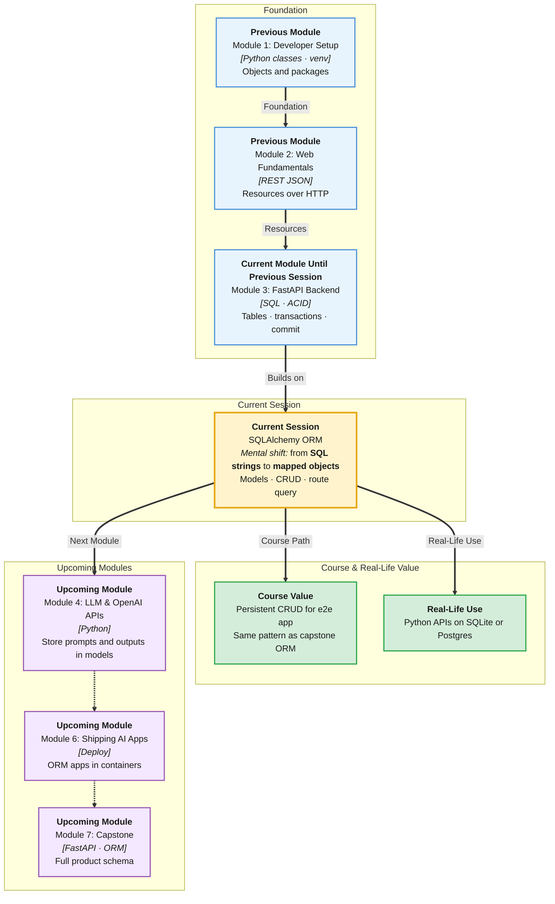

# Pre-Read: SQLAlchemy ORM

## Session Mindmap

This diagram shows where this session sits in the course.



## 1. What You'll Learn

In this pre-read, you'll discover:

- **ORM benefits** versus writing raw SQL in every FastAPI route
- How to **define SQLAlchemy models** that map to tables
- How to **SELECT, INSERT, UPDATE, DELETE** through the ORM
- How to set up **1-1, 1-many, and many-many** in models
- How to **connect a FastAPI route** to a simple ORM query

---

## 2. Detailed Explanation

### What Is an ORM?

An **ORM** (Object-Relational Mapper) lets you work with **Python classes** instead of typing SQL strings. SQLAlchemy is the common ORM with FastAPI.

**Analogy:** Raw SQL is driving a manual car. The ORM is an automatic — you still need to know the road (tables, keys, transactions).

> **In the Real World:** **Reddit**, many **Y Combinator** backends, and lots of Python startups use SQLAlchemy. They still expect you to understand the SQL you saw last week.

**Why It Matters**

- Models live next to Pydantic schemas
- Relationships match 1-1 / 1-many / many-many
- `commit()` is the transaction you studied in the masterclass

**Benefits vs raw SQL (for APIs):** fewer string bugs, reusable models, relationships as attributes. Raw SQL is still useful for special reports — not the default in every route.

### Messy to Clear

**Messy:** `cursor.execute("SELEC * FROM studnts")` — typo, runtime surprise.

**Clear:** `session.execute(select(Student)).scalars().all()` on a `Student` class the computer already checked.

### Models (tables as classes)

```python
from sqlalchemy import ForeignKey, String
from sqlalchemy.orm import DeclarativeBase, Mapped, mapped_column, relationship

class Base(DeclarativeBase):
    pass

class Club(Base):
    __tablename__ = "clubs"
    id: Mapped[int] = mapped_column(primary_key=True)
    name: Mapped[str] = mapped_column(String(80), unique=True)
    students: Mapped[list["Student"]] = relationship(back_populates="club")
```

That `students` list is **one-to-many** (one club, many students).

### CRUD via ORM

```python
# INSERT
club = Club(name="Robotics")
session.add(club)
session.commit()

# SELECT
row = session.get(Club, 1)

# UPDATE
row.name = "Robo"
session.commit()

# DELETE
session.delete(row)
session.commit()
```

`commit()` ends the transaction. Errors → `rollback()` (masterclass).

### Relationships in ORM

| Type | Pattern |
|------|---------|
| **1-many** | FK on the "many" side + `relationship` |
| **1-1** | FK with `unique=True` on the child |
| **many-many** | Association table + `relationship(secondary=...)` |

### FastAPI route + query

```python
@app.get("/clubs/{club_id}")
def read_club(club_id: int):
    club = session.get(Club, club_id)
    if not club:
        raise HTTPException(404)
    return {"id": club.id, "name": club.name}
```

Session wiring details expand in the end-to-end session. Today: one engine, one session, one GET.

---

## 3. Practice Exercises

**Exercise 1 — Why ORM (3 min)**  
Give two reasons an API team prefers models over SQL strings in every handler.

**Exercise 2 — Map a table (4 min)**  
Write a `Student` model: `id` PK, `name` string, `club_id` FK to `clubs.id`.

**Exercise 3 — Predict CRUD (3 min)**  
After `session.add(Club(name="Drama")); session.commit()`, what does `session.get` need to load it if you do not know the new id? (Hint: refresh or query by name.)

**Exercise 4 — Relationship pick (4 min)**  
Student ↔ IdCard (one card). Student ↔ Club with many clubs. Which ORM pattern for each?

**Exercise 5 — Real-world (4 min)**  
A **library** `GET /books/5` should use `session.get(Book, 5)`. What HTTP status if missing? Why not return `None` as 200?
