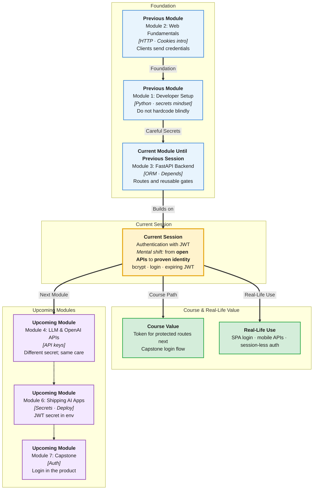

# Pre-Read: Authentication with JWT

## Session Mindmap

This diagram shows where this session sits in the course.



## 1. What You'll Learn

In this pre-read, you'll discover:

- The difference between **authentication** (who you are) and **authorization** (what you may do)
- How to **hash and verify passwords with bcrypt** — never store plain passwords
- How to **create and verify JWT** tokens in FastAPI
- How a **login endpoint** returns a JWT after a successful password check
- Why **token expiration** makes stolen tokens less dangerous

---

## 2. Detailed Explanation

### Authn vs Authz

**Authentication** answers: "Are you Asha?"  
**Authorization** answers: "May Asha delete this club?" (next session)

Today is mostly authentication: prove identity, issue a token.

**Analogy:** College ID card. **Authentication** is the photo check at the gate. **Authorization** is whether that ID opens the faculty lounge.

> **In the Real World:** **Gmail** login is authentication. Only the mailbox owner can delete mail — authorization. **IRCTC** login vs "cancel this PNR" is the same split.

**Why It Matters**

- APIs on the public internet cannot trust the client
- Plain-text passwords in SQLite are a disaster if the file leaks
- JWTs let the server stay stateless: no "memory of login" required for each GET

### Messy to Clear

**Messy:** `if password == user.password` stored as `"secret123"`.

**Clear:** Store a **bcrypt hash**. Verify with `bcrypt.checkpw`.

```python
import bcrypt

hashed = bcrypt.hashpw(b"secret123", bcrypt.gensalt())
ok = bcrypt.checkpw(b"secret123", hashed)
```

Hashing is one-way. Even the server should not "see" the original password again.

### JWT — A Signed Hall Pass

A **JWT** (JSON Web Token) is three Base64 parts: header, payload, signature.

The **payload** might hold `sub` (user id) and `exp` (expiry). The **signature** proves the server issued it.

```python
from datetime import datetime, timedelta, timezone
import jwt  # PyJWT

SECRET = "dev-only-change-me"
token = jwt.encode(
    {"sub": "1", "exp": datetime.now(timezone.utc) + timedelta(minutes=30)},
    SECRET,
    algorithm="HS256",
)
payload = jwt.decode(token, SECRET, algorithms=["HS256"])
```

**Create** = `encode`. **Verify** = `decode` with the same secret. Wrong secret or bad token → error.

### Login Endpoint

1. Client POST `{"email", "password"}`  
2. Load user, `checkpw`  
3. If ok, `encode` JWT, return `{"access_token": token}`  
4. If not, 401

Protecting routes with that token is the next session's main event. Today, login **returns** the JWT.

### Expiration

`exp` is a Unix time. After it, `decode` fails. Short-lived tokens (e.g. 30 minutes) limit damage if someone copies the token from DevTools.

---

## 3. Practice Exercises

**Exercise 1 — Authn or authz (3 min)**  
"Show student ID." "Only admins may POST /clubs." Label each.

**Exercise 2 — Predict bcrypt (3 min)**  
Two hashes of the same password look different (salt). Can `checkpw` still return True? Why use salt at all, in one phrase?

**Exercise 3 — JWT parts (3 min)**  
A JWT has three segments separated by dots. Which part stops a student from forging `sub=admin`?

**Exercise 4 — Login flow (4 min)**  
Order these: verify hash, return 401, encode JWT, read email from body. What is missing if we skip expiration?

**Exercise 5 — Real-world (4 min)**  
You leave a **GitHub** session open on a lab PC. Why do sites still expire tokens/sessions? Connect to `exp`.
