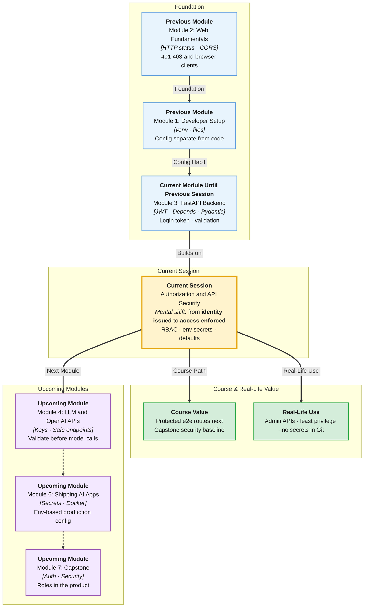

```mermaid
flowchart TB
    subgraph foundation ["Foundation"]
        direction TB
        P1["<b>Previous Module</b><br/>Module 2: Web Fundamentals<br/><i>[HTTP status · CORS]</i><br/>401 403 and browser clients"]
        P2["<b>Previous Module</b><br/>Module 1: Developer Setup<br/><i>[venv · files]</i><br/>Config separate from code"]
        CM["<b>Current Module Until Previous Session</b><br/>Module 3: FastAPI Backend<br/><i>[JWT · Depends · Pydantic]</i><br/>Login token · validation"]
    end

    subgraph current ["Current Session"]
        CS["<b>Current Session</b><br/>Authorization and API Security<br/><i>Mental shift:</i> from <b>identity issued</b> to <b>access enforced</b><br/>RBAC · env secrets · defaults"]
    end

    subgraph value ["Course & Real-Life Value"]
        CV["<b>Course Value</b><br/>Protected e2e routes next<br/>Capstone security baseline"]
        RL["<b>Real-Life Use</b><br/>Admin APIs · least privilege · no secrets in Git"]
    end

    subgraph future ["Upcoming Modules"]
        direction TB
        U1["<b>Upcoming Module</b><br/>Module 4: LLM and OpenAI APIs<br/><i>[Keys · Safe endpoints]</i><br/>Validate before model calls"]
        U2["<b>Upcoming Module</b><br/>Module 6: Shipping AI Apps<br/><i>[Secrets · Docker]</i><br/>Env-based production config"]
        U3["<b>Upcoming Module</b><br/>Module 7: Capstone<br/><i>[Auth · Security]</i><br/>Roles in the product"]
    end

    P1 ==>|&nbsp;Foundation&nbsp;| P2
    P2 ==>|&nbsp;Config Habit&nbsp;| CM
    CM ==>|&nbsp;Builds on&nbsp;| CS
    CS ==>|&nbsp;Course Path&nbsp;| CV
    CS ==>|&nbsp;Real-Life Use&nbsp;| RL
    CS ==>|&nbsp;Next Module&nbsp;| U1
    U1 -.-> U2
    U2 -.-> U3

    classDef previous fill:#E8F4FD,stroke:#4A90D9,stroke-width:2px,color:#1a1a1a
    classDef current fill:#FFF3CD,stroke:#E6A817,stroke-width:3px,color:#1a1a1a
    classDef value fill:#D4EDDA,stroke:#28A745,stroke-width:2px,color:#1a1a1a
    classDef future fill:#F3E8FF,stroke:#9B59B6,stroke-width:2px,color:#1a1a1a

    class P1,P2,CM previous
    class CS current
    class CV,RL value
    class U1,U2,U3 future

    linkStyle default stroke-width:3px
```
