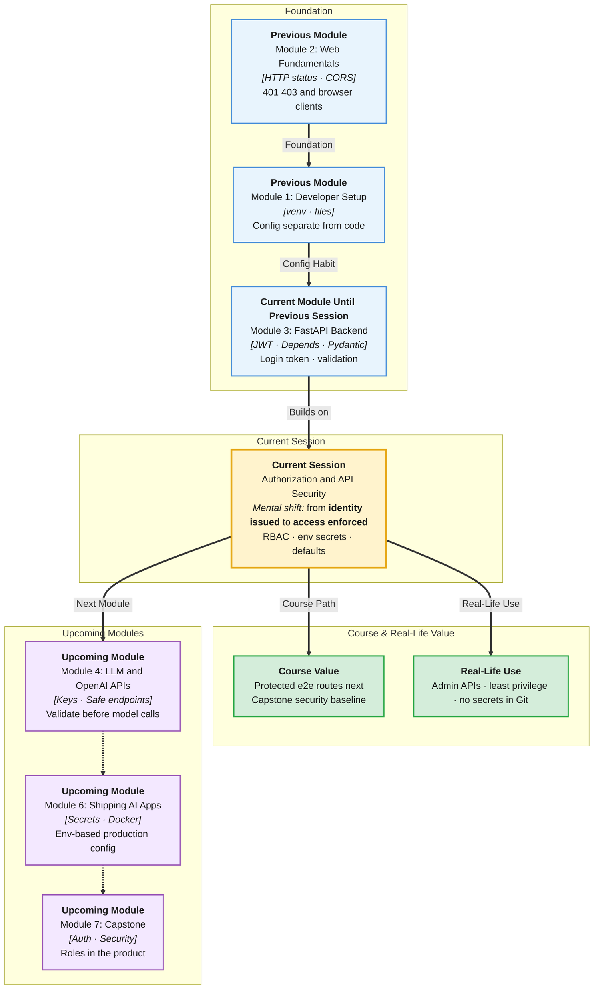

# Pre-Read: Authorization & API Security

## Session Mindmap

This diagram shows where this session sits in the course.



## 1. What You'll Learn

In this pre-read, you'll discover:

- How to **protect routes** with an **authentication dependency** that reads the JWT
- **RBAC basics** — **roles** (admin vs student) controlling who may call an endpoint
- How to **implement a simple role check** on selected routes
- How to keep **secrets in environment variables**, not in source code
- **Secure defaults**: keep **Pydantic validation**, avoid common API mistakes

---

## 2. Detailed Explanation

### From Token to Gate

Last session login **issued** a JWT. Today routes **demand** it.

A **dependency** (you built these earlier) can:

1. Read `Authorization: Bearer <token>`
2. `jwt.decode(...)`
3. Return the user (or raise 401)

**Analogy:** Wristband check at each ride, not only at the park gate.

> **In the Real World:** **GitHub** APIs expect a token. **AWS** IAM is a giant RBAC system. Your version is a `role` field on the user: `"student"` or `"admin"`.

**Why It Matters**

- Public GET /health can stay open; POST /clubs might be admin-only
- Secrets in GitHub = attackers mint tokens
- Validation + auth together stop both junk data and strangers

### Messy to Clear

**Messy:** `if token != "abc"` copied in eight routes. Secret in `main.py`.

**Clear:** `current_user = Depends(get_current_user)` and `JWT_SECRET` from the environment.

### Protecting Routes

```python
from fastapi import Depends, HTTPException

def get_current_user(token: str = Depends(oauth2_scheme)):
    try:
        payload = jwt.decode(token, SECRET, algorithms=["HS256"])
        return payload["sub"]
    except jwt.InvalidTokenError:
        raise HTTPException(status_code=401, detail="Invalid token")

@app.get("/me")
def me(user_id: str = Depends(get_current_user)):
    return {"user_id": user_id}
```

No token or bad token → **401**. Valid token, wrong role → **403 Forbidden**.

### RBAC Basics

**RBAC** (Role-Based Access Control) means permissions hang off a **role**, not a one-off username list.

| Role | Example |
|------|---------|
| `student` | GET own profile |
| `admin` | POST /clubs, DELETE /students |

```python
def require_admin(user: dict = Depends(get_current_user_full)):
    if user.get("role") != "admin":
        raise HTTPException(status_code=403, detail="Admins only")
    return user

@app.post("/clubs", dependencies=[Depends(require_admin)])
def create_club(...):
    ...
```

Selected routes only — not every route.

### Secrets in Environment Variables

```python
import os
SECRET = os.environ["JWT_SECRET"]
```

Set in the terminal: `export JWT_SECRET=...` (do not commit `.env` if it holds real secrets). Next modules deploy this idea further.

### Secure Defaults and Common Mistakes

- Keep **request validation** (Pydantic) on write routes
- Do not put tokens in query strings (`?token=` lands in logs)
- Same 401 for bad login (already practiced)
- Do not disable CORS `*` plus cookies without thought
- Do not return hashed passwords in JSON (response models)

---

## 3. Practice Exercises

**Exercise 1 — 401 vs 403 (3 min)**  
No token. Valid student token on admin route. Which status codes?

**Exercise 2 — Dependency (4 min)**  
Why does `Depends(get_current_user)` beat copy-paste `jwt.decode` in five files?

**Exercise 3 — RBAC table (4 min)**  
Fill: GET /health, GET /me, POST /clubs. Public, any logged-in user, or admin?

**Exercise 4 — Secret hunt (3 min)**  
You find `SECRET = "changeme"` in Git. What is the risk? Where should it live?

**Exercise 5 — Real-world mistake (4 min)**  
An intern returns the full user ORM object including `password_hash`. Which session idea (response model) stops this? Why is it a security default?
