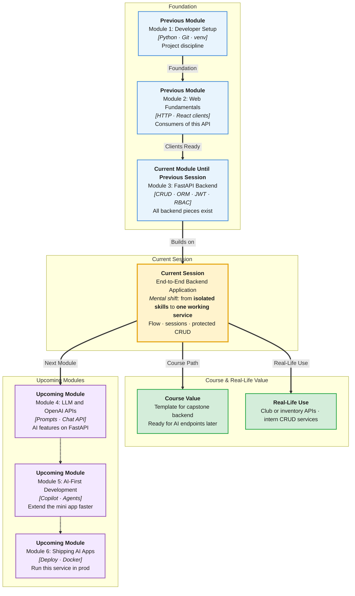

# Pre-Read: End-to-End Backend Application

## Session Mindmap

This diagram shows where this session sits in the course.



## 1. What You'll Learn

In this pre-read, you'll discover:

- The **full backend flow** from HTTP route → validation → session → SQL → JSON
- How to **build CRUD with persistent ORM storage** (survives restart)
- How to **wire SQLAlchemy sessions** into FastAPI (one session per request)
- How to **protect selected endpoints** with JWT auth from prior sessions
- What to watch in the **instructor-led mini backend app** so you can rebuild it

---

## 2. Detailed Explanation

### The Whole Pipe

Until now, skills arrived in slices. A real request walks the whole pipe:

1. Browser or Swagger sends HTTP  
2. CORS (if needed)  
3. Auth dependency (selected routes)  
4. Pydantic validates the body  
5. FastAPI path function runs  
6. SQLAlchemy **session** runs ORM CRUD  
7. **commit** or **rollback** (ACID)  
8. Response model → JSON

**Analogy:** A campus office file. Reception (HTTP) → ID check (JWT) → form completeness (Pydantic) → clerk writes in the register (ORM) → stamp (commit) → receipt (JSON).

> **In the Real World:** **Notion** saving a block, **Swiggy** placing an order, **LMS** submitting an assignment — this pipe, every time.

**Why It Matters**

- You can explain a 500: was it auth, validation, or DB?
- Capstone and Module 6 deploy this shape
- Restarting Uvicorn no longer wipes clubs

### Messy to Clear

**Messy:** Global `session = Session()` at import. Shared across users. Spooky bugs.

**Clear:** A `get_db` dependency:

```python
def get_db():
    db = SessionLocal()
    try:
        yield db
    finally:
        db.close()

@app.get("/clubs")
def list_clubs(db: Session = Depends(get_db)):
    return db.execute(select(Club)).scalars().all()
```

`yield` + `finally` closes the session after the response. Each request gets its own unit of work. Commit inside the route after writes.

### Mini App Shape (what you will follow)

A **campus clubs** API:

| Method | Path | Auth |
|--------|------|------|
| GET | `/clubs` | public |
| GET | `/clubs/{id}` | public |
| POST | `/clubs` | admin JWT |
| PUT | `/clubs/{id}` | admin JWT |
| DELETE | `/clubs/{id}` | admin JWT |
| POST | `/login` | public (issues JWT) |

Pydantic: `ClubCreate`, `ClubOut`. ORM: `Club` model. SQLite file.

### What to Watch in the Demo

- Table created once at startup (`create_all`)
- Seed admin user with bcrypt hash
- Failed POST without token  
- Successful POST with admin token  
- GET still works after **restart**

You are not adding new libraries beyond what Module 3 already used.

---

## 3. Practice Exercises

**Exercise 1 — Trace (4 min)**  
User POST /clubs with JSON. List the steps from CORS to commit in order (use the pipe above).

**Exercise 2 — Persistence (3 min)**  
Why does GET still show a club after Uvicorn `--reload` if it was committed to SQLite?

**Exercise 3 — Session (3 min)**  
Why `yield` + `close` in `get_db` instead of one global session?

**Exercise 4 — Protect (3 min)**  
Which of the six routes in the table stay public and why?

**Exercise 5 — Real-world (5 min)**  
Map **IRCTC** "book ticket" to this pipe: which step is payment write, which is auth, which is validation of passenger count? One line each.
