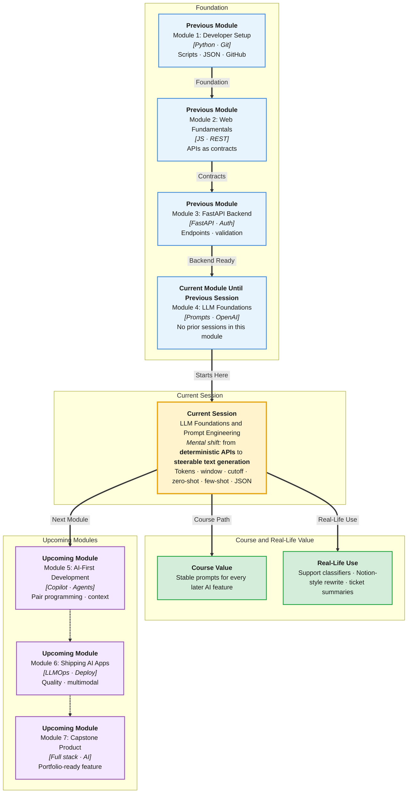

```mermaid
%%{init: {'flowchart': {'nodeSpacing': 42, 'rankSpacing': 54, 'padding': 18}}}%%
flowchart TB
    subgraph foundation ["Foundation"]
        direction TB
        P1["<b>Previous Module</b><br/>Module 1: Developer Setup<br/><i>[Python · Git]</i><br/>Scripts · JSON · GitHub"]
        P2["<b>Previous Module</b><br/>Module 2: Web Fundamentals<br/><i>[JS · REST]</i><br/>APIs as contracts"]
        P3["<b>Previous Module</b><br/>Module 3: FastAPI Backend<br/><i>[FastAPI · Auth]</i><br/>Endpoints · validation"]
        CM["<b>Current Module Until Previous Session</b><br/>Module 4: LLM Foundations<br/><i>[Prompts · OpenAI]</i><br/>No prior sessions in this module"]
    end

    subgraph current ["Current Session"]
        CS["<b>Current Session</b><br/>LLM Foundations and Prompt Engineering<br/><i>Mental shift:</i> from <b>deterministic APIs</b> to <b>steerable text generation</b><br/>Tokens · window · cutoff · zero-shot · few-shot · JSON"]
    end

    subgraph value ["Course and Real-Life Value"]
        CV["<b>Course Value</b><br/>Stable prompts for every later AI feature"]
        RL["<b>Real-Life Use</b><br/>Support classifiers · Notion-style rewrite · ticket summaries"]
    end

    subgraph future ["Upcoming Modules"]
        direction TB
        U1["<b>Upcoming Module</b><br/>Module 5: AI-First Development<br/><i>[Copilot · Agents]</i><br/>Pair programming · context"]
        U2["<b>Upcoming Module</b><br/>Module 6: Shipping AI Apps<br/><i>[LLMOps · Deploy]</i><br/>Quality · multimodal"]
        U3["<b>Upcoming Module</b><br/>Module 7: Capstone Product<br/><i>[Full stack · AI]</i><br/>Portfolio-ready feature"]
    end

    P1 ==>|&nbsp;Foundation&nbsp;| P2
    P2 ==>|&nbsp;Contracts&nbsp;| P3
    P3 ==>|&nbsp;Backend Ready&nbsp;| CM
    CM ==>|&nbsp;Starts Here&nbsp;| CS
    CS ==>|&nbsp;Course Path&nbsp;| CV
    CS ==>|&nbsp;Real-Life Use&nbsp;| RL
    CS ==>|&nbsp;Next Module&nbsp;| U1
    U1 -.-> U2
    U2 -.-> U3

    classDef previous fill:#E8F4FD,stroke:#4A90D9,stroke-width:2px,color:#1a1a1a
    classDef current fill:#FFF3CD,stroke:#E6A817,stroke-width:3px,color:#1a1a1a
    classDef value fill:#D4EDDA,stroke:#28A745,stroke-width:2px,color:#1a1a1a
    classDef future fill:#F3E8FF,stroke:#9B59B6,stroke-width:2px,color:#1a1a1a

    class P1,P2,P3,CM previous
    class CS current
    class CV,RL value
    class U1,U2,U3 future

    linkStyle default stroke-width:3px
```
