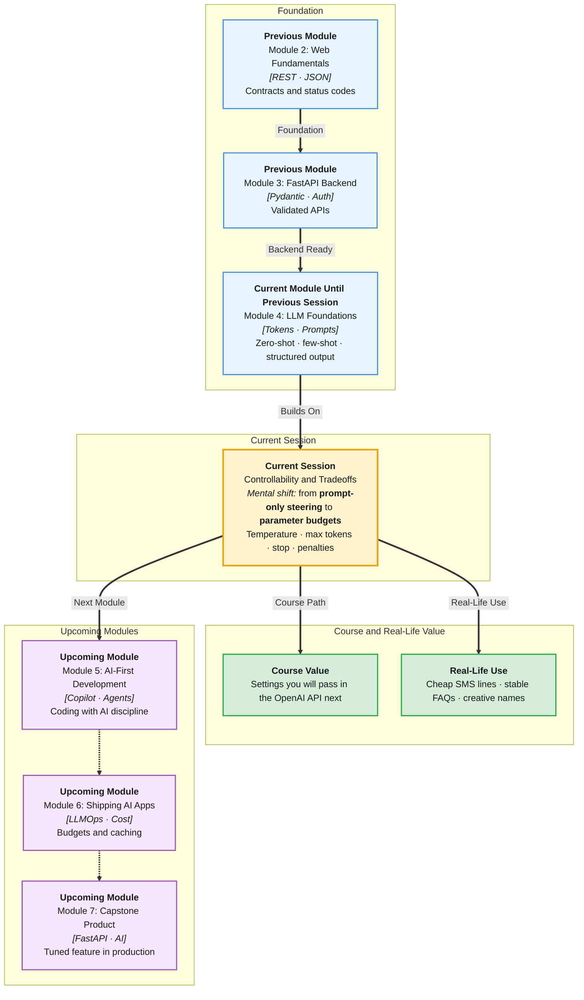

```mermaid
%%{init: {'flowchart': {'nodeSpacing': 42, 'rankSpacing': 54, 'padding': 18}}}%%
flowchart TB
    subgraph foundation ["Foundation"]
        direction TB
        P1["<b>Previous Module</b><br/>Module 2: Web Fundamentals<br/><i>[REST · JSON]</i><br/>Contracts and status codes"]
        P2["<b>Previous Module</b><br/>Module 3: FastAPI Backend<br/><i>[Pydantic · Auth]</i><br/>Validated APIs"]
        CM["<b>Current Module Until Previous Session</b><br/>Module 4: LLM Foundations<br/><i>[Tokens · Prompts]</i><br/>Zero-shot · few-shot · structured output"]
    end

    subgraph current ["Current Session"]
        CS["<b>Current Session</b><br/>Controllability and Tradeoffs<br/><i>Mental shift:</i> from <b>prompt-only steering</b> to <b>parameter budgets</b><br/>Temperature · max tokens · stop · penalties"]
    end

    subgraph value ["Course and Real-Life Value"]
        CV["<b>Course Value</b><br/>Settings you will pass in the OpenAI API next"]
        RL["<b>Real-Life Use</b><br/>Cheap SMS lines · stable FAQs · creative names"]
    end

    subgraph future ["Upcoming Modules"]
        direction TB
        U1["<b>Upcoming Module</b><br/>Module 5: AI-First Development<br/><i>[Copilot · Agents]</i><br/>Coding with AI discipline"]
        U2["<b>Upcoming Module</b><br/>Module 6: Shipping AI Apps<br/><i>[LLMOps · Cost]</i><br/>Budgets and caching"]
        U3["<b>Upcoming Module</b><br/>Module 7: Capstone Product<br/><i>[FastAPI · AI]</i><br/>Tuned feature in production"]
    end

    P1 ==>|&nbsp;Foundation&nbsp;| P2
    P2 ==>|&nbsp;Backend Ready&nbsp;| CM
    CM ==>|&nbsp;Builds On&nbsp;| CS
    CS ==>|&nbsp;Course Path&nbsp;| CV
    CS ==>|&nbsp;Real-Life Use&nbsp;| RL
    CS ==>|&nbsp;Next Module&nbsp;| U1
    U1 -.-> U2
    U2 -.-> U3

    classDef previous fill:#E8F4FD,stroke:#4A90D9,stroke-width:2px,color:#1a1a1a
    classDef current fill:#FFF3CD,stroke:#E6A817,stroke-width:3px,color:#1a1a1a
    classDef value fill:#D4EDDA,stroke:#28A745,stroke-width:2px,color:#1a1a1a
    classDef future fill:#F3E8FF,stroke:#9B59B6,stroke-width:2px,color:#1a1a1a

    class P1,P2,CM previous
    class CS current
    class CV,RL value
    class U1,U2,U3 future

    linkStyle default stroke-width:3px
```
