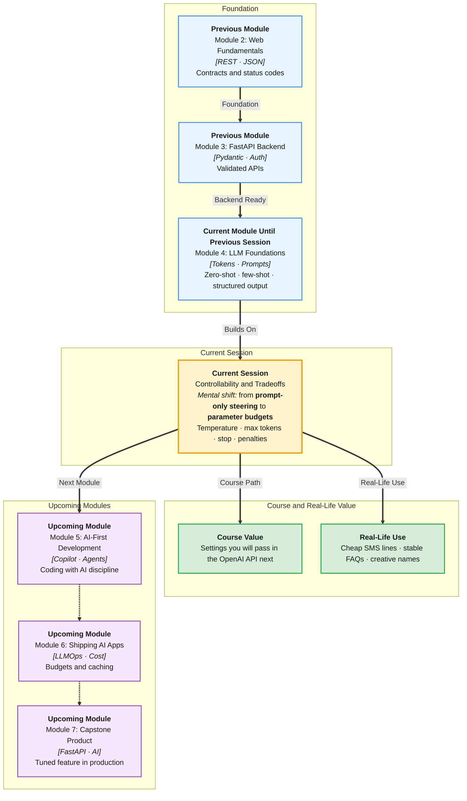

# Pre-Read: Controllability & Tradeoffs

## Session Mindmap

This diagram shows where this session sits in the course.



## 1. What You'll Learn

In this pre-read, you'll discover:

- When **temperature** changes creativity versus consistency
- How **max tokens** caps length and helps control **cost**
- How **stop sequences** cut generation at a chosen boundary
- What **frequency** and **presence penalties** do to repetition and novelty
- How to **tune parameters** for a product use case and compare tradeoffs

---

## 2. Detailed Explanation

### Generation Has Knobs

Last session you steered the model with **words**. This session you steer it with **numbers**. The prompt is the recipe. Parameters are oven temperature and timer.

**One-line definition:** Controllability means choosing generation settings so output length, variety, and cost match the product.

**Analogy:** A karaoke machine. Prompt = song choice. Temperature = how much the singer improvises. Max tokens = when the mic cuts. Stop sequence = end at the chorus.

> **In the Real World:** **ChatGPT**'s creative writing feels different from a bank FAQ bot. Teams pick settings **per feature**, not one global "AI vibe."

### Temperature — When It Matters

**Temperature** (typical range 0 to 2 on many APIs) controls how "peaky" vs "flat" the next-token probabilities are.

- **Low** (near 0): pick the most likely tokens. Good for classification, JSON, policies.
- **Medium**: natural prose with some variety. Good for summaries.
- **High**: more surprise. Good for slogans, names, brainstorming.

**When temperature matters:**
- The task has **many valid answers** (taglines)
- You need **repeatable** labels (intent = refund)
- QA must **reproduce** a bug

**When it matters less:**
- You already forced a tiny output space (`yes` or `no`)
- The prompt is so tight that only one completion fits

**Why It Matters:** A high-temperature classifier will sometimes invent a fourth category. A zero-temperature slogan tool will sound boring.

**Benefits:**
- Match the feature: legal vs marketing
- Reduce flaky tests
- Explain "why two runs differed" to your PM

### Max Tokens — Length and Cost

**Max tokens** is a hard cap on how many tokens the **reply** can use (plus you still pay for the prompt).

If the cap is too small, answers **cut off** mid-sentence or mid-JSON. If too large, a rambling model can spend money and time.

**Messy:** `max tokens = 4000` for a one-word label.  
**Clear:** `max tokens = 16` for `refund|shipping|other`.

Cost intuition: you pay for **input + output** tokens. Shorter completions are cheaper when the task allows it.

> **In the Real World:** **Intercom** snippet replies stay short on purpose. Long essays would slow agents and inflate bills. **Notion AI** "page draft" allows a larger cap because the user asked for a document.

### Stop Sequences

A **stop sequence** is a string that tells the generator **halt now**. The stop text is usually **not** included in the returned completion.

Examples:
- Stop at `\n\n` so you get one paragraph
- Stop at `END` after a template
- Stop at `}` only when you fully understand JSON (easy to get wrong — prefer "JSON only" + max tokens for beginners)

**Use stop sequences** when the model should fill a **blank in a template**.

```
Customer: I need a refund.
Agent:
```

Stop at `Customer:` so the model does not invent the next user line.

### Frequency and Presence Penalties

These penalties discourage the model from **repeating itself**.

- **Frequency penalty:** the more often a token already appeared, the more you downweight it. Fights "very very very."
- **Presence penalty:** if a token appeared **at all**, downweight it. Pushes toward **new** topics/words.

**Analogy:** Frequency = "stop saying the same word." Presence = "talk about something else now."

Use lightly. High penalties can make JSON keys disappear or force odd synonyms (`reimbursement` instead of `refund`) which **breaks parsers**.

> **In the Real World:** Brainstorming **Myntra** campaign names may use a presence penalty so you get ten distinct names. A **Zerodha**-style FAQ answer should **not** synonym-swap "demat" into made-up jargon.

### Tune for a Product Use Case

Pick a feature. Write the goal. Then choose a **bundle**:

| Feature | Temperature | Max tokens | Stop | Penalties |
|---------|-------------|------------|------|-----------|
| Intent JSON | low | small | optional | off / very low |
| Support summary | low–medium | medium | maybe `\n\n` | low |
| Ad slogans | higher | small per slogan | newline between ideas | mild presence |

**Tradeoffs to say out loud:**
- Consistency vs novelty
- Completeness vs cost/latency
- Natural prose vs parseable structure
- Less repetition vs broken required keywords

**Small example (settings you would pass later in code):**

```python
settings = {
    "temperature": 0,
    "max_tokens": 40,
    "stop": ["\n\n"],
    "frequency_penalty": 0,
    "presence_penalty": 0,
}
```

That bundle fits a one-paragraph, stable summary.

### Building Blocks

- Know the **job**: classify, summarise, invent
- Cap **length** before you ship
- Add **stop** when filling templates
- Nudge **penalties** only if repetition is the bug
- Compare two bundles on the **same three examples**

---

## 3. Practice Exercises

**Exercise 1 — Temperature choice**  
Feature: extract `order_id` as JSON. Pick low or high temperature. Write one sentence why.

**Exercise 2 — Max tokens**  
You need a 12-word SMS. Is `max_tokens = 500` a good default? What goes wrong?

**Exercise 3 — Stop sequence**  
Template: `Title: ` then the model writes a title. Which stop might keep it to one line: `\n` or nothing? Why?

**Exercise 4 — Penalties**  
A slogan model repeats "fresh" five times. Would you try frequency penalty, presence penalty, or both? One sentence.

**Exercise 5 — Tradeoff table**  
For "bank policy chatbot" vs "festival caption generator," fill temperature (low/high) and max tokens (small/large) for each. Note one risk if you swap the two bundles.
