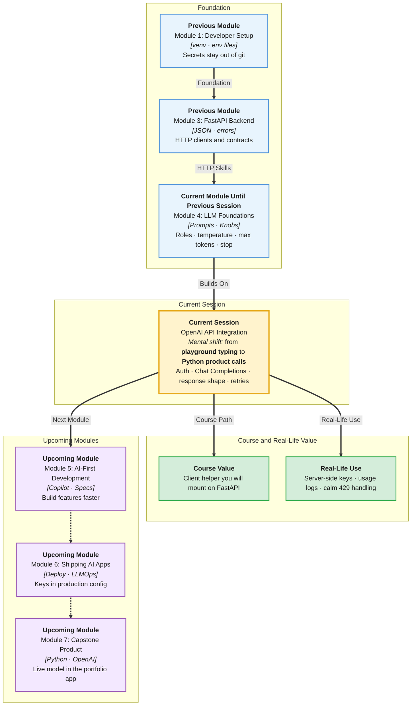

# Pre-Read: OpenAI API Integration

## Session Mindmap

This diagram shows where this session sits in the course.



## 1. What You'll Learn

In this pre-read, you'll discover:

- How to **authenticate** to the OpenAI API from a **Python** project
- How **Chat Completions** use **system**, **user**, and **assistant** messages
- How to **read the response object** and pull out the text you need
- How to handle **errors**, **retries**, and **rate limits** like a professional
- How to pass **temperature**, **max_tokens**, and **stop** from the last session

---

## 2. Detailed Explanation

### From Playground to Python

You typed prompts in a website. Products call an **HTTP API**. Python sends JSON and receives JSON.

**One-line definition:** The OpenAI API is a remote service that runs a chat model when you send messages and a secret key.

**Analogy:** A locked vending machine. The key is your **API key**. The buttons are messages and parameters. The can that drops is the **response**.

> **In the Real World:** Startups in Bengaluru and teams at **Microsoft** partners wrap this same pattern: env var for the key, one client helper, logs without printing secrets.

### Authentication in Python

Never paste the key in GitHub.

1. Create a key in the OpenAI dashboard (instructor will demo the idea).
2. Store it in a `.env` file: `OPENAI_API_KEY=sk-...`
3. Add `.env` to `.gitignore` (you already learned this).
4. Load it in Python (common pattern: environment variable).

```python
import os
from openai import OpenAI

client = OpenAI(api_key=os.environ["OPENAI_API_KEY"])
```

If the key is missing, fail **fast** with a clear local error. Do not proceed with an empty string.

### Chat Completions and Roles

**Chat Completions** means you send a **list of messages**. Each message has a **role** and **content**.

| Role | Job |
|------|-----|
| **system** | Standing rules: who the model is, format, safety |
| **user** | The human or app request this turn |
| **assistant** | Prior model replies (for multi-turn) |

**Zero-shot product call:** system + one user message.  
**Few-shot:** user/assistant pairs as examples, then the real user message.

```python
messages = [
    {"role": "system", "content": "Return JSON only."},
    {"role": "user", "content": "Classify: where is my order?"},
]
```

This is the same role prompting you wrote in English, now as data.

### Response Structure

A typical successful response includes:
- an **id**
- a **choices** list
- `choices[0].message.content` — the text you show or parse
- **usage** — prompt and completion token counts (cost signal)

**Messy:** print the whole object and hope.  
**Clear:** read `content`, then optionally log `usage`.

```python
resp = client.chat.completions.create(
    model="gpt-4o-mini",
    messages=messages,
)
text = resp.choices[0].message.content
```

Model names change over time. In class, use the model the instructor names. The **shape** of chat messages stays the skill.

### Errors, Retries, Rate Limits

Networks fail. Keys expire. You send too many requests.

**Professional pattern:**
- Catch API errors (bad key, bad request, server error)
- **Retry** only **temporary** failures (timeouts, 429, 5xx) with a short wait
- Do **not** retry forever
- On **429 rate limit**, wait and retry a few times; then show a friendly "busy, try again"
- Never dump raw API bodies with keys into user-facing HTML

**Analogy:** If the metro gate beeps, you wait and tap again. If your card is invalid, waiting does not help.

> **In the Real World:** **Slack**-like bots that hammer the API on every keystroke get rate-limited. Products **debounce** and **retry with backoff** (wait 1s, 2s, 4s — idea only).

### Pass Temperature, Max Tokens, Stop

Last session's bundle becomes arguments:

```python
resp = client.chat.completions.create(
    model="gpt-4o-mini",
    messages=messages,
    temperature=0,
    max_tokens=64,
    stop=["\n\n"],
)
```

Use the bookstore or classifier bundle you already chose. Do not invent new knobs in this session.

### Why It Matters

Playground demos do not ship. Python + env vars + error handling is how **your FastAPI AI endpoint** (next session) will call the model.

**Benefits:**
- Secrets stay off GitHub
- You can parse `content` into JSON
- Users see calm errors instead of stack traces
- Cost knobs actually apply in production code

### Building Blocks

- Client created with env key
- `messages` list with roles
- Read `choices[0].message.content`
- Try/except + limited retries
- `temperature`, `max_tokens`, `stop` passed in

---

## 3. Practice Exercises

**Exercise 1 — Secret hygiene**  
You committed `sk-live-xxxxx` in `app.py`. Write three steps to fix this professionally.

**Exercise 2 — Roles**  
Label each as system, user, or assistant: (a) "You classify tickets." (b) "My charger is missing." (c) a previous model JSON reply you send back for multi-turn.

**Exercise 3 — Response path**  
In one line of pseudocode, get the assistant text from `resp`.

**Exercise 4 — Retry or not**  
Should you retry a 401 invalid key? Should you retry a 429? Yes/no each, one reason each.

**Exercise 5 — Parameters**  
Copy your "intent JSON" bundle: write the `create(...)` arguments for temperature, max_tokens, and stop (stop may be `None` if unused).
