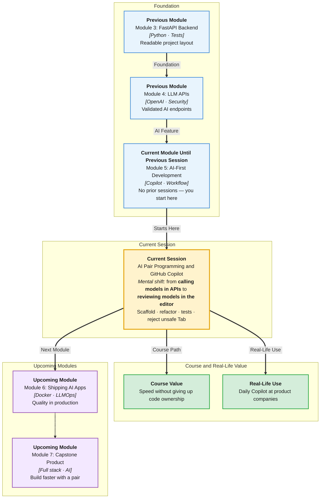

```mermaid
%%{init: {'flowchart': {'nodeSpacing': 42, 'rankSpacing': 54, 'padding': 18}}}%%
flowchart TB
    subgraph foundation ["Foundation"]
        direction TB
        P1["<b>Previous Module</b><br/>Module 3: FastAPI Backend<br/><i>[Python · Tests]</i><br/>Readable project layout"]
        P2["<b>Previous Module</b><br/>Module 4: LLM APIs<br/><i>[OpenAI · Security]</i><br/>Validated AI endpoints"]
        CM["<b>Current Module Until Previous Session</b><br/>Module 5: AI-First Development<br/><i>[Copilot · Workflow]</i><br/>No prior sessions — you start here"]
    end

    subgraph current ["Current Session"]
        CS["<b>Current Session</b><br/>AI Pair Programming and GitHub Copilot<br/><i>Mental shift:</i> from <b>calling models in APIs</b> to <b>reviewing models in the editor</b><br/>Scaffold · refactor · tests · reject unsafe Tab"]
    end

    subgraph value ["Course and Real-Life Value"]
        CV["<b>Course Value</b><br/>Speed without giving up code ownership"]
        RL["<b>Real-Life Use</b><br/>Daily Copilot at product companies"]
    end

    subgraph future ["Upcoming Modules"]
        direction TB
        U1["<b>Upcoming Module</b><br/>Module 6: Shipping AI Apps<br/><i>[Docker · LLMOps]</i><br/>Quality in production"]
        U2["<b>Upcoming Module</b><br/>Module 7: Capstone Product<br/><i>[Full stack · AI]</i><br/>Build faster with a pair"]
    end

    P1 ==>|&nbsp;Foundation&nbsp;| P2
    P2 ==>|&nbsp;AI Feature&nbsp;| CM
    CM ==>|&nbsp;Starts Here&nbsp;| CS
    CS ==>|&nbsp;Course Path&nbsp;| CV
    CS ==>|&nbsp;Real-Life Use&nbsp;| RL
    CS ==>|&nbsp;Next Module&nbsp;| U1
    U1 -.-> U2

    classDef previous fill:#E8F4FD,stroke:#4A90D9,stroke-width:2px,color:#1a1a1a
    classDef current fill:#FFF3CD,stroke:#E6A817,stroke-width:3px,color:#1a1a1a
    classDef value fill:#D4EDDA,stroke:#28A745,stroke-width:2px,color:#1a1a1a
    classDef future fill:#F3E8FF,stroke:#9B59B6,stroke-width:2px,color:#1a1a1a

    class P1,P2,CM previous
    class CS current
    class CV,RL value
    class U1,U2 future

    linkStyle default stroke-width:3px
```
