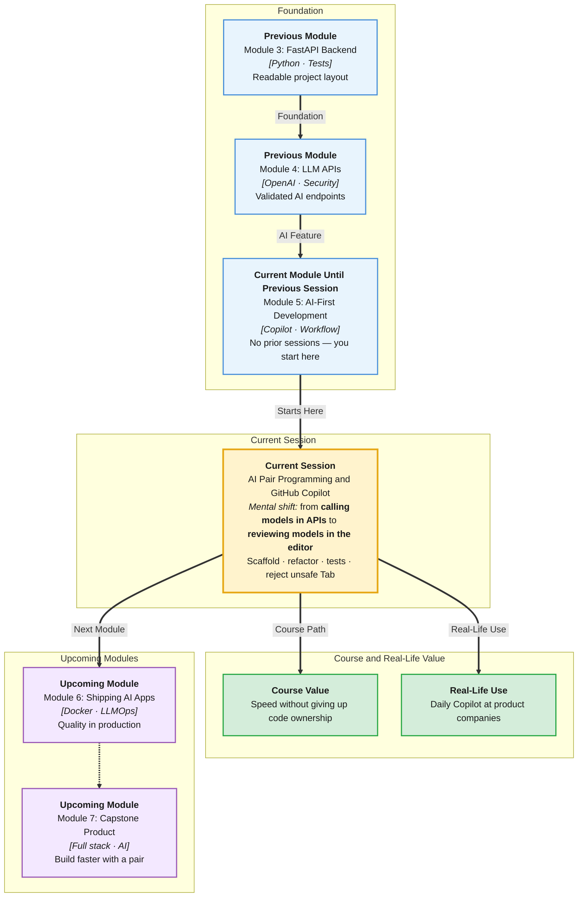

# Pre-Read: AI Pair Programming & GitHub Copilot

## Session Mindmap

This diagram shows where this session sits in the course.



## 1. What You'll Learn

In this pre-read, you'll discover:

- How to use **AI as a pair programmer** for scaffolding, refactoring, and explaining
- How **GitHub Copilot** suggests code, **docstrings**, and **tests**
- How to apply Copilot when **debugging** code that already exists
- When to **reject** unsafe or wrong suggestions
- How to keep **basic code standards** while accepting AI-written code

---

## 2. Detailed Explanation

### AI as a Pair, Not a Pilot

A **pair programmer** sits beside you. They suggest. You drive. **GitHub Copilot** (and chat AIs) play that role in the editor.

**One-line definition:** AI pair programming means you ask for help on a small task, then you review every line before it lands in git.

**Analogy:** A fast intern with infinite energy. You still sign the commit.

> **In the Real World:** Engineers at **GitHub**, **Shopify**, and many Indian product teams use Copilot daily. Teams that skip review ship **silent bugs** — tests that never fail, auth checks deleted, secrets in comments.

### Scaffolding, Refactoring, Explaining

**Scaffolding:** "Create a FastAPI router file with one GET health route matching our project layout."  
**Refactoring:** "Rename this function and extract the JSON parse. Do not change behaviour."  
**Explaining:** "Explain this `try/except` in simple English."

Use AI when you **know the goal**. Do not ask "build my whole app" in this session.

### Copilot Suggestions, Docstrings, Tests

**Copilot** predicts the next lines from open files and comments.

Tips:
- Write a clear function name and a one-line comment of intent
- Tab-accept only if you understand it
- Ask Copilot Chat (if available) for a **docstring** and a **unit test** — then run the test

```python
def urgency_from_text(text: str) -> str:
    """Return 'high' if the ticket mentions today or emergency, else 'low'."""
```

Copilot may complete the body. You still check the rules.

### Debug Existing Code

Paste the **error** and the **function**, not the entire repo. Ask: "Why is `intent` None?" Prefer **smallest** change.

**Messy:** "Rewrite my backend."  
**Clear:** "This test fails: expected refund, got other. Here is the classifier function. Suggest a fix and why."

### Reject Unsafe or Incorrect Suggestions

**Reject if** the suggestion:
- Hardcodes API keys or passwords
- Removes validation you already wrote
- Uses `eval` on user text
- Invents FastAPI features you never installed
- Changes many files when you asked for one function
- Tests that assert nothing useful (`assert True`)

**[Remember:]** Reject is quality control, not failure.

### Enforce Basic Standards

Your bar can be simple and strict:
- Type hints on new functions
- No unused imports
- Names that match the rest of the project
- Docstring for public functions
- Tests that fail when the bug returns

If Copilot writes `data = json.loads(text)` without `try/except` where your module always used it, **edit** or **reject**.

> **In the Real World:** **Google** and **Microsoft** style guides still apply. Copilot does not get a free pass on readability.

### Why It Matters

Module 4 taught you to **call** models. Module 5 teaches you to **build with** models without losing engineering judgment.

**Benefits:**
- Faster boilerplate
- Clearer explanations when stuck
- Tests you might skip when tired
- A habit of reading diffs — required for agents later

### Building Blocks

- Small asks: scaffold / refactor / explain
- Comment-driven Copilot completions
- Run tests before keep
- Reject list for danger
- Standards checklist

---

## 3. Practice Exercises

**Exercise 1 — Pair prompt**  
Write one prompt that asks AI to **refactor** a 15-line function without adding new libraries. Include a constraint sentence.

**Exercise 2 — Docstring**  
For `def parse_intent(raw: str) -> dict:`, write a three-line docstring Copilot could complete from (summary, args, return).

**Exercise 3 — Debug ask**  
Your FastAPI route returns 500. You have a traceback pointing at `json.loads`. Write a short Copilot/chat question that includes expected vs actual.

**Exercise 4 — Reject**  
Copilot suggests storing `OPENAI_API_KEY` in a frontend JS file. Write one sentence why you reject.

**Exercise 5 — Standard**  
AI adds a function with name `DoStuff` in a Python file full of `snake_case`. What do you change before commit? Why?
