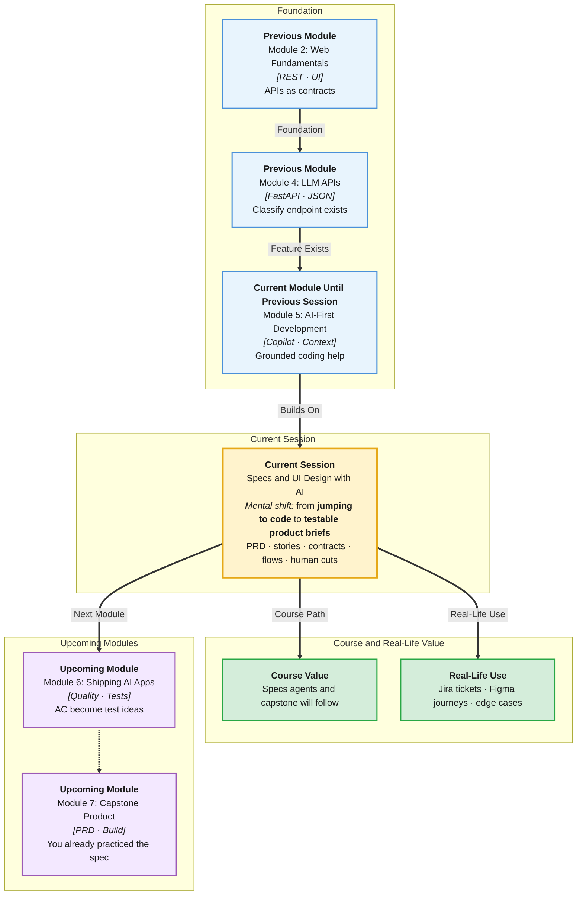

# Pre-Read: Specs & UI Design with AI

## Session Mindmap

This diagram shows where this session sits in the course.



## 1. What You'll Learn

In this pre-read, you'll discover:

- How to **draft a PRD or feature brief** with AI and **refine it as a human**
- How to write **user stories** and **acceptance criteria** with AI support
- How to generate **API contracts** and **edge cases**
- How to draft **UI flows or wireframes** with AI
- How to turn design notes into **implementable requirements**

---

## 2. Detailed Explanation

### Specs Before Code

A **PRD** (Product Requirements Document) or **feature brief** states the problem, who it is for, and what "done" means. AI can draft. **You** cut fantasy features.

**One-line definition:** Spec work is deciding what to build before Copilot writes files.

**Analogy:** An architect's sketch. Builders should not invent a third lift because the sketch was vague.

> **In the Real World:** **Google** PRDs, **Amazon** working-backwards docs, and startup Notion pages all exist so engineering does not guess. **Figma** + written stories is how **Swiggy** and **PhonePe** ship flows. AI speeds the first draft; PMs still own the cuts.

### Draft with AI, Refine with Judgment

Good ask:

```
Draft a one-page feature brief for "ticket classifier for an online bookstore."
Users: support agents.
Must use our existing POST /ai/classify JSON.
Do not add mobile apps, ML training, or a new database.
```

Then **human refine**:
- Delete anything not in scope
- Add real constraints (Pydantic max length, no key in browser)
- Write non-goals explicitly

**Messy:** "Build an AI support platform like Intercom."  
**Clear:** one user, one flow, one API.

### User Stories and Acceptance Criteria

**User story:** As a `<role>`, I want `<goal>` so that `<why>`.

**Acceptance criteria:** testable checks. Prefer Given / When / Then.

```
As an agent, I want a predicted intent so that I route the ticket faster.

Given a ticket under 2000 characters
When I submit it
Then I see intent in {refund, shipping, other}
And I never see the model API key
```

AI can draft ten stories. You keep **three** that match the brief.

### API Contracts and Edge Cases

You already know REST contracts. Ask AI to propose:
- Path, method, request JSON, response JSON
- Status codes: 200, 422, 503
- Edge cases: empty, too long, injection-like text, invalid JSON from model

You **check** against FastAPI reality. If AI adds `PATCH /ai/train`, that is out of scope — cut it.

### UI Flows and Wireframes

AI can describe screens in text or simple boxes:

```
1. Paste ticket
2. Click Classify
3. Show intent + urgency + summary
4. Show error banner if 422 or 503
```

That is a **wireframe in words**. You can sketch boxes on paper. You are **not** required to master Figma in this session. You **are** required to name steps, empty states, and errors.

> **In the Real World:** **Airbnb** and **Netflix** write user journeys before pixels. A missing error state is a product bug.

### Design Notes → Implementable Requirements

Implementable means an engineer can start without asking "what is summary?"

Convert:
- "Make it nice" → "Show `summary` max 20 words under the badges"
- "Handle failure" → "On 503, banner: Try again. No stack trace."
- "Secure" → "ticket_text max 2000; DATA fences remain"

**Why It Matters:** Module 5 agents will code from specs. Garbage spec → garbage PR.

**Benefits:**
- Shared language with PMs
- Edge cases before they hit production
- UI that matches the API
- Less hallucinated scope

### Building Blocks

- Brief with non-goals
- Stories + AC
- Contract table
- Flow steps
- Refined requirement list

---

## 3. Practice Exercises

**Exercise 1 — Brief**  
Write four bullets: problem, user, in-scope, **non-goal** for the bookstore classifier UI.

**Exercise 2 — Story**  
Write one user story with two acceptance criteria (happy path + 422).

**Exercise 3 — Contract**  
List request fields and response fields for `POST /ai/classify`. Add one edge case AI might forget.

**Exercise 4 — Flow**  
Number five UI steps from empty page to success **or** error.

**Exercise 5 — Refine**  
AI wrote: "Also add WhatsApp and voice." Write one human sentence that cuts this and points back to the brief.
