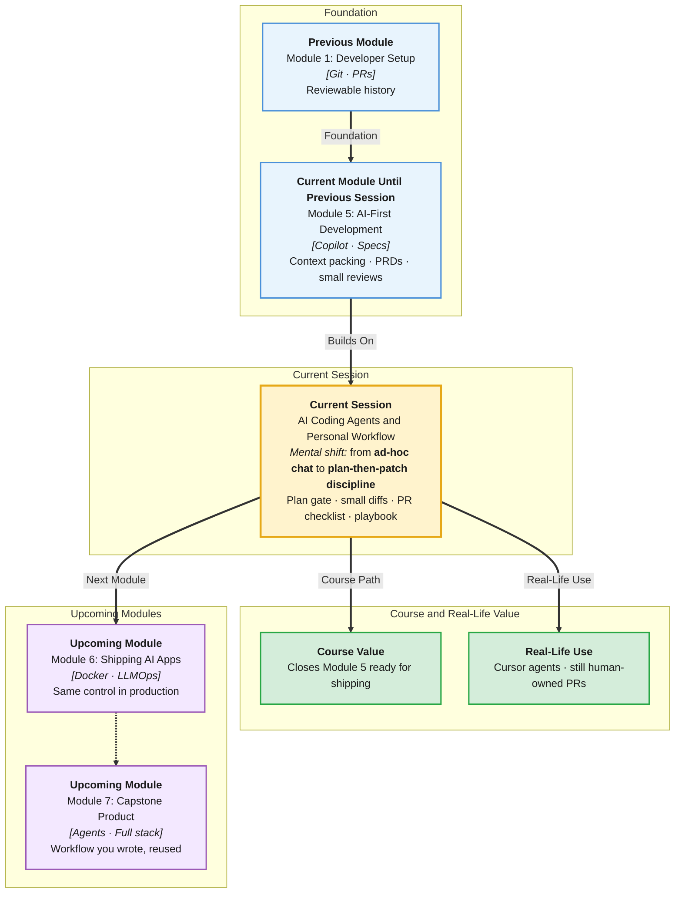

# Pre-Read: AI Coding Agents & Personal Workflow

## Session Mindmap

This diagram shows where this session sits in the course.



## 1. What You'll Learn

In this pre-read, you'll discover:

- How to run a workflow where the **agent proposes a plan** before coding
- How to use **clarifying questions** and keep work as **small diffs**
- How to **review AI changes** with a **PR-style checklist**
- How to **stay in control** instead of accepting huge unreviewed edits
- How to build a **personal, repeatable AI-first workflow**

---

## 2. Detailed Explanation

### Agents vs Pair Completions

**Copilot grey text** completes a few lines. A **coding agent** can edit many files, run commands, and loop. Power without a workflow is how repos get wrecked.

**One-line definition:** An AI coding agent is a helper that should **plan, ask, patch small, and wait for review**.

**Analogy:** A junior on a first PR. They do not rewrite the company. They propose a plan, ask two questions, change five lines, and request review.

> **In the Real World:** **Cursor** agents, **Claude Code**, and similar tools are used at startups and enterprises. Teams that skip plans get "drive-by refactors." **GitHub** still wants pull requests. The agent is not exempt.

### Plan Before Coding

Your first message should demand a plan:

```
Read schemas.py and classify route only.
Goal: add summary field from last spec.
Write a 5-step plan. Do not edit files yet.
Ask if anything in the spec is ambiguous.
```

Approve or correct the plan. **Then** allow edits.

### Clarifying Questions and Small Diffs

Good agents ask:
- Placeholder summary vs extra LLM call?
- Which files are in bounds?

**Small diff** means: one intent per change set. Easy to revert. Easy to review.

**Messy:** 18 files, rename everything, "while I was here."  
**Clear:** schema + route + one test.

### PR-Style Review Checklist

Treat agent output like a teammate's PR:

- [ ] Matches the approved plan
- [ ] No secret files touched
- [ ] Validation and DATA fences still there
- [ ] Tests added/updated and **run**
- [ ] Diff size reasonable
- [ ] You can explain each hunk

If you cannot explain it, it does not merge.

### Stay in Control

**You** decide when the agent may write. Stop words: "pause," "show diff only," "revert file X."

Reject **large unreviewed edits** even if tests pass. Passing tests can still delete comments, logging, or security.

**Control habits:**
- Branch first (`git checkout -b feat/summary`)
- Commit working state before the agent
- One task per agent run
- Read the diff in the editor, not the chat summary

### Personal Repeatable AI-First Workflow

Write a short playbook you will reuse:

1. Spec / ticket (from last session)
2. Pack context (files + constraints)
3. **Plan only**
4. Answer clarifying questions
5. Agent implements **small diff**
6. You run tests and PR checklist
7. Commit with a human message
8. Next task — new plan

Use it for **design** (spec), **implementation** (code), and **debugging** (plan: "add logs / write failing test / fix").

**Why It Matters:** Capstone week will tempt you to "let the agent finish." This session is the seatbelt.

**Benefits:**
- Reversible work
- Learnable history
- Security preserved
- You can describe your workflow in interviews

### Building Blocks

- Plan gate
- Questions
- Small diffs
- PR checklist
- Personal playbook

---

## 3. Practice Exercises

**Exercise 1 — Plan prompt**  
Write a prompt that forbids file edits until you say "go." Include the goal in one sentence.

**Exercise 2 — Questions**  
List two clarifying questions an agent should ask before adding `summary`.

**Exercise 3 — Small vs large**  
Which is a small diff: (a) schema + route + test, or (b) rewrite all routers to async plus new folder structure? Why?

**Exercise 4 — Checklist**  
Add one checklist item that specifically protects Module 4 **prompt-injection** defences.

**Exercise 5 — Playbook**  
Number your 6-step personal workflow from ticket to commit. Keep it generic so you can reuse it.
