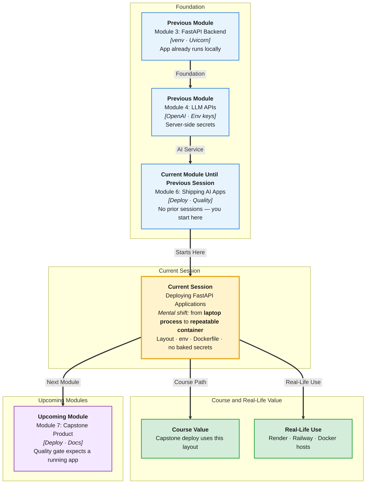

# Pre-Read: Deploying FastAPI Applications

## Session Mindmap

This diagram shows where this session sits in the course.



## 1. What You'll Learn

In this pre-read, you'll discover:

- How to **package a FastAPI app** with a **clear project layout**
- How to manage **environment variables and secrets** for **local vs production**
- How to write a **basic Dockerfile** for FastAPI
- How to **run a containerised app** with **stable configuration**
- How to **avoid hardcoding secrets** in images and source

---

## 2. Detailed Explanation

### Packaging for Somewhere That Is Not Your Laptop

**Package** means: a stranger (or a server) can run the API with documented files — not a mystery of "it works on my machine."

**One-line definition:** Deployment packaging is layout + dependencies + config so the same app runs locally and in a container.

**Analogy:** A tiffin box. Food (code), list of ingredients (`requirements.txt`), and a note: "salt is not included — add at the table" (secrets).

> **In the Real World:** **Render**, **Railway**, **Fly.io**, **AWS**, and **Azure** all expect a start command and env vars. **Docker** is the common box those platforms run.

### Clear Project Layout

A simple layout is enough:

```
app/
  main.py
  schemas.py
  services/
requirements.txt
Dockerfile
.gitignore
README.md
```

Entry point is obvious. Do not copy `venv/` into the image.

Pin dependencies in `requirements.txt` (versions you actually installed).

### Env Vars: Local vs Production

| | Local | Production |
|--|--------|------------|
| Key source | `.env` (gitignored) or exported vars | Platform secret store / env settings |
| Debug | May be on | Off |
| API keys | Your sandbox key | Restricted production key |

Read with `os.environ["OPENAI_API_KEY"]`. Fail if missing.

**Two configs, one code path** — not `if laptop: key = "sk-..."`.

### Basic Dockerfile

A Dockerfile is a recipe for an image.

Typical FastAPI idea:
- Start from a Python base image
- Set a work directory
- Copy `requirements.txt` and `pip install`
- Copy app code
- Run a server (often `uvicorn app.main:app --host 0.0.0.0 --port 8000`)

`--host 0.0.0.0` lets other containers/machines reach the port. `127.0.0.1` only talks to itself inside the container.

```dockerfile
FROM python:3.12-slim
WORKDIR /code
COPY requirements.txt .
RUN pip install --no-cache-dir -r requirements.txt
COPY app ./app
CMD ["uvicorn", "app.main:app", "--host", "0.0.0.0", "--port", "8000"]
```

**Do not** `COPY .env` into the image.

### Run with Stable Config

Build and run (instructor will use the exact commands in class):

- Build an image with a **tag** (name + version)
- Run mapping port `8000:8000`
- Pass `-e OPENAI_API_KEY=...` at **run time**
- Same `uvicorn` settings every time so behaviour does not drift

**Stable configuration** means: documented env var names, documented port, documented start command. No hidden flags only you know.

### Avoid Hardcoding Secrets

Hardcoding is putting `sk-...` in `main.py` or Dockerfile `ENV OPENAI_API_KEY=sk-...`.

Risks:
- Git history leak
- Image leak if you push to Docker Hub
- Cannot rotate keys without rebuilding

**Why It Matters:** Your AI endpoint is useless if the key is public. Production is where leaks get expensive.

**Benefits:**
- Same layout from class to capstone
- Keys rotatable
- Container runs like a mini production
- Teammates can start without your laptop paths

### Building Blocks

- Layout + requirements
- Env for secrets
- Dockerfile without `.env`
- Run with `-e` or platform secrets
- README start steps

---

## 3. Practice Exercises

**Exercise 1 — Layout**  
List five files/folders you would put in a deployable FastAPI AI repo. Exclude `venv/`.

**Exercise 2 — Local vs prod**  
Where does `OPENAI_API_KEY` live locally? Where should it live on a host like Render? One line each.

**Exercise 3 — Dockerfile smell**  
A Dockerfile contains `ENV OPENAI_API_KEY=sk-abc`. Why is this wrong?

**Exercise 4 — Host binding**  
Why might `uvicorn --host 127.0.0.1` fail when you try to open the app from your machine to a container?

**Exercise 5 — Stable config**  
Write three bullets a README needs so another student can run the container without pinging you.
