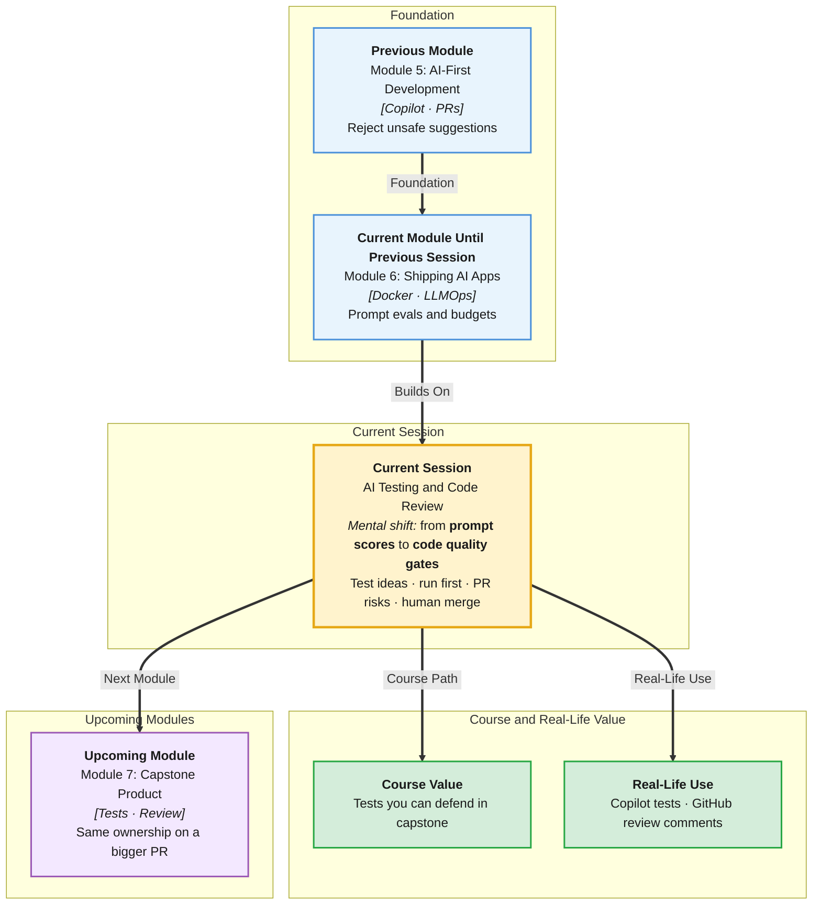

# Pre-Read: AI Testing & Code Review

## Session Mindmap

This diagram shows where this session sits in the course.



## 1. What You'll Learn

In this pre-read, you'll discover:

- How to use AI to generate **test ideas and test cases** for an existing feature
- How to **run and debug** AI-written tests **before** you accept them
- How to use AI to **review a pull request** and **spot risks**
- When to apply **refactor and readability** suggestions
- Why **humans own** accept/reject on quality

---

## 2. Detailed Explanation

### Tests Are Not True Because AI Wrote Them

AI is good at **listing cases** you forgot. It is also good at **fake tests** and testing the **wrong behaviour**.

**One-line definition:** AI-assisted testing and review means the model proposes; you execute, debug, and decide.

**Analogy:** A colleague who types fast in the PR comments. You still press Merge.

> **In the Real World:** **GitHub Copilot** tests, **Codium**-style tools, and **ChatGPT** review comments appear in startups and enterprises. **Google** still requires humans on the merge button. A test that `assert True` is worse than no test.

### Generate Test Ideas and Cases

Ask AI **after** you paste the real function and spec:

```
Feature: POST /ai/classify with TicketIn max 2000.
List test ideas: happy path, 422, 503, injection-like body.
Then write pytest functions that call the FastAPI TestClient.
Do not mock unless I ask.
```

Ideas might include:
- Valid refund-like text → 200 and allow-listed intent
- Empty string → 422
- 2001 characters → 422
- Missing field → 422
- Injection text still returns schema-valid JSON (if you call the model) **or** you mock the LLM in a unit test of the allow-list

Keep ideas that match **this** app.

### Run and Debug Before Accept

**Never** commit tests you did not run.

Steps:
1. Run pytest (or the project's test command)
2. Read failures
3. Decide: production bug vs **wrong test**
4. Fix code **or** fix test **or** delete test
5. Then accept

AI often tests private helpers that do not exist, or expects `intent == "Refund"` with a capital R.

**Messy:** green tests that never import your app.  
**Clear:** one failing test that reproduces a real 422 miss, then a fix.

### AI on Pull Requests — Risks

Paste a **diff**, not the whole repo. Ask:

```
Review this diff for: secrets, removed validation, behaviour change, missing tests, prompt-injection defences.
List risks. Do not rewrite the PR.
```

Typical risks AI **can** help spot:
- `.env` added
- `max_length` removed
- Broad `except:` swallowing errors
- Huge unrelated refactor

AI **cannot** certify the prompt is legally correct. You still read.

### Useful Refactors vs Noise

Apply when it **helps readers**:
- Rename unclear variables
- Extract a 40-line function
- Add a type hint

Reject when it:
- Restyles the entire file
- Swaps working code for clever one-liners you cannot debug
- Changes JSON keys the frontend uses

### Human Ownership

**You** are the author in git. In a job, **you** are responsible for outages.

Accept/reject with a one-line reason in the PR: "Rejected eval() suggestion — user text is untrusted."

**Why It Matters:** LLMOps tested prompts. This session tests **code** and **reviews**. Capstone quality gate needs both.

**Benefits:**
- More edge cases than you remember when tired
- Faster first-draft tests
- Second pair of eyes on diffs
- Habit of not merging on vibe

### Building Blocks

- Spec + code into the test prompt
- Run locally
- Debug failures
- Risk-focused review prompt
- Explicit human decision

---

## 3. Practice Exercises

**Exercise 1 — Ideas**  
List five test ideas for `/ai/classify` without writing code.

**Exercise 2 — Bad test**  
Why is `def test_ok(): assert True` harmful? One sentence.

**Exercise 3 — Debug**  
AI test expects HTTP 400 for empty body; FastAPI/Pydantic returns 422. Who is wrong? What do you change?

**Exercise 4 — Review risk**  
A PR removes DATA fences from the prompt builder. Write the risk in one sentence as if commenting on GitHub.

**Exercise 5 — Ownership**  
AI suggests a refactor you do not understand. Accept or reject? What question must you answer first?
