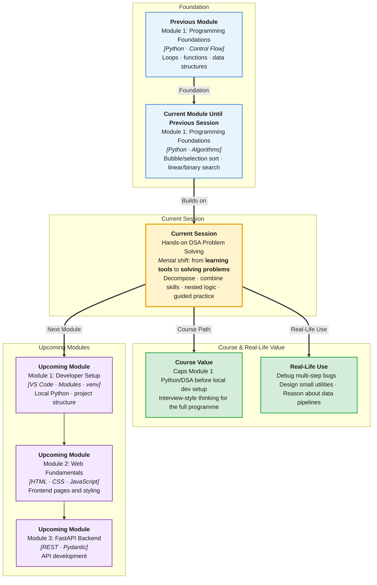

# Pre-Read: Hands-on DSA Problem Solving & Logic Building

## Session Mindmap

This diagram shows where this session sits in the course.



## 1. What You'll Learn

In this pre-read, you'll discover:

- How to **break a problem into inputs, steps, and outputs** before writing code
- How to **combine lists, strings, dictionaries, conditionals, and loops** in one solution
- When to **apply searching and sorting** in the right order inside a problem
- How to use **nested conditionals and loops** for multi-step exercises
- How to **approach guided DSA problems** step by step in One Compiler

---

## 2. Detailed Explanation

### From Pieces to Puzzles

So far you learned individual tools: variables, conditionals, loops, data structures, functions, search, and sort. Today you **combine** them like LEGO blocks to solve full problems.

**Analogy:** Learning chords is not the same as playing a song. This session is your first song.

### Problem Decomposition

Before coding, write down:

1. **Inputs** — What data do I get?
2. **Logic steps** — What must happen in order?
3. **Outputs** — What should the program print or return?
4. **Edge cases** — Empty list? Duplicate values? Already sorted?

```
Problem: Find the second largest number in a list
Input:  [12, 45, 7, 45, 3]
Steps:  Remove duplicates → sort → pick second from end
Output: 12
Edge:   What if all numbers are the same?
```

### Combining Prior Skills

| Skill | Example use in DSA |
|-------|-------------------|
| Lists & dicts | Store and count frequencies |
| Loops | Scan every element |
| Conditionals | Branch on comparisons |
| Search | Find target in data |
| Sort | Order data for binary search or ranking |

### Search + Sort Together

Some problems need **sort first, then search**:

- "Is `target` in the list?" on unsorted data → linear search
- "Find position in sorted list" → binary search after sorting

**Order matters.** Sorting when you only need one max value wastes steps.

### Nested Logic

A **nested loop** (loop inside a loop) compares every pair — useful for finding duplicates or pairs that sum to a target.

```python
nums = [2, 7, 3]
target = 9
for i in range(len(nums)):
    for j in range(i + 1, len(nums)):
        if nums[i] + nums[j] == target:
            print(nums[i], nums[j])
```

### Why It Matters

Interviews, contests, and real debugging all reward structured thinking. Jumping straight to code without a plan causes half-finished solutions.

**Benefits:**
- Faster problem-solving under time pressure
- Fewer syntax errors because logic is already clear
- Confidence combining everything you have learned

---

## 3. Practice Exercises

**Exercise 1 — Decompose**
Problem: Count how many words in a list start with the letter `"a"`. Write inputs, steps, and output on paper before coding.

**Exercise 2 — Frequency**
Given `[1, 2, 2, 3, 2]`, use a dictionary to count how many times each number appears.

**Exercise 3 — Plan first**
Problem: Check if a list is sorted in ascending order. Write the steps in plain English, then try coding in One Compiler.
