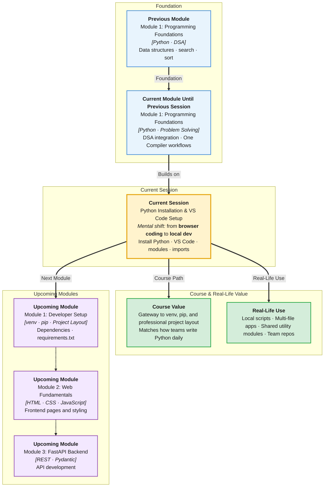

# Pre-Read: Python Installation, VS Code Setup & Python Modules

## Session Mindmap

This diagram shows where this session sits in the course.



## 1. What You'll Learn

In this pre-read, you'll discover:

- How to **install Python on your computer** and confirm it works
- How to **set up VS Code** with the integrated terminal for local coding
- How to **run Python scripts locally** instead of only in One Compiler
- How to **split code into modules** and import them across files
- How **import statements and namespaces** connect your project files

---

## 2. Detailed Explanation

### Leaving the Browser Behind

**One Compiler** is great for learning. Real projects run on your machine. Today you move from browser tabs to a **local development workflow** (coding on your own computer with professional tools).

**Analogy:** One Compiler is like a practice kitchen in a classroom. VS Code is your home kitchen where you cook full meals.

### Installing Python

**Python** is the language. You install it once on your laptop. Then you run `.py` files from the terminal.

After install, check it works:

```bash
python3 --version
```

You should see a version number like `Python 3.12.x`.

### VS Code: Your Coding Home Base

**VS Code** (Visual Studio Code) is a free editor where you write code, open folders, and run commands in one place.

Key pieces:
- **Editor** — where you type Python
- **Integrated terminal** — where you run `python3 script.py`
- **Python extension** — helpful hints and run buttons

Open a folder, create `hello.py`, and run it from the terminal inside VS Code.

### Running Scripts Locally

In One Compiler you clicked Run. Locally you type:

```bash
python3 hello.py
```

**Why It Matters:** Local projects can have many files, use packages, and match how teams work.

**Benefits:**
- Work offline after setup
- Organize code in folders like real engineers
- Prepare for virtual environments and pip next session

### Modules: Split Code Across Files

A **module** (a `.py` file treated as a reusable unit) holds related functions and variables.

`greetings.py`:
```python
def say_hello(name):
    return f"Hello, {name}"
```

`main.py`:
```python
import greetings
print(greetings.say_hello("Asha"))
```

### Import Statements

**`import`** brings code from another file into the current file.

Common forms:
- `import math` — built-in module
- `import greetings` — your own file
- `from greetings import say_hello` — import one name

### Namespaces

A **namespace** (the set of names visible in a given scope) decides what names you can use where.

Each module has its own namespace. `greetings.say_hello` means: look in the `greetings` module for `say_hello`.

**Common mistake:** Naming your file `math.py` — it can clash with Python's built-in `math` module.

### Multi-File Projects

A small project might look like:

```
my_project/
  main.py
  utils.py
```

`main.py` imports from `utils.py`. Both files live in the same folder so Python can find them.

---

## 3. Practice Exercises

**Exercise 1 — Local run**
Install Python (or confirm it is installed). Create `hello.py` that prints your name. Run it from the VS Code terminal.

**Exercise 2 — Custom module**
Create `calculator.py` with `add(a, b)`. In `main.py`, import and print `add(3, 5)`.

**Exercise 3 — Trace imports**
In `main.py`, try both `import calculator` and `from calculator import add`. Write one sentence on the difference.
