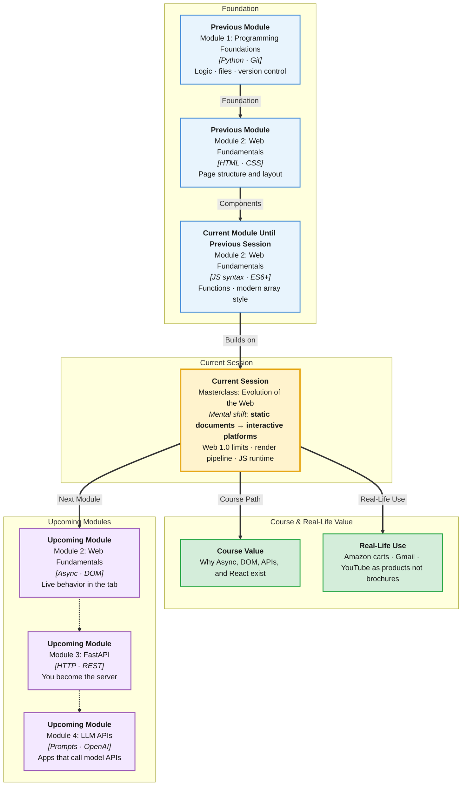

```mermaid
flowchart TB
    subgraph foundation ["Foundation"]
        P1["<b>Previous Module</b><br/>Module 1: Programming Foundations<br/><i>[Python · Git]</i><br/>Logic · files · version control"]
        P2["<b>Previous Module</b><br/>Module 2: Web Fundamentals<br/><i>[HTML · CSS]</i><br/>Page structure and layout"]
        CM["<b>Current Module Until Previous Session</b><br/>Module 2: Web Fundamentals<br/><i>[JS syntax · ES6+]</i><br/>Functions · modern array style"]
    end
    subgraph current ["Current Session"]
        CS["<b>Current Session</b><br/>Masterclass: Evolution of the Web<br/><i>Mental shift:</i> <b>static documents</b> → <b>interactive platforms</b><br/>Web 1.0 limits · render pipeline · JS runtime"]
    end
    subgraph value ["Course & Real-Life Value"]
        CV["<b>Course Value</b><br/>Why Async, DOM, APIs, and React exist"]
        RL["<b>Real-Life Use</b><br/>Amazon carts · Gmail · YouTube as products not brochures"]
    end
    subgraph future ["Upcoming Modules"]
        U1["<b>Upcoming Module</b><br/>Module 2: Web Fundamentals<br/><i>[Async · DOM]</i><br/>Live behavior in the tab"]
        U2["<b>Upcoming Module</b><br/>Module 3: FastAPI<br/><i>[HTTP · REST]</i><br/>You become the server"]
        U3["<b>Upcoming Module</b><br/>Module 4: LLM APIs<br/><i>[Prompts · OpenAI]</i><br/>Apps that call model APIs"]
    end
    P1 ==>|&nbsp;Foundation&nbsp;| P2
    P2 ==>|&nbsp;Components&nbsp;| CM
    CM ==>|&nbsp;Builds on&nbsp;| CS
    CS ==>|&nbsp;Course Path&nbsp;| CV
    CS ==>|&nbsp;Real-Life Use&nbsp;| RL
    CS ==>|&nbsp;Next Module&nbsp;| U1
    U1 -.-> U2
    U2 -.-> U3
    classDef previous fill:#E8F4FD,stroke:#4A90D9,stroke-width:2px,color:#1a1a1a
    classDef current fill:#FFF3CD,stroke:#E6A817,stroke-width:3px,color:#1a1a1a
    classDef value fill:#D4EDDA,stroke:#28A745,stroke-width:2px,color:#1a1a1a
    classDef future fill:#F3E8FF,stroke:#9B59B6,stroke-width:2px,color:#1a1a1a
    class P1,P2,CM previous
    class CS current
    class CV,RL value
    class U1,U2,U3 future
    linkStyle default stroke-width:3px
```
