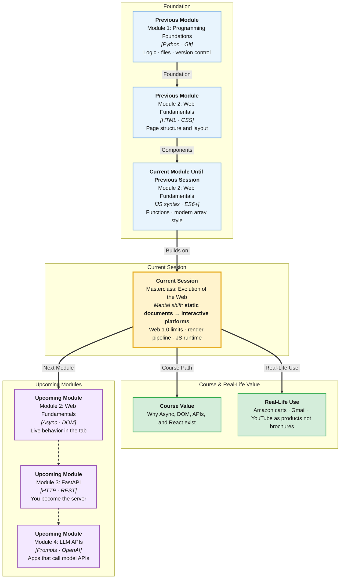

# Pre-Read: Masterclass — Evolution of the Web

## Session Mindmap

This diagram shows where this session sits in the course.



## 1. What You'll Learn

In this pre-read, you'll discover:

- Why **Web 1.0** (read-only brochure pages) could not support modern products
- The **demerits of static-only sites** when users need to log in, search, and save
- How **Web 2.0** turned websites into interactive, user-driven platforms
- How a **browser loads and renders** HTML, CSS, and images into a page
- The role of the **JavaScript runtime** in making pages dynamic after load

---

## 2. Detailed Explanation

### One-line definition

The **web** is a global system of documents and apps that browsers request, display, and (today) update without a full page rewrite.

### Relatable analogy

Web 1.0 is a printed newspaper. You read it. You cannot comment, like, or save a personal copy.

Web 2.0 is a group chat plus a shared whiteboard. You read, write, and see others' updates.

The **browser** is the stage. **HTML** is the set. **CSS** is lighting and costume. The **JavaScript runtime** is the actor who reacts to the audience.

### Why the web needed to evolve beyond static Web 1.0

Early public sites were **static**. A designer saved `.html` files on a server. Every visitor got the same page.

That model worked for campus notices and company "About" pages. It failed when people wanted:

- Personal inboxes (not one shared contact form dump)
- Shopping carts that remember items
- Search that updates results without a new printed catalog
- Comments, ratings, and profiles

**Why It Matters**

> **In the Real World:** **Amazon** cannot ship a million identical HTML files for every cart. **Gmail** cannot be a static "check your mail tomorrow" page. **Wikipedia** still publishes articles, but editors update them through interactive tools — a Web 2.0 pattern on a Web 1.0-looking surface.

**Benefits of understanding this history:**

- You stop treating "a website" as only HTML files
- You see why JavaScript, APIs, and later React exist
- You explain product decisions in interviews with a clear timeline

### Demerits of static-only websites

A **static-only website** serves the same files to everyone. No per-user data. Little live interaction.

| Pain | What users feel |
|------|-----------------|
| No personalization | Same homepage for guest and paying customer |
| No live feedback | Form posts to nowhere, or a full page reload |
| Hard to scale content | Every product change needs a new HTML file |
| Weak products | Cannot compete with apps that remember you |

**Messy:** Ten HTML files named `product1.html` … `product10.html`. A price change means ten edits.

**Clear:** One page template. Data comes later from a server. JavaScript fills the list.

### How Web 2.0 changed websites into platforms

**Web 2.0** (roughly mid-2000s onward) is the shift from "read pages" to "use products in the browser."

Users create content. Sites remember sessions. Pages update after load.

Examples you already know:

- **YouTube** — upload, comment, recommend
- **Facebook / Instagram** — feeds that change as you scroll
- **Flipkart** — cart, filters, live stock
- **Google Docs** — document that updates as people type

The technical stack you are learning maps to this era:

- **HTML** — structure
- **CSS** — look
- **JavaScript** — behavior after the page arrives

### How a browser loads and renders a page

When you type a URL or click a link:

1. The browser asks a **server** for the page (you will go deeper in *How the Web Works*).
2. It receives **HTML**.
3. It builds a **DOM** (a tree of elements — next sessions).
4. It requests **CSS**, images, and scripts listed in the HTML.
5. It **paints** pixels on screen (layout + paint).
6. If JavaScript is present, the **JS runtime** runs it and can change the DOM.

You do not need every engine detail yet. Hold this chain: **request → HTML → CSS → paint → JS can update**.

### Role of the JavaScript runtime inside the browser

The **JavaScript runtime** is the engine plus browser APIs (`setTimeout`, later `fetch`, DOM methods).

It runs **after** (or while) the page loads. It can:

- Change text and styles
- React to clicks
- Later: talk to APIs without a full reload

Without JS, the page is mostly a document. With JS, it becomes an **application**.

**Final small example (max 10 lines):**

```html
<p id="status">Static text from HTML.</p>
<button onclick="document.getElementById('status').textContent='Updated by JS'">
  Make it live
</button>
```

HTML supplies the paragraph. The JS runtime updates it on click. That is the Web 2.0 idea in one button.

### Building blocks

- [ ] I can name Web 1.0 as read-only static pages
- [ ] I can list two problems with static-only sites
- [ ] I can describe Web 2.0 as user-driven, interactive platforms
- [ ] I can list load steps: HTML, CSS, paint, then JS
- [ ] I can say the JS runtime changes the page after load

---

## 3. Practice Exercises

**Exercise 1 — Web 1.0 vs a product**  
List three things **IRCTC** or **Amazon** must do that a static HTML brochure cannot.

**Exercise 2 — Demerit story**  
A college club site is five HTML files. They add a "members only" notice. Write two reasons static-only files will hurt them.

**Exercise 3 — Web 2.0 examples**  
Name two sites you use. For each, write one **user-created** action (comment, cart, post, like).

**Exercise 4 — Render order**  
Put these in order: paint pixels, request HTML, run JavaScript, apply CSS. Write the sequence.

**Exercise 5 — Runtime role**  
In one sentence, explain what happens when JS changes `textContent` of a paragraph after load.
