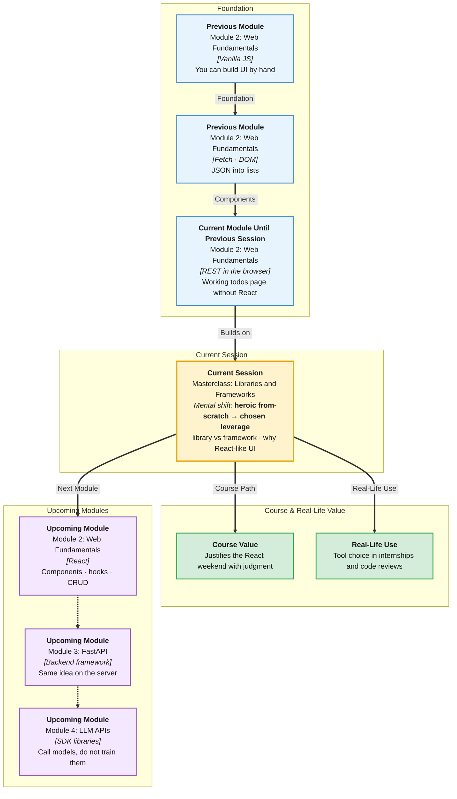

# Pre-Read: Masterclass — Understanding Libraries & Frameworks

## Session Mindmap

This diagram shows where this session sits in the course.

## 1. What You'll Learn

In this pre-read, you'll discover:

- Why **writing every feature from scratch** hurts real products
- Why teams use **libraries** and **frameworks**
- The difference: **library vs framework**
- When a **library is enough** vs when a **framework** is needed
- Why **React-like** tools became important for **UI**

---

## 2. Detailed Explanation

### One-line definition

A **library** is a toolkit you call. A **framework** is a structure that **calls your code** and sets the app's shape.

### Relatable analogy

A **library** is a power drill you pick up when you need a hole.

A **framework** is a prefab house kit. You fill rooms, but walls and plumbing routes are already decided.

Writing from scratch is carving the drill **and** the house from trees. Slow. Uneven. Hard to hire for.

### Why it matters

> **In the Real World:** **Instagram** does not rewrite a DOM diff engine each quarter. They stand on **React**. **jQuery** was a library that ruled Web 2.0. **Next.js** is a framework around React. You only need the idea this session.

**Benefits:**

- You can choose tools on purpose
- You will not call React "just a library" or "just HTML"
- You understand the next two React sessions

### Demerit of from-scratch everything

Imagine rebuilding:

- Date formatting
- Tab keyboard support
- DOM updates for every list change
- Browser quirks

**Costs:** time, bugs, no shared language in interviews, painful onboarding.

**Messy:** 2000 lines of `createElement` for one dashboard.

**Clear:** Reuse battle-tested UI patterns.

### Why libraries and frameworks exist

- **Speed** — common problems already solved
- **Consistency** — teams share structure
- **Community** — docs, hiring, Stack Overflow
- **Focus** — you write **product** rules, not all plumbing

### Library vs framework

| | Library | Framework |
|--|---------|-----------|
| Who is in charge? | **Your** code calls it | **It** calls your code |
| Example idea | A function `formatDate()` | "Put components in `src/`, we start the app" |
| Scope | Usually smaller | App architecture |

**Mental model:** Hollywood: a library is a guest star you invite. A framework is the studio that schedules you.

### When library vs framework

**Library enough:** one page, a chart, a date helper, a small widget.

**Framework needed:** many screens, shared state, routing, a team, long life.

A todo on one HTML file can stay vanilla. **Gmail-scale UI** needs a UI framework (or you will invent one).

### Why React-like tools matter for UI

You already: create/remove nodes, fetch JSON, re-render lists. That gets **error-prone** when UI state grows.

**React-like** libraries (component UI tools) help you:

- Split UI into **components**
- Describe **what** the screen should look like for given data
- Update the **virtual DOM** / diff so you do not manually sync every node

This session stays conceptual. Next session you **set up Vite + React**.

**Final small example (idea, not new API):**

Vanilla: 15 DOM calls when one todo completes.  
React idea: `completed: true` → UI matches. The tool updates the tree.

### Building blocks

- [ ] I can name two costs of from-scratch
- [ ] I can say why teams reuse tools
- [ ] I can define library vs framework
- [ ] I can pick library vs framework for a scenario
- [ ] I can say why React-like UI tools exist

---

## 3. Practice Exercises

**Exercise 1 — Scratch tax**  
List four features a shopping site would have to reinvent without any libraries.

**Exercise 2 — Why reuse**  
In three bullets, why a 6-person team wants a shared framework.

**Exercise 3 — Classify**  
Label library or framework in your own words: (a) a `sortByDate` helper you import, (b) a tool that requires a project folder and starts your app.

**Exercise 4 — Choose**  
A campus club needs a one-page events list from JSONPlaceholder. Library, framework, or vanilla? Why?

**Exercise 5 — React-like why**  
Write five sentences: how manual DOM + fetch gets hard as screens multiply. Why components help.
