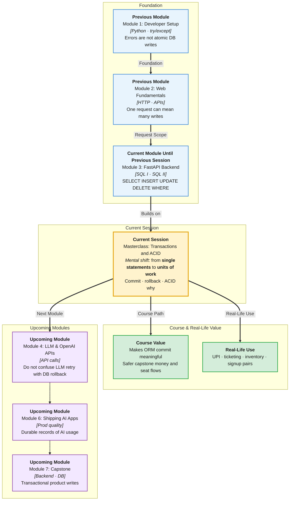

# Pre-Read: Masterclass — Database Transactions & ACID

## Session Mindmap

This diagram shows where this session sits in the course.

## 1. What You'll Learn

In this pre-read, you'll discover:

- The **demerit of multi-step updates** when they are not wrapped as one unit
- **Why databases need transactions** for real business operations
- **Commit** and **rollback** as success and failure handling
- The four **ACID** properties and **why each matters**
- **Why APIs and ORMs rely on transactions** so FastAPI writes stay safe

This is a **masterclass**: more "why the system is designed this way," less typing syntax. You already know INSERT/UPDATE/DELETE. Today we ask what happens when those statements must succeed **together**.

---

## 2. Detailed Explanation

### The Failure Story

Imagine a **UPI-style transfer**:

1. Subtract ₹500 from Asha  
2. Add ₹500 to Ravi  

If the server crashes after step 1, Asha lost money and Ravi got nothing. Two SQL statements, one business action. That is the **demerit of multi-step updates without protection**.

**Analogy:** A pair of train tickets printed as two slips. If the printer jams after slip one, you do not want a half-booking. You want **both slips or neither**.

> **In the Real World:** **NPCI / UPI**, **stock exchanges**, **IRCTC** seat + payment, **Amazon** inventory decrement + order row. These systems treat several writes as one **transaction**.

**Why It Matters**

- Money, seats, and stock cannot be "probably updated"
- Crashes and errors are normal; data must still make sense
- Your future FastAPI + SQLAlchemy code will `commit` or `rollback` for this reason

### What Is a Transaction?

A **transaction** is a bundle of database steps treated as **one unit**.

- **Commit** — "make all of it permanent"
- **Rollback** — "undo all of it; pretend none of it happened"

**Mental model:** A shopping cart checkout. Pay succeeds → order exists. Pay fails → cart unchanged. You never want "paid but no order" or "order but no pay" as a silent state.

### ACID — Four Promises

| Letter | Name | Plain meaning | Why it matters |
|--------|------|----------------|----------------|
| **A** | **Atomicity** | All steps or none | Stops half-transfers |
| **C** | **Consistency** | Rules still hold after commit | FKs, balances ≥ 0 still true |
| **I** | **Isolation** | Concurrent work does not scramble rows | Two bookings do not take the same last seat without control |
| **D** | **Durability** | After commit, a crash does not erase it | Power cut after "Payment success" still keeps the row |

If you remember only one line: **Atomicity** is "both or neither." **Durability** is "committed means it survived the crash."

### Messy to Clear

**Messy:** FastAPI route runs INSERT order, then UPDATE stock, no transaction. Stock update fails. Order row remains. Support tickets explode.

**Clear:** Both writes in one transaction. Failure → **rollback**. Client gets an error. Database still consistent.

### Why APIs and ORMs Rely on This

A **route handler** is often several DB operations: create user, create profile, write audit log. An **ORM** (next session) exposes `session.commit()` and `session.rollback()` because the database already implements transactions.

The API does not invent ACID. It **asks the database** to start a transaction, run statements, then commit or rollback.

You do not need to memorize isolation levels (repeatable read, etc.) today. You need to respect **why** `commit` exists.

---

## 3. Practice Exercises

**Exercise 1 — Half update (4 min)**  
A hostel allots a room: (1) mark bed taken, (2) insert allotment row. Step 1 works, step 2 fails. Describe the bad state in one sentence.

**Exercise 2 — Commit vs rollback (3 min)**  
Which do you want after a successful UPI-like pair of UPDATEs? After a crash in the middle?

**Exercise 3 — Name the letter (4 min)**  
Power fails **after** commit. Data still there. Which ACID letter? Two cashiers book the last seat. Which letter is about that overlap?

**Exercise 4 — API mapping (3 min)**  
A FastAPI POST `/transfer` will later call ORM commit. If the second UPDATE throws, should the first UPDATE stay? Why?

**Exercise 5 — Real-world (5 min)**  
**IRCTC:** deduct wallet, assign seat, write ticket. List the three writes. Write one sentence on atomicity for the passenger.
