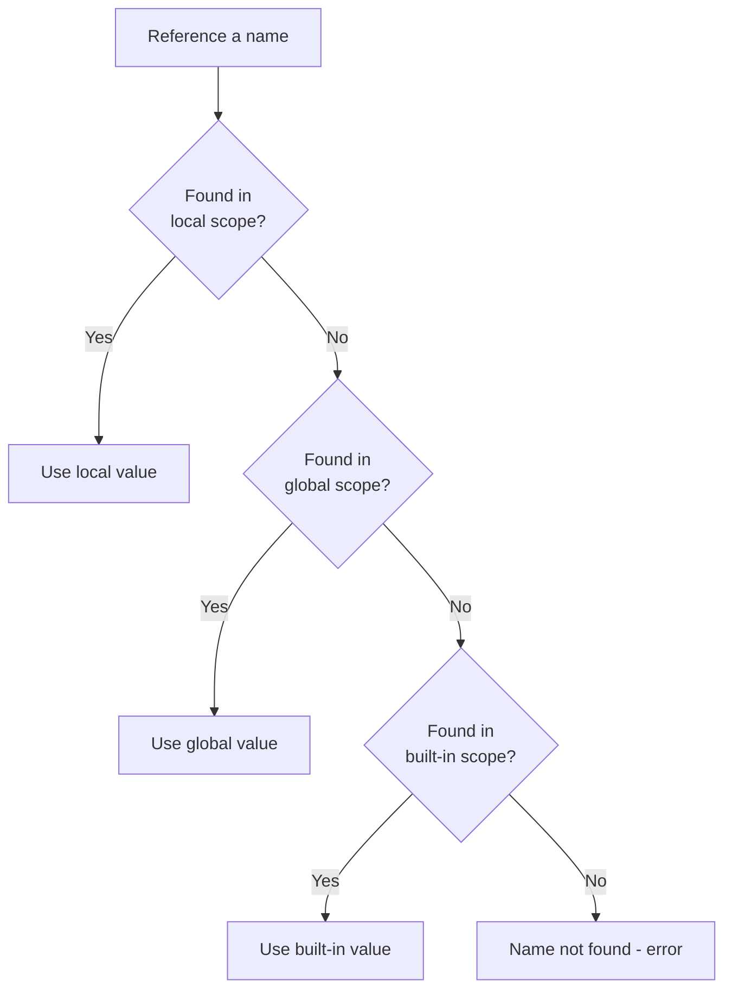
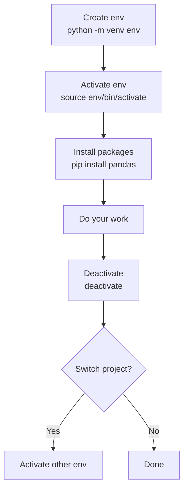
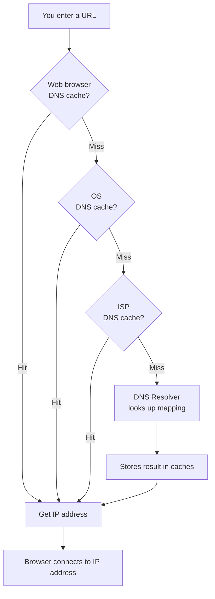

# Python Modules, pip, Virtual Environments, and Web Architecture

## What You'll Learn

In this lesson, you'll learn to:

- **Distinguish the three types of Python modules** — explain the difference between built-in, user-defined, and external modules, and know when each must be installed before use.
- **Write and interpret import statements** — use all three import forms and understand why the alias form helps avoid ambiguity.
- **Apply namespaces and scope** — trace exactly which variable Python selects when the same name exists in local, global, and built-in scopes, and apply the `global` keyword correctly.
- **Create and manage virtual environments** — set up an isolated Python environment with `python -m venv`, activate it, install packages, and inspect installed modules with `pip list`.
- **Explain how a web request travels from browser to server** — describe the roles of DNS, load balancer, CDN, IP addresses, and port numbers in routing a request to the right application.

---

## Types of Python Modules

### The three types you will always encounter

> **Imagine you are borrowing tools.** Some tools come in every standard toolbox (built-in). Some you made yourself (user-defined). Some you order specially from a supplier (external). The delivery rule changes for each.

Python code is organised into **modules** — a way to share and reuse code across files. Every module falls into one of three categories:

| Module Type | Who wrote it? | Part of Python? | Must install? | Must import? |
|---|---|---|---|---|
| **built-in module** | Python itself | Yes | No | Yes |
| **user-defined module** | You | N/A — you own it | No | Yes |
| **external module** | A third party | No | **Yes** | Yes |

**Built-in modules** like `math`, `OS`, `random`, and `JSON` are bundled with Python. You only need to `import` them — no installation step.

**User-defined modules** are files you have written yourself. Because you are the owner, you can also modify the code. Import the file name to use it in another file.

**External modules** like `NumPy`, `Pandas`, and `PyTorch` are written by others and are not bundled with Python. You must **install first, then import**. Without installing, Python cannot find the module and will raise an error.

```python
# External module: install first, then import
# pip install numpy
import numpy   # now works
```

---

## Import Syntax and Types

### Three standard forms of the import statement

> **Think of a library card system.** You can borrow every book in a section, borrow only the two books you need, or borrow a book under a nickname so it never clashes with your own notes.

There are three standard import forms. Each controls exactly what enters your program's namespace.

**Form 1 — Import specific names**

```python
from math import SQRT, factorial
print(SQRT(16))   # 4.0
```

Only `SQRT` and `factorial` are loaded. All other contents of `math` stay out. Good for when you need just a few functions by name.

**Form 2 — Import all names**

```python
from math import *
print(SQRT(16))   # 4.0
```

The `*` pulls in every name from the module. Fast, but risky — any name in `math` can silently clash with your own names.

**Form 3 — Import with alias (recommended)**

```python
import math as m
# now use m to call functions from math
# m is the alias for math
```

The alias `m` acts as a prefix, forcing Python to look inside `math` for the function. This removes ambiguity when two modules define a function with the same name — calling via the alias always points to the `math` version.

### How Python locates a module on your machine

When you write `import calc`, Python searches for that module in this order:

1. The **current directory** where you are running the script.
2. **Well-known Python installation paths** (where built-in modules live).

You can inspect these search paths by printing `sys.path` — it is a list of directory strings. If a module is not in any of those directories, Python cannot find it and will report the module as not found. The fix is either to install the module or to place your file in the current directory.

```python
import sys
for p in sys.path:
    print(p)
```

---

## pip — how to install and remove modules

### How to add and remove external modules

> **A tool catalogue for your project.** You browse, pick what you need, and have it installed into your Python environment. After that it is available to import.

`pip` is the standard tool for installing external modules. Run these commands in your terminal, not inside a Python file:

```bash
pip install numpy          # installs NumPy
pip list                   # shows every installed package
pip list --outdated        # shows packages with newer versions available
pip uninstall numpy        # removes NumPy
pip install -r requirements.txt   # installs every package listed in a text file
```

The `requirements.txt` pattern is common in team projects: write all package names (and optionally versions) in a plain text file, then share that file. A new team member can reproduce the exact environment with one command.

---

## Namespace and Scope

### How Python searches for a variable name

> **Imagine three nested rooms.** When you call for something, Python checks the innermost room first (local), then the middle room (global), then the outermost room (built-in). It stops at the first room where it finds the name.

A **namespace** gives every object in Python a unique name. When your code references a variable, Python must decide *which* variable you mean by searching three scopes in order:

```
Local scope → Global scope → Built-in scope
```

**Local scope**: names defined inside the currently running function.
**Global scope**: names defined at the top level of the module (outside all functions).
**Built-in scope**: names Python ships pre-defined, like `len`.

```python
x = 20           # global variable

def demo():
    y = 90       # local variable
    print(y)     # found in local scope — prints 90
    print(x)     # not local, found in global scope — prints 20

demo()
print(y)         # error — y does not exist outside demo
```

The diagram below shows the search order:



---

## The global Keyword

### How to access and modify a global variable from inside a function

> **A sticky note on the whiteboard.** By default, writing a name inside a function creates a fresh local copy. The `global` keyword tears off that local copy and points directly at the shared whiteboard.

By default, assigning to a name inside a function creates a **new local variable**. The `global` keyword overrides that default: it tells Python "do not create a local variable — use the one from the global namespace."

```python
counter = 0          # global variable

def increment():
    global counter   # do not create a local counter — use the global one
    counter += 1
    print(counter)   # prints the updated global value

increment()
print(counter)       # same value — global was modified, not a local copy
```

Without `global counter`, Python treats `counter` as a new, uninitialized local variable and raises an error when you try to increment it before assigning a value.

---

## globals() and locals() Functions

### How to see all variables in the local and global namespace

When debugging a large program where a variable produces unexpected values, you can print the contents of both namespaces directly:

```python
A = 20            # local variable inside a function

print(locals())   # shows all names in local scope  -> {'A': 20, ...}
print(globals())  # shows all names in global scope
```

Both functions return a **dictionary** of name-to-value pairs. If a variable name is a key in `locals()`, Python uses that key's value. This makes the search order concrete: Python is literally checking a dictionary, local first, then global.

You can also check `__name__` to confirm which namespace is active:

```python
print(__name__)   # '__main__' when running directly
```

---

## Python Built-in Modules

### The standard library that comes with every Python install

> **The toolbox that comes in every box.** You unpack Python and the standard library is already there — no delivery required.

Built-in libraries require only an `import` statement. Some frequently used ones:

| Library | What it does |
|---|---|
| `math` | compute square roots, powers, pi, factorial |
| `OS` | work with the file system and operating system |
| `random` | produce random numbers and random choices |
| `JSON` | Read and write JSON files |

Using a built-in library saves writing (and debugging) the underlying logic yourself. A library function like `SQRT` is already tested and correct — writing your own definition risks introducing a bug that corrupts every computation downstream.

```python
from math import SQRT, factorial

print(SQRT(16))       # 4.0
print(factorial(4))   # result of 4 factorial
```

---

## External Modules

### The key external libraries for data science and ML

> **The right tool for each domain.** The standard toolbox covers everyday tasks. For data science and machine learning, you bring in purpose-built modules — each designed for a narrow domain.

These libraries must be installed with `pip` before they can be imported. Each serves a distinct purpose:

| Library | Primary use | Key concept |
|---|---|---|
| **NumPy** | Numerical Python — arrays, matrices, multidimensional data | compute mean, sum, element-wise multiply on arrays |
| **Pandas** | Data analysis and data manipulation | organise data into a **data frame** — a table mapping names to values |
| **Matplotlib** | creating graphs and plots | produce charts from data |
| **PyTorch** | deep learning framework for ML training and testing | work with **tensors** — multi-dimensional arrays used in ML |

### What NumPy can do for you

The result of calling `mean` on an array like the one containing 1, 2, 3, 4 is `2.5`. The `sum` of that array is `20`. NumPy can also work on 2D matrices — a list of lists representing rows and columns.

### What Pandas can do for you

Pandas works with **data frames**. A data frame is created by passing a dictionary of column names to values. For example, a name column with Alice, Bob, Charlie and a marks column with `90`, `85`, `95` produces a table where you can compute the mean or filter rows above a threshold.

The **data frame** maps column names (`name`, `marks`) to their values — similar to how tabular data in a file is organised row by row.

---

## Virtual Environments

### Why each project needs its own environment

> **A separate workbench for each project.** When all tools land on one shared bench, project A's tools collide with project B's. Give each project its own workbench and they never interfere.

A **virtual environment** creates an isolated Python setup where packages are installed only inside that environment — not system-wide. For example, you can install Pandas `3.0.2` in one project's environment without that version affecting any other project on your machine.

### How to set up and use a virtual environment

```bash
python -m venv env            # create a virtual environment named 'env'
source env/bin/activate       # activate it
pip install pandas            # installs only inside this environment
pip list                      # shows only packages in this environment
deactivate                    # exit the virtual environment
```

The command prompt shows the environment name while it is active, confirming you are working inside the isolated space.

The flow for setting up a project environment:



---

## Architecture of the Web

### How web communication works

> **A postal system for billions of machines.** Every machine has an address. Data travels through routing hubs that read addresses and deliver each packet to the right door.

The **web** is nothing but an interconnection of many computers so that they can share data. The same idea that powered early ARPANET — connecting machines to share information — still drives every website you open today.

When you open a browser and type a URL, several components work together:

| Component | Role |
|---|---|
| **Client** | The browser or device making a request (you) |
| **Server** | The machine that processes the request and sends back data |
| **request** | Communication from client to server asking for data |
| **response** | Communication from server back to client with the data |
| **HTTP** | Hypertext transfer protocol — the formal set of rules governing how two systems communicate |
| **HTTPS** | HTTP with an SSL security layer added, making communication encrypted and secure |

A **URL** (uniform resource locator) has up to four parts:

```
https        ://    some-server-name    /folder/page
[protocol]          [domain]            [path]
```

- **protocol** — how the two machines communicate (`https`)
- **domain** — which server to contact
- **path** — which resource inside that server to access
- **port** — which application on the server handles the request (often implicit)

The **top level domain** (`.com` in academic sites) is the rightmost part of the domain and indicates the category of the resource.

Web architecture is designed around six goals:

| Goal | What it means |
|---|---|
| **scalability** | handle many clients at once, not just one at a time |
| **security** | keep data and infrastructure safe from attacks |
| **performance** | respond quickly even under heavy load |
| **manageability** | let administrators add or replace components without rebuilding everything |
| **user experience** | make the product intuitive and easy to navigate |
| **cost effective** | achieve all of the above on a limited budget |

---

## DNS and Domain Name System

### How a URL gets converted to an IP address

> **A phone book that works in reverse.** You know the name (the URL). You need the number (the IP address). DNS does that lookup for you — automatically, in milliseconds.

Every machine on the internet has a unique **IP address**. People remember names; machines route by numbers. **DNS** (Domain Name System) bridges the gap by converting human-readable URLs into machine-identifiable IP addresses.

For example, when you type `google.com`, DNS returns something like `192.168.1.0` (a numerical address) so your browser knows which machine to contact.

### How the DNS lookup works step by step

DNS does not always need to contact a central server. It checks a hierarchy of caches first:



**Three levels of DNS cache:**
1. **Web browser cache** — stores IP addresses for sites visited recently.
2. **OS cache** — the operating system maintains its own mapping table.
3. **ISP cache** — your internet service provider caches popular addresses.

Only when all three caches miss does the request reach the **DNS Resolver** — a dedicated server that holds a complete mapping of domain names to IP addresses. After the Resolver responds, the result is stored back in the caches so future lookups are instant.

A **load balancer** works alongside DNS. When a domain like `google.com` is backed by multiple servers (in different countries), the load balancer decides which specific server your request should reach — for example, routing a user in India to a nearby server rather than one in the US.

A **CDN** (geographically local servers) reduces load on the main web server by caching frequently accessed pages nearby. When you request a popular page, the CDN serves the cached copy directly, without touching the main server.

---

## IP Address and IPv4 vs IPv6

### The unique number every machine on the internet has

> **A house without an address cannot receive mail.** Without a number, no delivery arrives. IP addresses serve the same role for machines on the internet.

An **IP address** is the unique number assigned to each machine connected to the internet. There are two formats in use:

| Property | IPv4 | IPv6 |
|---|---|---|
| Bit size | 32 bits (4 bytes) | 128 bits |
| Example | `192.168.1.1` | Much longer hexadecimal string |
| Why introduced | Original standard | IPv4 addresses ran out, especially due to **IoT** growth |

With 32 bits, IPv4 could represent about 4 billion unique addresses. With the explosion of IoT devices, 4 billion was not enough, so IPv6 expanded the address space to 128 bits.

---

## Port Numbers and Port Types

### How the right application receives the right data

> **An apartment building has one street address but dozens of units.** The IP address is the building address. The port number is the unit number — it tells the postman exactly which tenant receives the package.

Your machine has one IP address but can run many applications simultaneously (a browser, a database, an SSH session). A **port** is a logical identifier that distinguishes which application on a device should receive incoming data.

A connection between client and server is always the combination of three things:

```
IP address + port number + protocol = one connection
```

Port numbers are 16-bit values, giving a range from 0 to 65535. They are divided into three categories:

| port type | number range | what it is for |
|---|---|---|
| **well-known ports** | 0 – 1023 | fixed and dedicated; reserved for standard protocols |
| **registered ports** | after 1023 | reserved for common applications, but not universal |
| **dynamic ports** | starting from 49152 | free for any new application or custom protocol |

**Common well-known port assignments:**

| Protocol | Port |
|---|---|
| HTTP | 80 |
| DNS | 53 |
| SSH | 22 |
| MySQL | 3306 |
| FTP | 21 |
| RDP | Registered range |

When a browser tab sends a request, the request is tagged with its source port. When the response arrives, the operating system reads the port number and delivers the data to exactly the right tab or application — not to every open program.

---

## Key Takeaways

- **Python has three module types with different installation rules.** Built-in modules come with Python and only need `import`. External modules must be installed with `pip install` first. User-defined modules are files you own and can modify.

- **The alias import form (`import math as m`) prevents name clashes.** When two modules define a function with the same name, prefixing with an alias tells Python exactly which module's version to call.

- **Namespace search always flows local → global → built-in.** Python checks the innermost scope first. The `global` keyword inside a function redirects a name to the global scope instead of creating a fresh local one.

- **Think of a virtual environment as an isolated workbench per project.** Two projects that need different versions of the same package each get their own environment; they are completely unaware of each other.

- **DNS is a lookup service that converts domain names to IP addresses.** It does so through a three-level cache hierarchy (browser → OS → ISP) before reaching the DNS Resolver, keeping the Resolver from being overwhelmed.

- **An IP address identifies the machine; a port identifies the application.** A complete network connection requires all three: IP address + port + protocol. Well-known ports (0–1023) are fixed — HTTP always uses port 80, DNS always uses port 53, SSH always uses port 22.

- **Web architecture is judged by six goals: scalability, security, performance, manageability, user experience, and cost-effectiveness.** Parts like load balancer and CDN exist specifically to satisfy multiple goals at the same time.