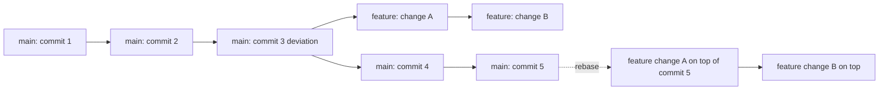

# Git Collaboration and Workflow

## What You'll Learn

In this lesson, you'll learn to:

- **describe the git state model end-to-end** — explain the relationship between a local repository, a shared repository, and a central repository, and use `git push` and `git pull` to move code between them.
- **apply the four core commands** — use `git status`, `git add`, `git commit`, and `git log` with intent, knowing the difference between an untracked file, a modified file, and a tracked file.
- **build and switch branches to isolate work** — use `git branch` and `git checkout` to develop a feature branch, then bring it back into main using `git rebase`.
- **read, build, and apply patches** — explain why a patch stores only the differences between two versions of code, and use `git diff` and `git apply` to share lightweight changes.
- **fix merge conflicts and host repos remotely** — manually clear the conflict markers a merge produces, and place a repository on GitHub, GitLab, or Bitbucket.
- **reuse python code with modules** — write a user defined module, import it, and recognize the difference between a built-in module, a user defined module, and an external module such as numpy or pandas.

## A quick refresher on repository, push, pull, and commit

> **Picture three layers of code that have to stay in sync:** the copy on your laptop, the copy your teammates can see, and the single shared copy everyone trusts.

This is the mental model Git is built around.

- A **local repository** is the codebase that lives on one developer's machine — it can be modified and inspected by that developer.
- A **shared repository** is what every collaborator can see; if your code is meant to be visible to the team, it must reach this layer.
- The **central repository** (sometimes called the central directory or global repository) is the single source of truth that the whole team pulls from and pushes to.

Three commands move code between these layers:

- `git push` — send meaningful local changes to the central directory so others can see them.
- `git pull` — fetch whatever your teammates have already pushed into the central repository back to your machine.
- `git commit` — record a meaningful change locally, with a message explaining why you made it.

## Branches, merge, and tags

> **Imagine your team is shipping Android 1.1, then Android 1.2, then Android 2.0.** Every release needs its own snapshot, and risky work has to stay separated from the main code until it is ready.

Three concepts make that possible:

- **Branch** — a parallel line of work. You create a new branch whenever you start meaningful modification, so the main branch stays clean while you experiment.
- **Merge** — the step where a deviated branch is brought back into the main branch. Merging is what folds your isolated work into the shared timeline.
- **Tag** — a specific version name attached to a meaningful point in history. If someone needs to roll back to Android 1.1 or Android 2.0, the tag is what they reach for.

## Git as a distributed version control system

> **Think of every developer holding a complete copy of the project history**, not just the latest snapshot.

That is the meaning of a **distributed version control system**. Git can:

- track changes in files
- track full history
- store commits
- support collaboration across a team
- undo mistakes
- manage branches

Because every developer has the full history locally, work can continue even when no central server is reachable.

## git status — what changed since the last commit

> **You have been editing files for an hour and want a quick answer to "what did I touch?".**

`git status` reports only the files you have actually modified. If you have not changed a file, it will not show up — Git keeps the report focused.

```shell
git status
```

When you first add a new file like `a.c`, `git status` will mark it as an untracked file because the rest of the team is not yet aware of it.

## Untracked vs modified files

Git classifies files into a few simple buckets, and knowing the bucket tells you what to do next:

| File state | What it means |
|---|---|
| **Untracked file** | A new file you created. Other collaborators working on this git repo are not aware of this file yet. |
| **Modified file** | A file that is shared among all collaborators, and you made some change to it. |
| **Tracked file** | A file that is already in the repo and that Git is watching for changes. |

There is also a `git ignore` mechanism for files you never want Git to track at all, such as build artifacts.

## git add file vs git add for everything

> **You modified ten files but only two are ready to share.** You need a way to add exactly those two — not the noisy debug files.

This is where the comparison between `git add <file>` and the dot form of `git add` matters. The two forms are written like this:

```shell
git add a.c
git add .
```

- `git add <file>` adds a specific file by name. You decide exactly what is going up.
- `git add` followed by a dot (the second form above) adds every file currently in the untracked or modified bucket — everything you created or modified will be reflected as a change to the central repository.

It is safer to add files by name than to add everything in one shot, because the dot form can sweep up junk and debug files you never meant to push.

## git commit and commit messages

> **Every change you make has a reason.** Six months from now, "I changed this" will not help anyone — but "fixed login crash on empty password" will.

`git commit` records your staged changes. The `-m` flag attaches a commit message that explains why the change was made:

```shell
git commit -m "test"
```

The message lives forever in the history of the repo — think of it as a note to your future teammates (and your future self).

## git log and commit ID

> **You want to answer "who changed this file, when, and why?"** without opening every file by hand.

`git log` shows the complete history of the repo — from the very first commit to the most recent one. There is no time bound; everything is there.

```shell
git log
```

For each commit, the log surfaces:

- A **commit ID** — a random number written in front of each commit. This is the unique handle for that commit.
- The **author** who made the change.
- The **date** the commit was made (the day and time the change went in).
- The **commit message** that was attached.

If you want to inspect what a single commit changed, use the commit ID with `git show`:

```shell
git show <commit-id>
```

## Why we need branches

> **A real project may run for 20 or 30 years**, and many developers will touch it during that time. If everyone edited the main branch directly, the codebase would collapse under conflicting changes very quickly.

A branch lets you work in isolation. The rule of thumb: **create a new branch whenever you start meaningful modification work**. Your branch can move forward, break things, and try ideas without disturbing the main branch. When the work is ready, you bring it back through merge or rebase.

## The rebase concept

> **You started a feature branch a few days ago.** Meanwhile, the main branch has moved forward — your teammates merged several new commits. How do you bring your work onto the new main without erasing their progress?

This is exactly the problem **rebase** solves. The idea is:

1. You created a feature branch and made some commits.
2. Meanwhile, the main branch moved forward with other developers' commits.
3. The rebase command says: "temporarily remove your changes, fast-forward to the latest main, then re-apply your changes on top."

Here is the same idea as a picture:



After rebase, your feature branch sits cleanly on top of the latest main, and a final merge becomes painless.

## git rebase command

The command that performs the rebase is short:

```shell
git checkout feature
git rebase main
```

The first line makes sure you are on the feature branch. The second line tells Git: "rebase whatever is on this branch onto the tip of main." Git handles the temporary removal and re-application automatically — assuming there is no merge conflict, which we will tackle below.

## git clone and open source repos

> **You want to contribute to a huge open source project — say the Linux kernel or an Android codebase.** You did not start it, you do not own the central server, but you still need a working copy.

`git clone` is the answer:

```shell
git clone <url>
```

What this does:

- copies the entire repository (its full history, all branches) onto your local system.
- makes you a collaborator — you can now pull, modify the actual code base, and send your changes back to the maintainer.

This is the entry point for working on any open source code base.

## git pull

> **You cloned a repo last week and have been reading the code.** Meanwhile, your teammates pushed several updates to the central repository. Your local copy is stale.

`git pull` brings your local repo back in sync:

```shell
git pull
```

It fetches the actual snapshot of the codebase as it currently lives in the central repository, so you are working against the latest code.

## Creating a GitHub repository and cloning

The end-to-end flow for starting fresh on GitHub:

1. on GitHub, click **new** to create a new repository (give it a short name, choose public or private, then click create).
2. GitHub gives you a `<url>` for the repository.
3. on your local system, clone it:

```shell
git clone <url>
```

If the repo is brand new, GitHub will warn you that you cloned an empty repository — that is expected. You now have an empty directory locally. If you do `ls` inside it, you will see a hidden `.git` file. That hidden directory holds all the internals: how many branches exist, where HEAD is pointing, and so on.

**HEAD** is simply Git's pointer to where you are right now in the history — which snapshot of the codebase you are currently looking at.

## End-to-end demo: create a file, add, commit, push

Once your repo is cloned, the typical loop is:

```shell
# 1. Create or edit a file (here, a new file called a.c)

# 2. See what changed
git status

# 3. add the file you want to send
git add a.c

# 4. Record the change with a message
git commit -m "test"

# 5. Send it to the central repository
git push
```

After `git push`, the file shows up on GitHub. The repo's history will list one commit, with your username as the author and "test" as the message.

If you run `git log` you will see the same information laid out: commit ID, author, date, message. Use `git show <commit-id>` to view exactly what changed in that commit (in this case: a new file `a.c` was added).

## git branch and git checkout demo

To experiment without touching main, create a branch:

```shell
git branch test
git branch
```

The first command creates a new branch called `test`. The second command lists all branches; the active branch is marked with a star (`*`).

Right after creation, you are still on main. To switch onto the new branch:

```shell
git checkout test
git branch
```

Now the star sits next to `test`. Any file you create or edit will live on the test branch, not on main. For example, if you create `b.c` and commit it on the test branch, then run `git log`, you will see your new commit. But if you switch back with `git checkout main` and run `ls`, you will only see `a.c` — `b.c` lives on the test branch and is invisible from main.

This is the power of branches: two different versions of the code base coexist on the same system.

## Patch concept and patch file format

> **Your codebase has 1 million lines of code.** You modified thousands of lines and deleted a few thousand more. To send the entire 1 million lines back to the server every time would be wasteful — most of it has not changed.

This is the problem a **patch** solves. A patch is a file that contains the difference between two versions of code — only the lines you added and the lines you deleted, not the full file.

How a patch represents a change:

- Lines that are unchanged are skipped — they are already on the server.
- Lines you added are marked with a `+`.
- Lines you deleted are marked with a `-`.
- The patch records the file name and the line number (for example, line number 695) where each change lives.

So even on a million-line repo, a patch describing thousands of changes stays small and lightweight. The server can apply that patch against V1 and reach V2 without ever shipping the whole file.

## git diff and git apply

Two commands work directly with patches: `git diff` and `git apply`.

- `git diff` creates the patch — it generates the differentiating file between V1 and V2.
- `git apply` takes a patch file and applies it to your current code base.

Used as a pair, these let you share precise, lightweight changes with anyone who has the same starting point.

## Merge conflicts and resolution

> **You wrote `hello cat` on your branch.** At the same time, a teammate wrote `hello dog` on main. When you try to merge, Git looks at the same line and sees two different answers — and it has no way to choose between them.

This is a **merge conflict**. Git cannot automatically combine changes from different branches when:

- Multiple branches modified the same line in a file.
- One branch renamed a file (say `a.c` to `b.c`) while another branch added content into the original name.

When a conflict happens, Git marks the conflicted region in the file. The marker block looks like the example below — it shows the version coming from HEAD on top, an equals separator, and the version coming from your branch below:

```text
<<<<<< HEAD
hello dog
======
hello cat
>>>>>>
```

The first marker line containing HEAD says "this version comes from the main branch." The line of equal signs separates the two versions. The last marker line closes the block. Your job as the developer is to:

1. decide which version is correct (`hello dog`, `hello cat`, both kept together, or something new).
2. edit the file so only the correct content remains.
3. delete all three marker lines (the one with HEAD, the one with equal signs, and the closing one).

Git cannot make this decision because it does not know your intent. Once you have resolved the conflict and removed the markers, the patch can be merged. Test cases will then run to confirm your resolution did not break the logic.

## Git vs GitHub vs GitLab vs Bitbucket

> **People often confuse the protocol with the platform.** Git is the tool itself; GitHub is one place to store git repositories.

The distinction:

| Name | What it is |
|---|---|
| **Git** | The protocol — the tool you run on your machine to push, pull, branch, and merge. |
| **GitHub** | A hosting website where you can store, pull, push, and collaborate on a repo. A cloud server for your code. |
| **GitLab** | Another hosting platform offering similar facilities. |
| **Bitbucket** | A third hosting platform offering similar facilities. |

GitHub, GitLab, and Bitbucket are all places where you can host your repo. They differ in functionality, performance, and pricing details, but the core role is the same: provide cloud storage so you can back up, collaborate, and share code rather than keeping everything locally.

Whenever you run `git push`, the data has to go somewhere — and that "somewhere" is provided by one of these hosting platforms.

## Introduction to Python modules

> **Every Python program needs to print, take square roots, sort lists, and use the value of pi.** If every developer rewrote those definitions from scratch, the world would be full of buggy reimplementations.

A **module** is the solution. It is a Python file that contains definitions and statements — most often functions, classes, and variables — that other programs can reuse without rewriting.

Why modules matter:

- **Avoid repetition** — write the definition of square root once, use it everywhere.
- **Reduce bugs** — multiple reimplementations introduce inconsistencies; a single trusted module is easier to keep correct.
- **Improve maintainability** — a fix in one place propagates everywhere the module is used.
- **Provide reliable constants** — for example, the value of pi as 3.14 or 22 by 7. A module gives you the exact value rather than relying on a developer's guess (3.75 is wrong; do not roll your own).

A module can contain:

- Functions (like square root, sort)
- Classes
- Variables (like pi)

## Import statement and the calc.py example

The `import` statement is how you bring a module into your code:

```python
import calc
```

When Python sees this, it looks for a file named `calc.py` (the `.py` extension is added automatically) in your local directory. Once found, you can use anything defined inside it by writing the module name, then a dot, then the function name — calling `add` or `subtract` from inside `calc`.

A minimal `calc.py` might look like this:

```python
def add(x, y):
    return x + y

def subtract(x, y):
    return x - y
```

And the program that uses it imports `calc`, then calls the `add` function from inside `calc` with arguments 10 and 2, and prints the result. After the import line, you write the module name `calc`, then a dot, then `add` with the arguments `10` and `2` — python looks up `add` inside the `calc` module, runs it, and the result is `12`.

The mental shift: **importing means "I have access to that code."** You did not write `add` — someone else did, and the import statement gives you access to it. If you call a function name that does not exist in the module (for example, asking for some other function name when only `add` is defined), Python will tell you.

## Types of modules: built-in, user defined, external

Python ships with three flavors of module, and the difference is about who wrote the code and what you have to do to use it:

| Module Type | Where it comes from | Do you install? | Do you import? |
|---|---|---|---|
| **Built-in module** | comes by default with python (for example, the module behind the `print` function) | no | no |
| **User defined module** | Created by you or someone in your team (for example, your own `calc.py`) | No (you have the source code) | Yes |
| **External module** | Written by someone outside your team and published for everyone (for example, numpy, pandas, request) | Yes | Yes |

Two practical points:

- For an external module, you do not have the source code and you cannot modify it. You install it, import it, and use it as-is.
- For a user defined module, you do have the source code, so you can change the definitions if needed.

The deeper journey into external modules — and into how libraries like numpy and pandas are used in real workflows — comes when you reach machine learning, database backend, or web development backend areas.

## Key Takeaways

- **Git is a distributed version control system, not a place to store files.** Every developer has the full history locally; hosting platforms like GitHub, GitLab, and Bitbucket exist to share that history across a team.
- **The four-command rhythm is `git status` → `git add` → `git commit` → `git push`.** Status tells you what changed, add stages exactly what you want, commit records it with a message, push sends it to the central repository.
- **A branch is your safe space to experiment.** Create a new branch whenever you start meaningful modification work, then merge or rebase it back into main when you are done. The rule of thumb: never edit main directly on a real project.
- **A patch is a lightweight description of change.** It stores only what you added and deleted, not the full file — which is why even million-line repositories can move work around quickly with `git diff` and `git apply`.
- **Merge conflicts are decisions Git refuses to make for you.** When two branches change the same line, Git marks the region with conflict markers (one tagged HEAD on top, an equals-sign separator in the middle, and a closing marker at the bottom) and waits for you to choose. The developer is the one who has to clean those markers out.
- **A python module is reusable code in one file.** Writing `import calc` brings the contents of `calc.py` into your program. A built-in module needs no install or import, a user defined module needs import only, and an external module like numpy or pandas needs both install and import.
- **Think of Git as the workflow protocol and GitHub as one of many landing strips for it.** The skills (branch, commit, rebase, resolve, push) carry over identically whether your team chooses GitHub, GitLab, or Bitbucket.