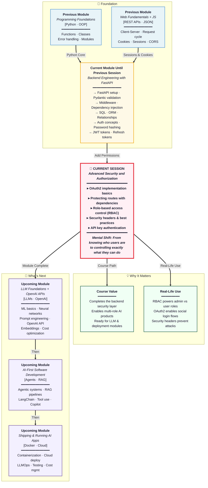

**Diagram 4 — Advanced Security and Authorization**

```mermaid
flowchart TB
    classDef prevModule fill:#e8f4f8,stroke:#5b9bd5,stroke-width:2px,color:#1a1a2e
    classDef currentModulePrev fill:#fef9e7,stroke:#f0a500,stroke-width:2px,color:#1a1a2e
    classDef currentSession fill:#fff0f5,stroke:#e63946,stroke-width:4px,color:#1a1a2e,font-weight:bold
    classDef valueBox fill:#f0fff4,stroke:#2d6a4f,stroke-width:2px,color:#1a1a2e
    classDef futureModule fill:#f3f0ff,stroke:#7b5ea7,stroke-width:2px,color:#1a1a2e

    subgraph FOUNDATION["🧱 Foundation"]
        direction TB
        PM1["<b>Previous Module</b><br/><i>Programming Foundations</i><br/>[Python · OOP]<br/>━━━━━━━━━━━━━━<br/>Functions · Classes<br/>Error handling · Modules"]
        PM2["<b>Previous Module</b><br/><i>Web Fundamentals + JS</i><br/>[REST APIs · JSON]<br/>━━━━━━━━━━━━━━<br/>Client-Server · Request cycle<br/>Cookies · Sessions · CORS"]
        CM_PREV["<b>Current Module Until Previous Session</b><br/><i>Backend Engineering with FastAPI</i><br/>━━━━━━━━━━━━━━<br/>→ FastAPI setup · Pydantic validation<br/>→ Middleware · Dependency injection<br/>→ SQL · ORM · Relationships<br/>→ Auth concepts · Password hashing<br/>→ JWT tokens · Refresh tokens"]
    end

    CS["🎯 <b>CURRENT SESSION</b><br/><i>Advanced Security and Authorization</i><br/>━━━━━━━━━━━━━━━━━━━━<br/>▸ OAuth2 implementation basics<br/>▸ Protecting routes with dependencies<br/>▸ Role-based access control (RBAC)<br/>▸ Security headers & best practices<br/>▸ API key authentication<br/>━━━━━━━━━━━━━━━━━━━━<br/><i>Mental Shift: From knowing who users are<br/>to controlling exactly what they can do</i>"]

    subgraph VALUE["💡 Why It Matters"]
        direction LR
        CV["<b>Course Value</b><br/>━━━━━━━━━<br/>Completes the backend security layer<br/>Enables multi-role AI products<br/>Ready for LLM & deployment modules"]
        RV["<b>Real-Life Use</b><br/>━━━━━━━━━<br/>RBAC powers admin vs user roles<br/>OAuth2 enables social login flows<br/>Security headers prevent attacks"]
    end

    subgraph FUTURE["🚀 What's Next"]
        direction TB
        FM1["<b>Upcoming Module</b><br/><i>LLM Foundations + OpenAI APIs</i><br/>[LLMs · OpenAI]<br/>━━━━━━━━━━━━━━<br/>ML basics · Neural networks<br/>Prompt engineering · OpenAI API<br/>Embeddings · Cost optimization"]
        FM2["<b>Upcoming Module</b><br/><i>AI-First Software Development</i><br/>[Agents · RAG]<br/>━━━━━━━━━━━━━━<br/>Agentic systems · RAG pipelines<br/>LangChain · Tool use · Copilot"]
        FM3["<b>Upcoming Module</b><br/><i>Shipping & Running AI Apps</i><br/>[Docker · Cloud]<br/>━━━━━━━━━━━━━━<br/>Containerization · Cloud deploy<br/>LLMOps · Testing · Cost mgmt"]
    end

    PM1 ==>|"&nbsp;Python Core&nbsp;"| CM_PREV
    PM2 ==>|"&nbsp;Sessions & Cookies&nbsp;"| CM_PREV
    CM_PREV ==>|"&nbsp;Add Permissions&nbsp;"| CS
    CS ==>|"&nbsp;Course Path&nbsp;"| CV
    CS ==>|"&nbsp;Real-Life Use&nbsp;"| RV
    CS ==>|"&nbsp;Module Complete&nbsp;"| FM1
    FM1 ==>|"&nbsp;Then&nbsp;"| FM2
    FM2 ==>|"&nbsp;Then&nbsp;"| FM3

    class PM1,PM2 prevModule
    class CM_PREV currentModulePrev
    class CS currentSession
    class CV,RV valueBox
    class FM1,FM2,FM3 futureModule
    linkStyle default stroke-width:3px
```