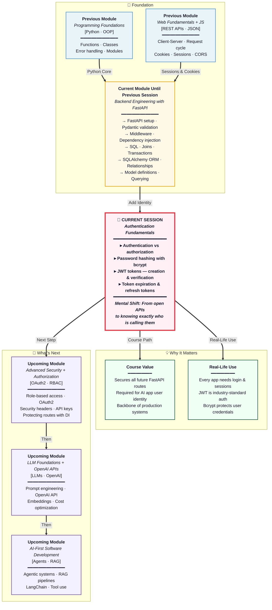

**Diagram 3 — Authentication Fundamentals**

```mermaid
flowchart TB
    classDef prevModule fill:#e8f4f8,stroke:#5b9bd5,stroke-width:2px,color:#1a1a2e
    classDef currentModulePrev fill:#fef9e7,stroke:#f0a500,stroke-width:2px,color:#1a1a2e
    classDef currentSession fill:#fff0f5,stroke:#e63946,stroke-width:4px,color:#1a1a2e,font-weight:bold
    classDef valueBox fill:#f0fff4,stroke:#2d6a4f,stroke-width:2px,color:#1a1a2e
    classDef futureModule fill:#f3f0ff,stroke:#7b5ea7,stroke-width:2px,color:#1a1a2e

    subgraph FOUNDATION["🧱 Foundation"]
        direction TB
        PM1["<b>Previous Module</b><br/><i>Programming Foundations</i><br/>[Python · OOP]<br/>━━━━━━━━━━━━━━<br/>Functions · Classes<br/>Error handling · Modules"]
        PM2["<b>Previous Module</b><br/><i>Web Fundamentals + JS</i><br/>[REST APIs · JSON]<br/>━━━━━━━━━━━━━━<br/>Client-Server · Request cycle<br/>Cookies · Sessions · CORS"]
        CM_PREV["<b>Current Module Until Previous Session</b><br/><i>Backend Engineering with FastAPI</i><br/>━━━━━━━━━━━━━━<br/>→ FastAPI setup · Pydantic validation<br/>→ Middleware · Dependency injection<br/>→ SQL · Joins · Transactions<br/>→ SQLAlchemy ORM · Relationships<br/>→ Model definitions · Querying"]
    end

    CS["🎯 <b>CURRENT SESSION</b><br/><i>Authentication Fundamentals</i><br/>━━━━━━━━━━━━━━━━━━━━<br/>▸ Authentication vs authorization<br/>▸ Password hashing with bcrypt<br/>▸ JWT tokens — creation & verification<br/>▸ Token expiration & refresh tokens<br/>━━━━━━━━━━━━━━━━━━━━<br/><i>Mental Shift: From open APIs<br/>to knowing exactly who is calling them</i>"]

    subgraph VALUE["💡 Why It Matters"]
        direction LR
        CV["<b>Course Value</b><br/>━━━━━━━━━<br/>Secures all future FastAPI routes<br/>Required for AI app user identity<br/>Backbone of production systems"]
        RV["<b>Real-Life Use</b><br/>━━━━━━━━━<br/>Every app needs login & sessions<br/>JWT is industry-standard auth<br/>Bcrypt protects user credentials"]
    end

    subgraph FUTURE["🚀 What's Next"]
        direction TB
        FM1["<b>Upcoming Module</b><br/><i>Advanced Security + Authorization</i><br/>[OAuth2 · RBAC]<br/>━━━━━━━━━━━━━━<br/>Role-based access · OAuth2<br/>Security headers · API keys<br/>Protecting routes with DI"]
        FM2["<b>Upcoming Module</b><br/><i>LLM Foundations + OpenAI APIs</i><br/>[LLMs · OpenAI]<br/>━━━━━━━━━━━━━━<br/>Prompt engineering · OpenAI API<br/>Embeddings · Cost optimization"]
        FM3["<b>Upcoming Module</b><br/><i>AI-First Software Development</i><br/>[Agents · RAG]<br/>━━━━━━━━━━━━━━<br/>Agentic systems · RAG pipelines<br/>LangChain · Tool use"]
    end

    PM1 ==>|"&nbsp;Python Core&nbsp;"| CM_PREV
    PM2 ==>|"&nbsp;Sessions & Cookies&nbsp;"| CM_PREV
    CM_PREV ==>|"&nbsp;Add Identity&nbsp;"| CS
    CS ==>|"&nbsp;Course Path&nbsp;"| CV
    CS ==>|"&nbsp;Real-Life Use&nbsp;"| RV
    CS ==>|"&nbsp;Next Step&nbsp;"| FM1
    FM1 ==>|"&nbsp;Then&nbsp;"| FM2
    FM2 ==>|"&nbsp;Then&nbsp;"| FM3

    class PM1,PM2 prevModule
    class CM_PREV currentModulePrev
    class CS currentSession
    class CV,RV valueBox
    class FM1,FM2,FM3 futureModule
    linkStyle default stroke-width:3px
```

---

