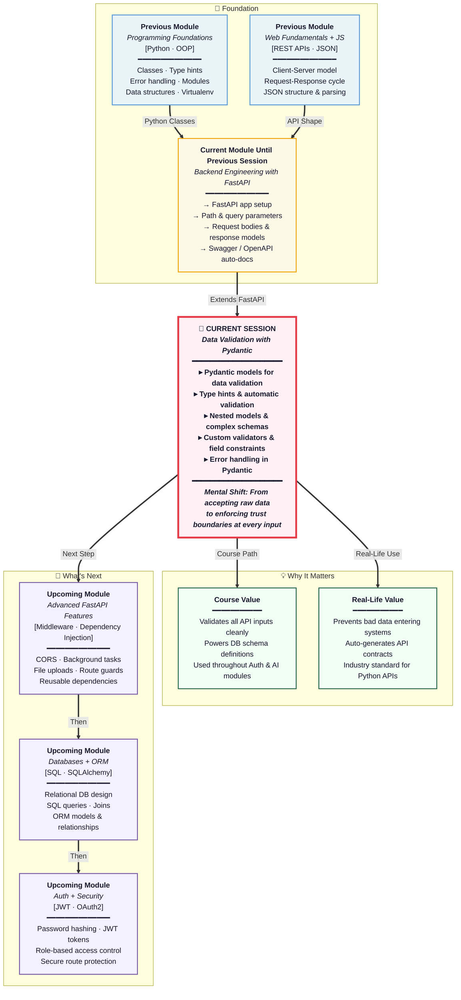

```mermaid
flowchart TB
    classDef prevModule fill:#e8f4f8,stroke:#5b9bd5,stroke-width:2px,color:#1a1a2e
    classDef currentModulePrev fill:#fef9e7,stroke:#f0a500,stroke-width:2px,color:#1a1a2e
    classDef currentSession fill:#fff0f5,stroke:#e63946,stroke-width:4px,color:#1a1a2e,font-weight:bold
    classDef valueBox fill:#f0fff4,stroke:#2d6a4f,stroke-width:2px,color:#1a1a2e
    classDef futureModule fill:#f3f0ff,stroke:#7b5ea7,stroke-width:2px,color:#1a1a2e

    %%--- FOUNDATION SUBGRAPH ---%%
    subgraph FOUNDATION["🧱 Foundation"]
        direction TB

        PM1["<b>Previous Module</b><br/><i>Programming Foundations</i><br/>[Python · OOP]<br/>━━━━━━━━━━━━━━<br/>Classes · Type hints<br/>Error handling · Modules<br/>Data structures · Virtualenv"]

        PM2["<b>Previous Module</b><br/><i>Web Fundamentals + JS</i><br/>[REST APIs · JSON]<br/>━━━━━━━━━━━━━━<br/>Client-Server model<br/>Request-Response cycle<br/>JSON structure & parsing"]

        CM_PREV["<b>Current Module Until Previous Session</b><br/><i>Backend Engineering with FastAPI</i><br/>━━━━━━━━━━━━━━<br/>→ FastAPI app setup<br/>→ Path & query parameters<br/>→ Request bodies & response models<br/>→ Swagger / OpenAPI auto-docs"]
    end

    %%--- CURRENT SESSION ---%%
    CS["🎯 <b>CURRENT SESSION</b><br/><i>Data Validation with Pydantic</i><br/>━━━━━━━━━━━━━━━━━━━━<br/>▸ Pydantic models for data validation<br/>▸ Type hints & automatic validation<br/>▸ Nested models & complex schemas<br/>▸ Custom validators & field constraints<br/>▸ Error handling in Pydantic<br/>━━━━━━━━━━━━━━━━━━━━<br/><i>Mental Shift: From accepting raw data<br/>to enforcing trust boundaries at every input</i>"]

    %%--- VALUE SUBGRAPH ---%%
    subgraph VALUE["💡 Why It Matters"]
        direction LR
        CV["<b>Course Value</b><br/>━━━━━━━━━━━<br/>Validates all API inputs cleanly<br/>Powers DB schema definitions<br/>Used throughout Auth & AI modules"]
        RV["<b>Real-Life Value</b><br/>━━━━━━━━━━━<br/>Prevents bad data entering systems<br/>Auto-generates API contracts<br/>Industry standard for Python APIs"]
    end

    %%--- FUTURE SUBGRAPH ---%%
    subgraph FUTURE["🚀 What's Next"]
        direction TB
        FM1["<b>Upcoming Module</b><br/><i>Advanced FastAPI Features</i><br/>[Middleware · Dependency Injection]<br/>━━━━━━━━━━━━━━<br/>CORS · Background tasks<br/>File uploads · Route guards<br/>Reusable dependencies"]

        FM2["<b>Upcoming Module</b><br/><i>Databases + ORM</i><br/>[SQL · SQLAlchemy]<br/>━━━━━━━━━━━━━━<br/>Relational DB design<br/>SQL queries · Joins<br/>ORM models & relationships"]

        FM3["<b>Upcoming Module</b><br/><i>Auth + Security</i><br/>[JWT · OAuth2]<br/>━━━━━━━━━━━━━━<br/>Password hashing · JWT tokens<br/>Role-based access control<br/>Secure route protection"]
    end

    %%--- CONNECTIONS ---%%
    PM1 ==>|"&nbsp;Python Classes&nbsp;"| CM_PREV
    PM2 ==>|"&nbsp;API Shape&nbsp;"| CM_PREV
    CM_PREV ==>|"&nbsp;Extends FastAPI&nbsp;"| CS
    CS ==>|"&nbsp;Course Path&nbsp;"| CV
    CS ==>|"&nbsp;Real-Life Use&nbsp;"| RV
    CS ==>|"&nbsp;Next Step&nbsp;"| FM1
    FM1 ==>|"&nbsp;Then&nbsp;"| FM2
    FM2 ==>|"&nbsp;Then&nbsp;"| FM3

    %%--- CLASS ASSIGNMENTS ---%%
    class PM1,PM2 prevModule
    class CM_PREV currentModulePrev
    class CS currentSession
    class CV,RV valueBox
    class FM1,FM2,FM3 futureModule

    linkStyle default stroke-width:3px
```