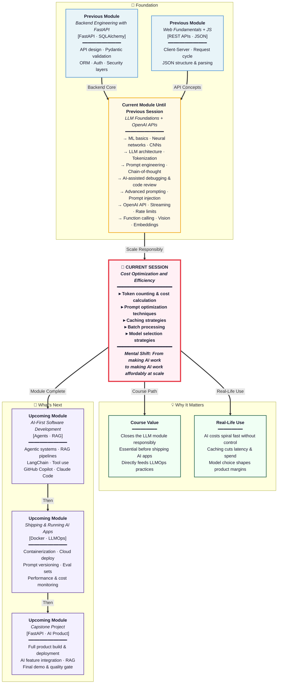

```mermaid
flowchart TB
    classDef prevModule fill:#e8f4f8,stroke:#5b9bd5,stroke-width:2px,color:#1a1a2e
    classDef currentModulePrev fill:#fef9e7,stroke:#f0a500,stroke-width:2px,color:#1a1a2e
    classDef currentSession fill:#fff0f5,stroke:#e63946,stroke-width:4px,color:#1a1a2e,font-weight:bold
    classDef valueBox fill:#f0fff4,stroke:#2d6a4f,stroke-width:2px,color:#1a1a2e
    classDef futureModule fill:#f3f0ff,stroke:#7b5ea7,stroke-width:2px,color:#1a1a2e

    subgraph FOUNDATION["🧱 Foundation"]
        direction TB
        PM1["<b>Previous Module</b><br/><i>Backend Engineering with FastAPI</i><br/>[FastAPI · SQLAlchemy]<br/>━━━━━━━━━━━━━━<br/>API design · Pydantic validation<br/>ORM · Auth · Security layers"]
        PM2["<b>Previous Module</b><br/><i>Web Fundamentals + JS</i><br/>[REST APIs · JSON]<br/>━━━━━━━━━━━━━━<br/>Client-Server · Request cycle<br/>JSON structure & parsing"]
        CM_PREV["<b>Current Module Until Previous Session</b><br/><i>LLM Foundations + OpenAI APIs</i><br/>━━━━━━━━━━━━━━<br/>→ ML basics · Neural networks · CNNs<br/>→ LLM architecture · Tokenization<br/>→ Prompt engineering · Chain-of-thought<br/>→ AI-assisted debugging & code review<br/>→ Advanced prompting · Prompt injection<br/>→ OpenAI API · Streaming · Rate limits<br/>→ Function calling · Vision · Embeddings"]
    end

    CS["🎯 <b>CURRENT SESSION</b><br/><i>Cost Optimization and Efficiency</i><br/>━━━━━━━━━━━━━━━━━━━━<br/>▸ Token counting & cost calculation<br/>▸ Prompt optimization techniques<br/>▸ Caching strategies<br/>▸ Batch processing<br/>▸ Model selection strategies<br/>━━━━━━━━━━━━━━━━━━━━<br/><i>Mental Shift: From making AI work<br/>to making AI work affordably at scale</i>"]

    subgraph VALUE["💡 Why It Matters"]
        direction LR
        CV["<b>Course Value</b><br/>━━━━━━━━━<br/>Closes the LLM module responsibly<br/>Essential before shipping AI apps<br/>Directly feeds LLMOps practices"]
        RV["<b>Real-Life Use</b><br/>━━━━━━━━━<br/>AI costs spiral fast without control<br/>Caching cuts latency & spend<br/>Model choice shapes product margins"]
    end

    subgraph FUTURE["🚀 What's Next"]
        direction TB
        FM1["<b>Upcoming Module</b><br/><i>AI-First Software Development</i><br/>[Agents · RAG]<br/>━━━━━━━━━━━━━━<br/>Agentic systems · RAG pipelines<br/>LangChain · Tool use<br/>GitHub Copilot · Claude Code"]
        FM2["<b>Upcoming Module</b><br/><i>Shipping & Running AI Apps</i><br/>[Docker · LLMOps]<br/>━━━━━━━━━━━━━━<br/>Containerization · Cloud deploy<br/>Prompt versioning · Eval sets<br/>Performance & cost monitoring"]
        FM3["<b>Upcoming Module</b><br/><i>Capstone Project</i><br/>[FastAPI · AI Product]<br/>━━━━━━━━━━━━━━<br/>Full product build & deployment<br/>AI feature integration · RAG<br/>Final demo & quality gate"]
    end

    PM1 ==>|"&nbsp;Backend Core&nbsp;"| CM_PREV
    PM2 ==>|"&nbsp;API Concepts&nbsp;"| CM_PREV
    CM_PREV ==>|"&nbsp;Scale Responsibly&nbsp;"| CS
    CS ==>|"&nbsp;Course Path&nbsp;"| CV
    CS ==>|"&nbsp;Real-Life Use&nbsp;"| RV
    CS ==>|"&nbsp;Module Complete&nbsp;"| FM1
    FM1 ==>|"&nbsp;Then&nbsp;"| FM2
    FM2 ==>|"&nbsp;Then&nbsp;"| FM3

    class PM1,PM2 prevModule
    class CM_PREV currentModulePrev
    class CS currentSession
    class CV,RV valueBox
    class FM1,FM2,FM3 futureModule
    linkStyle default stroke-width:3px
```