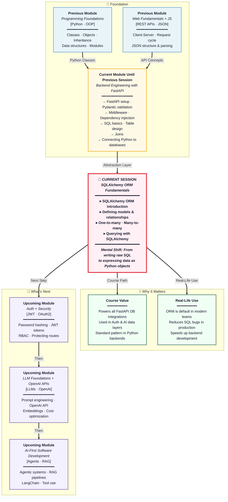

**Diagram 2 — SQLAlchemy ORM Fundamentals**

```mermaid
flowchart TB
    classDef prevModule fill:#e8f4f8,stroke:#5b9bd5,stroke-width:2px,color:#1a1a2e
    classDef currentModulePrev fill:#fef9e7,stroke:#f0a500,stroke-width:2px,color:#1a1a2e
    classDef currentSession fill:#fff0f5,stroke:#e63946,stroke-width:4px,color:#1a1a2e,font-weight:bold
    classDef valueBox fill:#f0fff4,stroke:#2d6a4f,stroke-width:2px,color:#1a1a2e
    classDef futureModule fill:#f3f0ff,stroke:#7b5ea7,stroke-width:2px,color:#1a1a2e

    subgraph FOUNDATION["🧱 Foundation"]
        direction TB
        PM1["<b>Previous Module</b><br/><i>Programming Foundations</i><br/>[Python · OOP]<br/>━━━━━━━━━━━━━━<br/>Classes · Objects · Inheritance<br/>Data structures · Modules"]
        PM2["<b>Previous Module</b><br/><i>Web Fundamentals + JS</i><br/>[REST APIs · JSON]<br/>━━━━━━━━━━━━━━<br/>Client-Server · Request cycle<br/>JSON structure & parsing"]
        CM_PREV["<b>Current Module Until Previous Session</b><br/><i>Backend Engineering with FastAPI</i><br/>━━━━━━━━━━━━━━<br/>→ FastAPI setup · Pydantic validation<br/>→ Middleware · Dependency injection<br/>→ SQL basics · Table design<br/>→ Joins <br/>→ Connecting Python to databases"]
    end

    CS["🎯 <b>CURRENT SESSION</b><br/><i>SQLAlchemy ORM Fundamentals</i><br/>━━━━━━━━━━━━━━━━━━━━<br/>▸ SQLAlchemy ORM introduction<br/>▸ Defining models & relationships<br/>▸ One-to-many · Many-to-many<br/>▸ Querying with SQLAlchemy<br/>━━━━━━━━━━━━━━━━━━━━<br/><i>Mental Shift: From writing raw SQL<br/>to expressing data as Python objects</i>"]

    subgraph VALUE["💡 Why It Matters"]
        direction LR
        CV["<b>Course Value</b><br/>━━━━━━━━━<br/>Powers all FastAPI DB integrations<br/>Used in Auth & AI data layers<br/>Standard pattern in Python backends"]
        RV["<b>Real-Life Use</b><br/>━━━━━━━━━<br/>ORM is default in modern teams<br/>Reduces SQL bugs in production<br/>Speeds up backend development"]
    end

    subgraph FUTURE["🚀 What's Next"]
        direction TB
        FM1["<b>Upcoming Module</b><br/><i>Auth + Security</i><br/>[JWT · OAuth2]<br/>━━━━━━━━━━━━━━<br/>Password hashing · JWT tokens<br/>RBAC · Protecting routes"]
        FM2["<b>Upcoming Module</b><br/><i>LLM Foundations + OpenAI APIs</i><br/>[LLMs · OpenAI]<br/>━━━━━━━━━━━━━━<br/>Prompt engineering · OpenAI API<br/>Embeddings · Cost optimization"]
        FM3["<b>Upcoming Module</b><br/><i>AI-First Software Development</i><br/>[Agents · RAG]<br/>━━━━━━━━━━━━━━<br/>Agentic systems · RAG pipelines<br/>LangChain · Tool use"]
    end

    PM1 ==>|"&nbsp;Python Classes&nbsp;"| CM_PREV
    PM2 ==>|"&nbsp;API Concepts&nbsp;"| CM_PREV
    CM_PREV ==>|"&nbsp;Abstraction Layer&nbsp;"| CS
    CS ==>|"&nbsp;Course Path&nbsp;"| CV
    CS ==>|"&nbsp;Real-Life Use&nbsp;"| RV
    CS ==>|"&nbsp;Next Step&nbsp;"| FM1
    FM1 ==>|"&nbsp;Then&nbsp;"| FM2
    FM2 ==>|"&nbsp;Then&nbsp;"| FM3

    class PM1,PM2 prevModule
    class CM_PREV currentModulePrev
    class CS currentSession
    class CV,RV valueBox
    class FM1,FM2,FM3 futureModule
    linkStyle default stroke-width:3px
```

---

