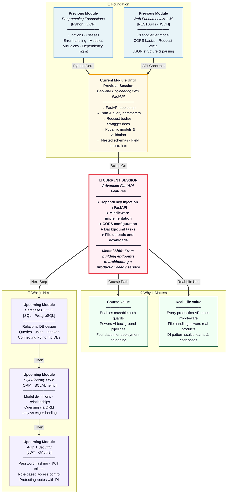

```mermaid
flowchart TB
    classDef prevModule fill:#e8f4f8,stroke:#5b9bd5,stroke-width:2px,color:#1a1a2e
    classDef currentModulePrev fill:#fef9e7,stroke:#f0a500,stroke-width:2px,color:#1a1a2e
    classDef currentSession fill:#fff0f5,stroke:#e63946,stroke-width:4px,color:#1a1a2e,font-weight:bold
    classDef valueBox fill:#f0fff4,stroke:#2d6a4f,stroke-width:2px,color:#1a1a2e
    classDef futureModule fill:#f3f0ff,stroke:#7b5ea7,stroke-width:2px,color:#1a1a2e

    %%--- FOUNDATION SUBGRAPH ---%%
    subgraph FOUNDATION["🧱 Foundation"]
        direction TB

        PM1["<b>Previous Module</b><br/><i>Programming Foundations</i><br/>[Python · OOP]<br/>━━━━━━━━━━━━━━<br/>Functions · Classes<br/>Error handling · Modules<br/>Virtualenv · Dependency mgmt"]

        PM2["<b>Previous Module</b><br/><i>Web Fundamentals + JS</i><br/>[REST APIs · JSON]<br/>━━━━━━━━━━━━━━<br/>Client-Server model<br/>CORS basics · Request cycle<br/>JSON structure & parsing"]

        CM_PREV["<b>Current Module Until Previous Session</b><br/><i>Backend Engineering with FastAPI</i><br/>━━━━━━━━━━━━━━<br/>→ FastAPI app setup<br/>→ Path & query parameters<br/>→ Request bodies · Swagger docs<br/>→ Pydantic models & validation<br/>→ Nested schemas · Field constraints"]
    end

    %%--- CURRENT SESSION ---%%
    CS["🎯 <b>CURRENT SESSION</b><br/><i>Advanced FastAPI Features</i><br/>━━━━━━━━━━━━━━━━━━━━<br/>▸ Dependency injection in FastAPI<br/>▸ Middleware implementation<br/>▸ CORS configuration<br/>▸ Background tasks<br/>▸ File uploads and downloads<br/>━━━━━━━━━━━━━━━━━━━━<br/><i>Mental Shift: From building endpoints<br/>to architecting a production-ready service</i>"]

    %%--- VALUE SUBGRAPH ---%%
    subgraph VALUE["💡 Why It Matters"]
        direction LR
        CV["<b>Course Value</b><br/>━━━━━━━━━━━<br/>Enables reusable auth guards<br/>Powers AI background pipelines<br/>Foundation for deployment hardening"]
        RV["<b>Real-Life Value</b><br/>━━━━━━━━━━━<br/>Every production API uses middleware<br/>File handling powers real products<br/>DI pattern scales teams & codebases"]
    end

    %%--- FUTURE SUBGRAPH ---%%
    subgraph FUTURE["🚀 What's Next"]
        direction TB
        FM1["<b>Upcoming Module</b><br/><i>Databases + SQL</i><br/>[SQL · PostgreSQL]<br/>━━━━━━━━━━━━━━<br/>Relational DB design<br/>Queries · Joins · Indexes<br/>Connecting Python to DBs"]

        FM2["<b>Upcoming Module</b><br/><i>SQLAlchemy ORM</i><br/>[ORM · SQLAlchemy]<br/>━━━━━━━━━━━━━━<br/>Model definitions · Relationships<br/>Querying via ORM<br/>Lazy vs eager loading"]

        FM3["<b>Upcoming Module</b><br/><i>Auth + Security</i><br/>[JWT · OAuth2]<br/>━━━━━━━━━━━━━━<br/>Password hashing · JWT tokens<br/>Role-based access control<br/>Protecting routes with DI"]
    end

    %%--- CONNECTIONS ---%%
    PM1 ==>|"&nbsp;Python Core&nbsp;"| CM_PREV
    PM2 ==>|"&nbsp;API Concepts&nbsp;"| CM_PREV
    CM_PREV ==>|"&nbsp;Builds On&nbsp;"| CS
    CS ==>|"&nbsp;Course Path&nbsp;"| CV
    CS ==>|"&nbsp;Real-Life Use&nbsp;"| RV
    CS ==>|"&nbsp;Next Step&nbsp;"| FM1
    FM1 ==>|"&nbsp;Then&nbsp;"| FM2
    FM2 ==>|"&nbsp;Then&nbsp;"| FM3

    %%--- CLASS ASSIGNMENTS ---%%
    class PM1,PM2 prevModule
    class CM_PREV currentModulePrev
    class CS currentSession
    class CV,RV valueBox
    class FM1,FM2,FM3 futureModule

    linkStyle default stroke-width:3px
```