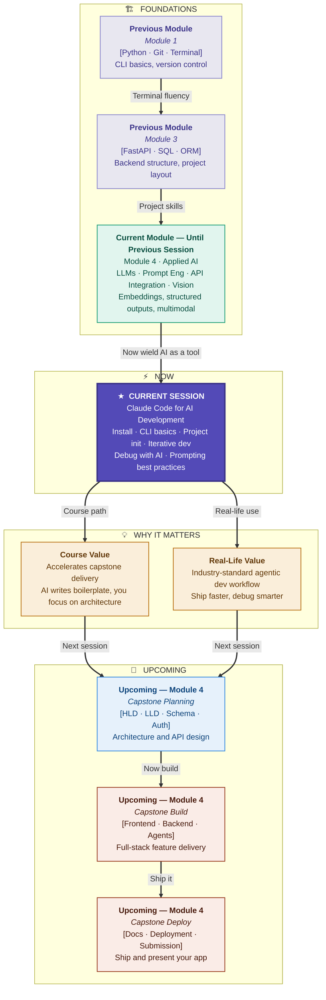

```mermaid
flowchart TB
    classDef prev fill:#E8E7F0,stroke:#8B87CC,color:#3C3489,stroke-width:1.5px
    classDef currmod fill:#E1F5EE,stroke:#1D9E75,color:#085041,stroke-width:1.5px
    classDef current fill:#534AB7,stroke:#3C3489,color:#ffffff,stroke-width:3px
    classDef value fill:#FAEEDA,stroke:#BA7517,color:#633806,stroke-width:1.5px
    classDef future fill:#E6F1FB,stroke:#378ADD,color:#0C447C,stroke-width:1.5px
    classDef capstone fill:#FAECE7,stroke:#993C1D,color:#4A1B0C,stroke-width:1.5px

    linkStyle default stroke-width:2.5px

    subgraph FOUNDATIONS ["🏗 &nbsp; FOUNDATIONS"]
        direction LR
        M1["<b>Previous Module</b><br/><i>Module 1</i><br/>[Python · Git · Terminal]<br/>CLI basics, version control"]:::prev
        M3["<b>Previous Module</b><br/><i>Module 3</i><br/>[FastAPI · SQL · ORM]<br/>Backend structure, project layout"]:::prev
        AIMOD["<b>Current Module — Until Previous Session</b><br/>Module 4 · Applied AI<br/>LLMs · Prompt Eng · API Integration · Vision<br/>Embeddings, structured outputs, multimodal"]:::currmod
    end

    M1 ==>|&nbsp;Terminal fluency&nbsp;| M3
    M3 ==>|&nbsp;Project skills&nbsp;| AIMOD

    subgraph NOW ["⚡ &nbsp; NOW"]
        CURR["★ &nbsp;<b>CURRENT SESSION</b><br/>Claude Code for AI Development<br/>Install · CLI basics · Project init · Iterative dev<br/>Debug with AI · Prompting best practices"]:::current
    end

    AIMOD ==>|&nbsp;Now wield AI as a tool&nbsp;| CURR

    subgraph VALUE ["💡 &nbsp; WHY IT MATTERS"]
        direction LR
        CV["<b>Course Value</b><br/>Accelerates capstone delivery<br/>AI writes boilerplate, you focus on architecture"]:::value
        RV["<b>Real-Life Value</b><br/>Industry-standard agentic dev workflow<br/>Ship faster, debug smarter"]:::value
    end

    CURR ==>|&nbsp;Course path&nbsp;| CV
    CURR ==>|&nbsp;Real-life use&nbsp;| RV

    subgraph UPCOMING ["🚀 &nbsp; UPCOMING"]
        direction LR
        U1["<b>Upcoming — Module 4</b><br/><i>Capstone Planning</i><br/>[HLD · LLD · Schema · Auth]<br/>Architecture and API design"]:::future
        U2["<b>Upcoming — Module 4</b><br/><i>Capstone Build</i><br/>[Frontend · Backend · Agents]<br/>Full-stack feature delivery"]:::capstone
        U3["<b>Upcoming — Module 4</b><br/><i>Capstone Deploy</i><br/>[Docs · Deployment · Submission]<br/>Ship and present your app"]:::capstone
    end

    CV ==>|&nbsp;Next session&nbsp;| U1
    RV ==>|&nbsp;Next session&nbsp;| U1
    U1 ==>|&nbsp;Now build&nbsp;| U2
    U2 ==>|&nbsp;Ship it&nbsp;| U3
```