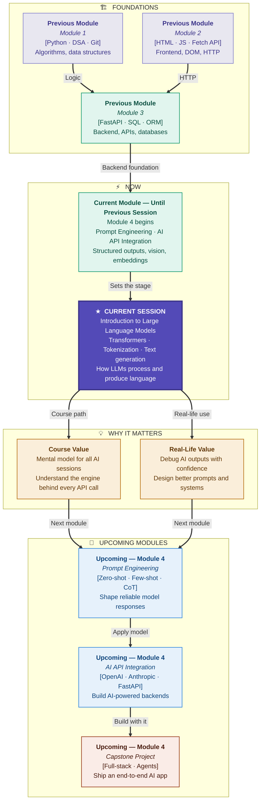

```mermaid
flowchart TB
    classDef prev fill:#E8E7F0,stroke:#8B87CC,color:#3C3489,stroke-width:1.5px
    classDef currmod fill:#E1F5EE,stroke:#1D9E75,color:#085041,stroke-width:1.5px
    classDef current fill:#534AB7,stroke:#3C3489,color:#ffffff,stroke-width:3px
    classDef value fill:#FAEEDA,stroke:#BA7517,color:#633806,stroke-width:1.5px
    classDef future fill:#E6F1FB,stroke:#378ADD,color:#0C447C,stroke-width:1.5px
    classDef capstone fill:#FAECE7,stroke:#993C1D,color:#4A1B0C,stroke-width:1.5px

    linkStyle default stroke-width:2.5px

    subgraph FOUNDATIONS ["🏗 &nbsp; FOUNDATIONS"]
        direction TB
        M1["<b>Previous Module</b><br/><i>Module 1</i><br/>[Python · DSA · Git]<br/>Algorithms, data structures"]:::prev
        M2["<b>Previous Module</b><br/><i>Module 2</i><br/>[HTML · JS · Fetch API]<br/>Frontend, DOM, HTTP"]:::prev
        M3["<b>Previous Module</b><br/><i>Module 3</i><br/>[FastAPI · SQL · ORM]<br/>Backend, APIs, databases"]:::currmod
    end

    M1 ==>|&nbsp;Logic&nbsp;| M3
    M2 ==>|&nbsp;HTTP&nbsp;| M3

    subgraph NOW ["⚡ &nbsp; NOW"]
        direction TB
        PREV["<b>Current Module — Until Previous Session</b><br/>Module 4 begins<br/>Prompt Engineering · AI API Integration<br/>Structured outputs, vision, embeddings"]:::currmod
        CURR["★ &nbsp;<b>CURRENT SESSION</b><br/>Introduction to Large Language Models<br/>Transformers · Tokenization · Text generation<br/>How LLMs process and produce language"]:::current
    end

    M3 ==>|&nbsp;Backend foundation&nbsp;| PREV
    PREV ==>|&nbsp;Sets the stage&nbsp;| CURR

    subgraph VALUE ["💡 &nbsp; WHY IT MATTERS"]
        direction LR
        CV["<b>Course Value</b><br/>Mental model for all AI sessions<br/>Understand the engine behind every API call"]:::value
        RV["<b>Real-Life Value</b><br/>Debug AI outputs with confidence<br/>Design better prompts and systems"]:::value
    end

    CURR ==>|&nbsp;Course path&nbsp;| CV
    CURR ==>|&nbsp;Real-life use&nbsp;| RV

    subgraph UPCOMING ["🚀 &nbsp; UPCOMING MODULES"]
        direction LR
        U1["<b>Upcoming — Module 4</b><br/><i>Prompt Engineering</i><br/>[Zero-shot · Few-shot · CoT]<br/>Shape reliable model responses"]:::future
        U2["<b>Upcoming — Module 4</b><br/><i>AI API Integration</i><br/>[OpenAI · Anthropic · FastAPI]<br/>Build AI-powered backends"]:::future
        U3["<b>Upcoming — Module 4</b><br/><i>Capstone Project</i><br/>[Full-stack · Agents]<br/>Ship an end-to-end AI app"]:::capstone
    end

    CV ==>|&nbsp;Next module&nbsp;| U1
    RV ==>|&nbsp;Next module&nbsp;| U1
    U1 ==>|&nbsp;Apply model&nbsp;| U2
    U2 ==>|&nbsp;Build with it&nbsp;| U3
```