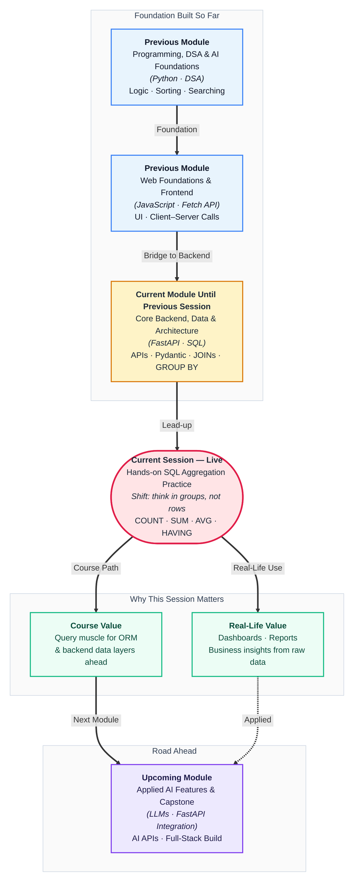

# Mental Model — Hands-on SQL Aggregation Practice

```mermaid
%%{init: {'flowchart': {'nodeSpacing': 60, 'rankSpacing': 75, 'diagramPadding': 20, 'curve': 'basis'}}}%%
flowchart TB

  subgraph FOUND[" Foundation Built So Far "]
    direction TB
    P1["<b>Previous Module</b><br/>Programming, DSA & AI Foundations<br/><i>(Python · DSA)</i><br/>Logic · Sorting · Searching"]
    P2["<b>Previous Module</b><br/>Web Foundations & Frontend<br/><i>(JavaScript · Fetch API)</i><br/>UI · Client–Server Calls"]
    CMP["<b>Current Module Until Previous Session</b><br/>Core Backend, Data & Architecture<br/><i>(FastAPI · SQL)</i><br/>APIs · Pydantic · JOINs · GROUP BY"]
  end

  CUR(["<b>Current Session &mdash; Live</b><br/>Hands-on SQL Aggregation Practice<br/><i>Shift: think in groups, not rows</i><br/>COUNT &middot; SUM &middot; AVG &middot; HAVING"])

  subgraph VAL[" Why This Session Matters "]
    direction TB
    COURSE["<b>Course Value</b><br/>Query muscle for ORM<br/>& backend data layers ahead"]
    LIFE["<b>Real-Life Value</b><br/>Dashboards &middot; Reports<br/>Business insights from raw data"]
  end

  subgraph FUT[" Road Ahead "]
    direction TB
    U1["<b>Upcoming Module</b><br/>Applied AI Features & Capstone<br/><i>(LLMs · FastAPI Integration)</i><br/>AI APIs &middot; Full-Stack Build"]
  end

  P1 ==>|&nbsp;Foundation&nbsp;| P2
  P2 ==>|&nbsp;Bridge to Backend&nbsp;| CMP
  CMP ==>|&nbsp;Lead-up&nbsp;| CUR
  CUR ==>|&nbsp;Course Path&nbsp;| COURSE
  CUR ==>|&nbsp;Real-Life Use&nbsp;| LIFE
  COURSE ==>|&nbsp;Next Module&nbsp;| U1
  LIFE -.->|&nbsp;Applied&nbsp;| U1

  classDef prev fill:#E8F4FD,stroke:#3B82F6,stroke-width:2px,color:#0F172A;
  classDef curMod fill:#FEF3C7,stroke:#D97706,stroke-width:2px,color:#1F2937;
  classDef current fill:#FFE4E6,stroke:#E11D48,stroke-width:3px,color:#1F2937;
  classDef value fill:#ECFDF5,stroke:#10B981,stroke-width:2px,color:#064E3B;
  classDef future fill:#EDE9FE,stroke:#7C3AED,stroke-width:2px,color:#1E1B4B;
  classDef zone fill:#FAFAFA,stroke:#CBD5E1,stroke-width:1px,color:#334155;

  class P1,P2 prev;
  class CMP curMod;
  class CUR current;
  class COURSE,LIFE value;
  class U1 future;
  class FOUND,VAL,FUT zone;

  linkStyle default stroke-width:3px;
```
