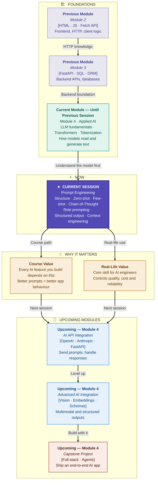

```mermaid
flowchart TB
    classDef prev fill:#E8E7F0,stroke:#8B87CC,color:#3C3489,stroke-width:1.5px
    classDef currmod fill:#E1F5EE,stroke:#1D9E75,color:#085041,stroke-width:1.5px
    classDef current fill:#534AB7,stroke:#3C3489,color:#ffffff,stroke-width:3px
    classDef value fill:#FAEEDA,stroke:#BA7517,color:#633806,stroke-width:1.5px
    classDef future fill:#E6F1FB,stroke:#378ADD,color:#0C447C,stroke-width:1.5px
    classDef capstone fill:#FAECE7,stroke:#993C1D,color:#4A1B0C,stroke-width:1.5px

    linkStyle default stroke-width:2.5px

    subgraph FOUNDATIONS ["🏗 &nbsp; FOUNDATIONS"]
        direction LR
        M2["<b>Previous Module</b><br/><i>Module 2</i><br/>[HTML · JS · Fetch API]<br/>Frontend, HTTP, client logic"]:::prev
        M3["<b>Previous Module</b><br/><i>Module 3</i><br/>[FastAPI · SQL · ORM]<br/>Backend APIs, databases"]:::prev
        PREV["<b>Current Module — Until Previous Session</b><br/>Module 4 · Applied AI<br/>LLM fundamentals · Transformers · Tokenization<br/>How models read and generate text"]:::currmod
    end

    M2 ==>|&nbsp;HTTP knowledge&nbsp;| M3
    M3 ==>|&nbsp;Backend foundation&nbsp;| PREV

    subgraph NOW ["⚡ &nbsp; NOW"]
        CURR["★ &nbsp;<b>CURRENT SESSION</b><br/>Prompt Engineering<br/>Structure · Zero-shot · Few-shot · Chain-of-Thought<br/>Role prompting · Structured output · Context engineering"]:::current
    end

    PREV ==>|&nbsp;Understand the model first&nbsp;| CURR

    subgraph VALUE ["💡 &nbsp; WHY IT MATTERS"]
        direction LR
        CV["<b>Course Value</b><br/>Every AI feature you build depends on this<br/>Better prompts = better app behaviour"]:::value
        RV["<b>Real-Life Value</b><br/>Core skill for AI engineers<br/>Controls quality, cost and reliability"]:::value
    end

    CURR ==>|&nbsp;Course path&nbsp;| CV
    CURR ==>|&nbsp;Real-life use&nbsp;| RV

    subgraph UPCOMING ["🚀 &nbsp; UPCOMING MODULES"]
        direction LR
        U1["<b>Upcoming — Module 4</b><br/><i>AI API Integration</i><br/>[OpenAI · Anthropic · FastAPI]<br/>Send prompts, handle responses"]:::future
        U2["<b>Upcoming — Module 4</b><br/><i>Advanced AI Integration</i><br/>[Vision · Embeddings · Schemas]<br/>Multimodal and structured outputs"]:::future
        U3["<b>Upcoming — Module 4</b><br/><i>Capstone Project</i><br/>[Full-stack · Agents]<br/>Ship an end-to-end AI app"]:::capstone
    end

    CV ==>|&nbsp;Next session&nbsp;| U1
    RV ==>|&nbsp;Next session&nbsp;| U1
    U1 ==>|&nbsp;Level up&nbsp;| U2
    U2 ==>|&nbsp;Build with it&nbsp;| U3
```